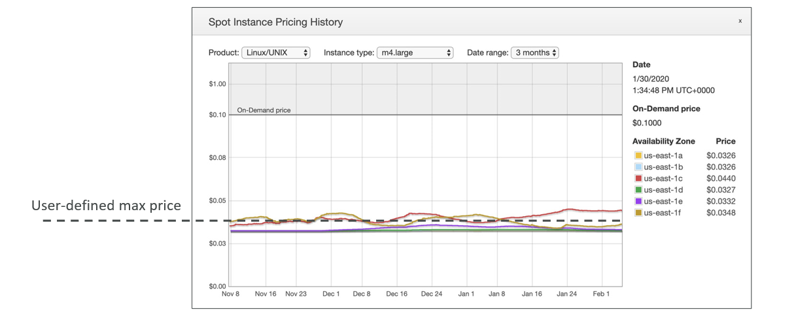
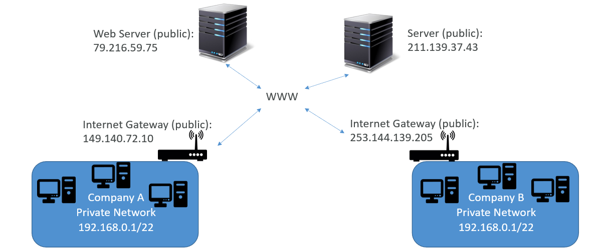
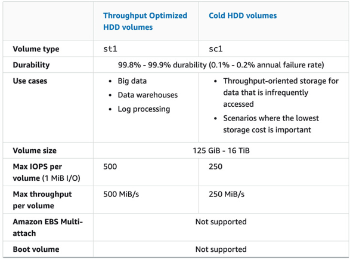
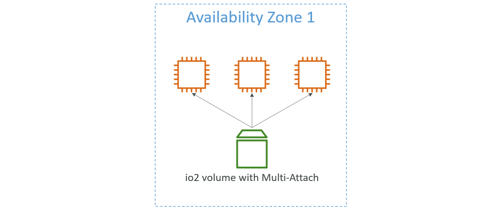
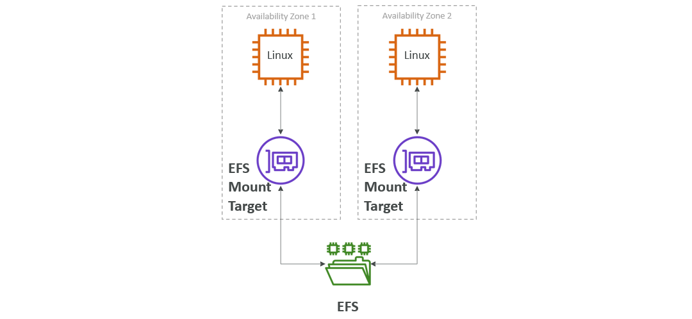
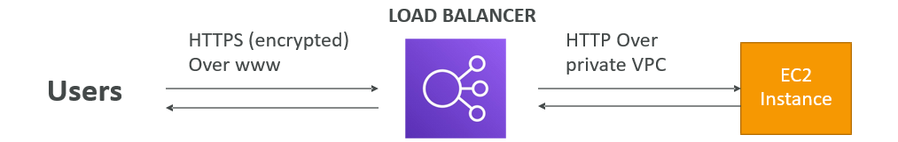
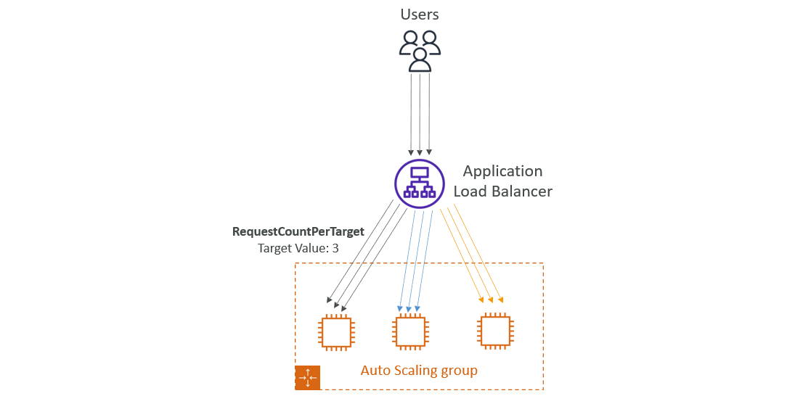
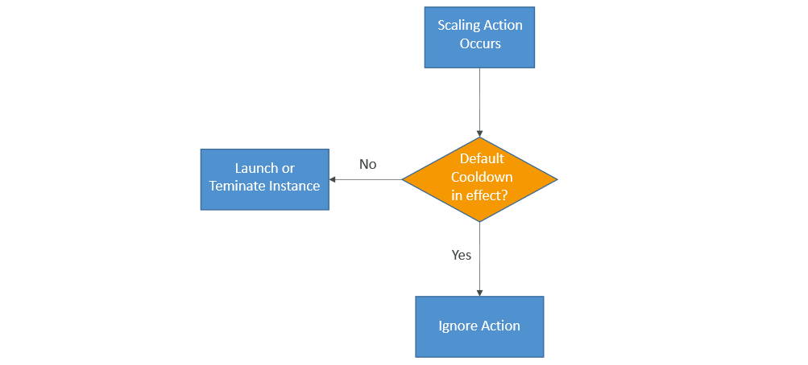

# AWS
* AWS (Amazon Web Services) is a Cloud Provider.
* They provide you with Servers and Services that you can use on demand and scale easily.
* **Use Cases:**
  * AWS enables you to build sophisticated, scalable Applications.
  * Applicable to a diverse set of Industries.
  * Use cases include
    * Enterprise IT, Backup & Storage, Big Data analytics
    * Website hosting, Mobile & Social Apps
    * Gaming

## AWS Global Infrastructure
* AWS Regions
* AWS Availability Zones
* AWS Data Centers
* AWS Edge Locations/Points of Presence

### AWS Regions
* AWS has Regions all around the world.
* Names can be us-east-1, eu-west-3…
* A Region is a cluster of Data Centers.
* Most AWS Services are region-scoped.

#### How to choose an AWS Region
* **Compliance with data governance and legal requirements:** data never leaves a Region without your explicit permission.
* **Proximity to customers:** reduced latency
* **Available Services within a Region:** new Services and new features aren’t available in every Region.
* **Pricing:** pricing varies Region to Region and is transparent in the service pricing page.

### AWS Availability Zones
* Each Region has many Availability Zones (usually 3, Min is 3, Max is 6). Example:
  * ap-southeast-2a
  * ap-southeast-2b
  * ap-southeast-2c
* Each Availability Zone (AZ) is one or more discrete data centers with redundant power, networking, and connectivity.
* They’re separate from each other, so that they’re isolated from disasters.
* They’re connected with high bandwidth, ultra-low latency networking.

## Tour of AWS Console
* **AWS has Global Services:**
  * Identity and Access Management (IAM)
  * Route 53 (DNS service)
  * CloudFront (Content Delivery Network)
  * WAF (Web Application Firewall)
* **Most AWS services are Region-scoped:**
  * Amazon EC2 (Infrastructure as a Service)
  * Elastic Beanstalk (Platform as a Service)
  * Lambda (Function as a Service)
  * Rekognition (Software as a Service)


# Identity and Access Management (IAM)
## IAM Users & Groups
* IAM is Global Service.
* Root account created by default, shouldn’t be used or shared.
* Users are People within your Organization, and can be Grouped.
* Groups only contain Users, not other Groups.
* Users don’t have to belong to a Group, and User can belong to Multiple Groups.

### Create IAM User
* Go to `IAM` and select `Users`.
* Click `Create user`.
  * Step 1 - `Specify user details`
    * Give `User name`
    * Select to `Provide user access to the AWS Management Console`
    * In User type, select `I want to create an IAM user`
    * Provide `Console password`
    * Choose & verify remaining data
  * Step 2 - `Set permissions`
    * Select `Permissions options` (In this case we are selecting `Add user to group`)
      * Click `Create group`
      * Give `User group name` and Add `Permissions policies`
      * Click `Create user group`.
    * Select `Group`
  * Step 3 - Review and create
    * Check Details and Click `Create user`
  * Step 4 - Retrieve password
    * Shows `Console sign-in details`
    * You can Save it using `Download .csv file` or `Email sign-in instructions`
  * Click `Return to users list`.

## Account Alias
* Account Alias is alias to Account ID. We can use Account Alias Name instead of Account ID.
* To set Account Alias:
  * Go to `IAM Dashboard`
  * In `AWS Account`, we can add `Account Alias`.
* This Account Alias Name is replaced with Account ID in `Sign-in URL for IAM users in this account`.

## IAM Permissions
* Users or Groups can be assigned JSON documents called Policies.
* These Policies define the Permissions of the Users.
* In AWS you apply the least privilege principle: don’t give more Permissions than a User needs.

### IAM Policies Structure


* Consists of
  * **Version:** Policy Language Version, always include “2012-10-17”
  * **Id:** An Identifier for the Policy (optional)
  * **Statement:** One or more individual Statements (required)
* Statements consists of
  * **Sid:** An identifier for the Statement (optional)
  * **Effect:** Whether the Statement allows or denies access (Allow, Deny)
  * **Principal:** Account/User/Role to which this Policy applied to
  * **Action:** List of Actions this Policy allows or denies
  * **Resource:** List of Resources to which the Actions applied to
  * **Condition:** Conditions for when this Policy is in effect (optional)

### About Policies
* We can `Attach/Dettach` Policies to `Users/Groups`.
  * Go to `Users/Groups`
  * In `Permissions`, we can Add/Remove `Permissions policies`.
* We can create Policies of your Own
  * Go to `Policies`
  * Click `Create policy`
    * Select `Service`, `Actions allowed` and `Resources`
    * Give `Policy name`
    * Click `Create policy`.
* In `Policies`, click on `Policy name`
  * It shows `Permissions defined in this policy`
  * Click on `JSON` to show that Policy JSON Format.

## IAM Password Policy
* Strong Passwords = higher security for your account.
* In AWS, you can setup a Password Policy:
  * Set a minimum password length
  * Require specific character types:
    * including uppercase letters
    * lowercase letters
    * numbers
    * non-alphanumeric characters
  * Allow all IAM Users to change their own Passwords
  * Require Users to change their Password after some time (password expiration)
  * Prevent Password re-use

### Create Password Policy
* In IAM, go to `Account settings` in Access management.
* In Password policy, click `Edit`.
* Select `Custom` to Apply customized password requirements.
* Select required Options and click `Save changes`.

## Multi Factor Authentication (MFA)
* Users have access to your Account and can possibly change Configurations or Delete Resources in your AWS Account.
* You protect your Root Accounts and IAM users using MFA.
* MFA = Password you know + Security Device you own.
* **Main benefit of MFA:** If a Password is stolen or hacked, the Account is not compromised.

### Add MFA to Root Account
* In AWS Console, click on Root Username and select `Security credentials`.
* In `Multi-factor authentication (MFA)`, select `Assign MFA device`.
  * Step 1 - `Select MFA device`
    * Give `Device name`
    * Select `Device options` (In this case we are using `Authenticator app`)
  * Step 2 - `Set up device`
    * Click `Show QR code` and Scan the QR Code with Authenticator App.
    * Add Authenticator App Codes in `Type two consecutive MFA codes below`
  * Click `Add MFA`.

## How Can Users Access AWS
* To Access AWS, we have three options:
  * **AWS Management Console:** Protected by Password + MFA
  * **AWS Command Line Interface (CLI):** Protected by Access Keys
  * **AWS Software Developer Kit (SDK):** For Code: Protected by Access Keys
* Access Keys are generated through the AWS Console.
  * Users manage their own Access Keys.
  * Access Keys are Secret, just like a Password. Don’t share them
    * Access Key ID ~= Username
    * Secret Access Key ~= Password

### AWS CLI
* A Tool that enables you to interact with AWS Services using commands in your Command-Line Shell.
* Direct access to the Public APIs of AWS Services.
* You can develop scripts to manage your Resources.
* Alternative to using AWS Management Console.

#### Install & Configure AWS CLI
* [Refer Here](https://docs.aws.amazon.com/cli/latest/userguide/getting-started-install.html) for Official Site.
* In that select your Operating System and follow the Steps.
* After installation check the version `aws --version`
* Create Access Keys and Configure AWS. Use command `aws configure`
  * Provide Access Key, Secret Access Key and Region.
* After successful Configuration, check the configuration using basic command `aws iam list-users --> List the IAM Users`.

#### Create Access Keys
* Go to `IAM Users` and click on User.
* In User `Security credentials`, navigate to `Access keys` and click `Create access key`.
  * Step 1 - `Access key best practices & alternatives`
    * In Use case, select `Command Line Interface (CLI)`
  * Step 2 - `Set description tag`
    * Provide `Description tag value`
    * Click `Create access key`.
  * Step 3 - `Retrieve access keys`
    * Save `Access key & Secret access key` by clicking `Download .csv file`

### AWS SDK (Software Development Kit)
* Language-specific APIs (set of libraries).
* Enables you to access and manage AWS Services Programmatically.
* Embedded within your Application.
* Supports
  * SDKs (JavaScript, Python, PHP, .NET, Ruby, Java, Go, Node.js, C++)
  * Mobile SDKs (Android, iOS, …)
  * IoT Device SDKs (Embedded C, Arduino, …)
* Example: AWS CLI is built on AWS SDK for Python.

## AWS CloudShell
* AWS CloudShell is available on top right side .
* AWS CloudShell is a Terminal in AWS Console comes with AWS CLI pre-installed.
* In AWS CloudShell
  * `Actions:` Used to Upload and Download files.
  * `Settings:` Used to change Display Preferences.

## IAM Roles for Services
* Some AWS service will need to perform actions on your behalf.
* To do so, we will assign Permissions to AWS services with IAM Roles.
* **Common Roles:**
  * EC2 Instance Roles
  * Lambda Function Roles
  * Roles for CloudFormation

### Create Role
* Go to IAM, in Access management select `Roles`.
* Click `Create role`.
  * Step 1 - Select trusted entity
    * Select `Trusted entity type` to `AWS service`
    * Select `Use case`
  * Step 2 - `Add permissions`
    * Provide `Permissions policies`
  * Step 3 - `Name, review, and create`
    * Give `Role name`
    * Check Details and click `Create role`.

## IAM Security Tools
* **IAM Credentials Report (Account-Level)**
  * A report that lists all your Account's Users and the status of their various Credentials.
  * For `Credentials Report:`
    * Go to IAM, In Access reports select `Credential report`
    * Click `Download credentials report`.
* **IAM Access Advisor (User-Level)**
  * Access advisor shows the Service permissions granted to a User and when those Services were last accessed.
  * You can use this information to revise your Policies.
  * For `Access Advisor Report:`
    * Go to IAM Users and select User.
    * Select `Last Accessed` and it shows the Report.

## IAM Guidelines & Best Practices
* Don’t use the root account except for AWS account setup.
* One Physical User = One AWS User.
* Assign Users to Groups and assign Permissions to Groups.
* Create a Strong Password Policy.
* Use and enforce the use of Multi Factor Authentication (MFA).
* Create and use Roles for giving Permissions to AWS Services.
* Use Access Keys for Programmatic Access (CLI / SDK).
* Audit Permissions of your Account using IAM Credentials Report & IAM Access Advisor.
* Never share IAM Users & Access Keys.

## IAM Section – Summary
* **Users:** Mapped to a Physical User, has a Password for AWS Console.
* **Groups:** Contains Users only.
* **Policies:** JSON document that outlines Permissions for Users or Groups.
* **Roles:** For EC2 Instances or AWS Services.
* **Security:** MFA + Password Policy.
* **AWS CLI:** Manage your AWS Services using the Command-Line.
* **AWS SDK:** Manage your AWS Services using a Programming Language.
* **Access Keys:** Access AWS using the CLI or SDK.
* **Audit:** IAM Credential Reports & IAM Access Advisor.

## AWS Budget Setup
* Click on Account Username and select `Billing and Cost Management`.
* IAM Users are by default they didn't have access to `Billing and Cost Management` even they have `Administrator Access`.
  * To Enable,
    * Go to IAM Root User Account and click Username, select `Account`.
    * In that navigate to `IAM user and role access to Billing information` and click `Edit`.
    * Select `Activate IAM Access` and click `Update`.
  * Now IAM Users can access `Billing and Cost Management` who have Administrator Access.

### Create Budget
* Go to Billing and Cost Management, select `Budgets` in Budgets and Planning.
* Click `Create budget`.
  * Select `Budget setup` - Use a template (simplified).
  * Select `Templates` based on requirement.
  * Give `Budget name` and provide `Email recipients`.
  * Click `Create budget`.


# Amazon EC2
* EC2 is one of the most popular of AWS offering.
* EC2 = Elastic Compute Cloud = Infrastructure as a Service.
* It mainly consists in the capability of
  * Renting Virtual Machines (EC2)
  * Storing Data on Virtual Drives (EBS)
  * Distributing load across Machines (ELB)
  * Scaling the Services using an Auto-Scaling Group (ASG)
* Knowing EC2 is fundamental to understand how the Cloud works.

## EC2 Sizing & Configuration Options
* Operating System (**OS**): Linux, Windows or MacOS
* How much Compute Power & Cores (**CPU**)
* How much Random-Access Memory (**RAM**)
* How much Storage Space:
  * Network-Attached (**EBS & EFS**)
  * Hardware (**EC2 Instance Store**)
* Network Card: Speed of the Card, Public IP Address
* Firewall Rules: **Security Group**
* Bootstrap Script (Configure at first Launch): **EC2 User Data**

## EC2 User Data
* It is possible to bootstrap our Instances using an EC2 User Data Script.
* Bootstrapping means Launching Commands when a Machine Starts.
* That Script is only run once at the Instance first Start.
* EC2 User Data is used to Automate boot Tasks such as:
  * Installing Updates
  * Installing Software
  * Downloading Common Files from the Internet
  * Anything you can think of
* The EC2 User Data Script runs with the Root User.

## Launch instance
* Go to EC2 and click `Launch instance`.
* Give `Name` in Name and tags.
* Select `AMI` in Application and OS Images (Amazon Machine Image).
* Select `Instance type`.
* Create or Add `Key pair (login)`
  * Click `Create new key pair`
  * Give `Key pair name` and click `Create key pair`.
* In `Network settings`, Create New Security Group or Select an Existing Security Group.
  * Select required Ports to allow Traffic.
* `Configure storage`, in that change Volume Size if required.
* In `Advanced details`, navigate to `User data` and provide required User Data.
  * User Data is knowthing but Commands
  * In User Data, we first provide `#!/bin/bash` and then give Commands.
  * Sample User Data:
    ```
    #!/bin/bash
    # install httpd on Amazon Linux
    yum update -y
    yum install -y httpd
    systemctl start httpd
    systemctl enable httpd
    echo "<h1>Hello World from $(hostname -f)</h1>" > /var/www/html/index.html
    ```
* Check `Summary`.
* Click `Launch instance`.

### Start/Stop/Terminate Instance
* Select Instance and click `Instance state`.
* Select required Action.

## Instance Types
* We can use different types of EC2 Instances that are optimised for different use cases.
* [Refer Here](https://aws.amazon.com/ec2/instance-types/) for Official docs.
* Instance Types are
  * General Purpose
  * Compute Optimized
  * Memory Optimized
  * Accelerated Computing
  * Storage Optimized
  * HPC Optimized
  * Instance Features
  * Measuring Instance Performance
* AWS has the naming convention: **m5.2xlarge**
  * `m:` Instance Class
  * `5:` Generation (AWS Improves then over Time)
  * `2xlarge:` Size within the Instance Class
#### General Purpose
* Great for a diversity of `Workloads` such as Web Servers or Code Repositories.
* Balance between:
  * Compute
  * Memory
  * Networking
* In the course, we will be using the t2.micro which is a General Purpose EC2 Instance.
#### Compute Optimized
* Great for compute-intensive tasks that require `high performance processors`:
  * Batch Processing Workloads
  * Media Transcoding
  * High Performance Web Servers
  * High Performance Computing (HPC)
  * Scientific Modeling & Machine Learning
  * Dedicated Gaming Servers
#### Memory Optimized
* Fast performance for workloads that process `large data sets in memory`
* Use cases:
  * High performance, relational/non-relational databases
  * Distributed web scale cache stores
  * In-memory databases optimized for BI (business intelligence)
  * Applications performing real-time processing of big unstructured data
#### Storage Optimized
* Great for `storage-intensive tasks` that require high, sequential read and write access to large data sets on local storage.
* Use cases:
  * High frequency online transaction processing (OLTP) systems
  * Relational & NoSQL databases
  * Cache for in-memory databases (for example, Redis)
  * Data warehousing applications
  * Distributed file systems

## Security Groups
* Security Groups are the fundamental of Network Security in AWS.
* They control how traffic is allowed into or out of our EC2 Instances.
  
* Security groups only contain rules.
* Security groups rules can reference by IP or by security group.
* Security groups are acting as a “firewall” on EC2 instances
* They regulate:
  * Access to Ports
  * Authorised IP ranges – IPv4 and IPv6
  * Control of inbound network (from other to the instance)
  * Control of outbound network (from the instance to other)
* Security Groups Diagram
  
* Referencing other Security Groups Diagram
  

### Security Groups Good to know
* Can be attached to multiple instances.
* Locked down to a region / VPC combination.
* Does live “outside” the EC2 – if traffic is blocked the EC2 instance won’t see it.
* It’s good to maintain one separate security group for SSH access.
* If your application is not accessible (time out), then it’s a security group issue.
* If your application gives a “connection refused“ error, then it’s an application error or it’s not launched.
* All inbound traffic is blocked by default.
* All outbound traffic is authorised by default.

### Classic Ports to know
* 22 = SSH (Secure Shell) - log into a Linux instance.
* 21 = FTP (File Transfer Protocol) – upload files into a file share.
* 22 = SFTP (Secure File Transfer Protocol) – upload files using SSH.
* 80 = HTTP – access unsecured websites.
* 443 = HTTPS – access secured websites.
* 3389 = RDP (Remote Desktop Protocol) – log into a Windows instance.

### Create Security Group
* Go to EC2, in Network & Security click `Security Groups`.
* Click `Create security group`.
  * Give `Security group name`, `Description` and select `VPC`.
  * Add `Inbound rules`
    * Click `Add rule`
    * Select `Type`, `Protocol`, `Port range` and `Source`
    * Provide `Tags`
  * Click `Create security group`.

### Update Inbound Rules to Security Group
* Go to Instances, select Instance.
  * Select `Security`, in `Security details` attached Security Groups are available in `Security groups`.
  * Click on required Security Group.
<center> (or) </center>

* Go to EC2, in Network & Security click `Security Groups`.
  * Select required Security Group.
* In `Inbound rules`, we can Add/Remove Inbound Rules.
  * Click `Edit inbound rules`
  * Click `Add rule`
  * Select `Type`, `Protocol`, `Port range` and `Source`
  * Click `Save rules`.

## SSH into EC2 Instance
* SSH is one of the most important function. It allows you to control a remote machine, all using the command line.
  ```
  ssh -i <.pem file along with path> <username>@<publicIP>
  ```

## EC2 Instance Connect
* Connect to your EC2 instance within your browser.
* No need to use your key file that was downloaded.
* The “magic” is that a temporary key is uploaded onto EC2 by AWS.
* Need to make sure the port 22 is still opened!
* Connect to Instance:
  * Select Instance and click `Connect`.
  * Choose `EC2 Instance Connect` and click `Connect`.
* Now SSH Connection is established to Instance.
* EC2 Instance Connect is a feature of AWS that provides a secure way to connect to your Linux Instances over Secure Shell.

## EC2 Instances Purchasing Options
* **On-Demand Instances:** short workload, predictable pricing, pay by second
* **Reserved:** (1 & 3 years)
  * **Reserved Instances:** long workloads
  * **Convertible Reserved Instances:** long workloads with flexible instances
* **Savings Plans:** commitment to an amount of usage, long workload (1 & 3 years)
* **Spot Instances:** short workloads, cheap, can lose instances (less reliable)
* **Dedicated Hosts:** book an entire physical server, control instance placement
* **Dedicated Instances:** no other customers will share your hardware
* **Capacity Reservations:** reserve capacity in a specific AZ for any duration

### EC2 On Demand
* Pay for what you use:
  * Linux or Windows - billing per second, after the first minute
  * All other operating systems - billing per hour 
* Has the highest cost but no upfront payment
* No long-term commitment
* Recommended for **short-term** and **un-interrupted workloads**, where you can't predict how the application will behave

### EC2 Reserved Instances
* **Up to 72% discount** compared to On-demand
* You reserve a specific instance attributes (**Instance Type, Region, Tenancy, OS**)
* **Reservation Period – 1 year** (+discount) or **3 years** (+++discount)
* **Payment Options** – **No Upfront** (+), **Partial Upfront** (++), **All Upfront** (+++)
* **Reserved Instance’s Scope** – **Regional** or **Zonal** (reserve capacity in an AZ)
* Recommended for steady-state usage applications (think database)
* You can buy and sell in the Reserved Instance Marketplace
* **Convertible Reserved Instance**
  * Can change the EC2 instance type, instance family, OS, scope and tenancy
  * Up to 66% discount

### EC2 Savings Plans
* Get a discount based on long-term usage (up to 72% - same as RIs)
* Commit to a certain type of usage ($10/hour for 1 or 3 years)
* Usage beyond EC2 Savings Plans is billed at the On-Demand price
* Locked to a specific instance family & AWS region (e.g., M5 in us-east-1)
* Flexible across:
  * Instance Size (e.g., m5.xlarge, m5.2xlarge)
  * OS (e.g., Linux, Windows)
  * Tenancy (Host, Dedicated, Default)

### EC2 Spot Instances
* Can get a **discount of up to 90%** compared to On-demand
* Instances that you can “lose” at any point of time if your max price is less than the current spot price
* The **MOST cost-efficient** instances in AWS
* **Useful for workloads that are resilient to failure**
  * Batch jobs
  * Data analysis
  * Image processing
  * Any **distributed** workloads
  * Workloads with a flexible start and end time
* **Not suitable for critical jobs or databases**

### EC2 Dedicated Hosts
* A physical server with EC2 instance capacity fully dedicated to your use
* Allows you address **compliance requirements** and **use your existing server- bound software licenses** (per-socket, per-core, pe—VM software licenses)
* Purchasing Options:
  * **On-demand** – pay per second for active Dedicated Host
  * **Reserved** - 1 or 3 years (No Upfront, Partial Upfront, All Upfront)
* The most expensive option
* Useful for software that have complicated licensing model (BYOL – Bring Your Own License)
* Or for companies that have strong regulatory or compliance needs

### EC2 Dedicated Instances
* Instances run on hardware that’s dedicated to you
* May share hardware with other instances in same account
* No control over instance placement (can move hardware after Stop / Start)

### EC2 Capacity Reservations
* Reserve **On-Demand** instances capacity in a specific AZ for any duration
* You always have access to EC2 capacity when you need it
* **No time commitment** (create/cancel anytime), **no billing discounts**
* Combine with Regional Reserved Instances and Savings Plans to benefit from billing discounts
* You’re charged at On-Demand rate whether you run instances or not
* Suitable for short-term, uninterrupted workloads that needs to be in a specific AZ

### Which purchasing option is right for me?
* **On demand:** coming and staying in resort whenever we like, we pay the full price
* **Reserved:** like planning ahead and if we plan to stay for a long time, we may get a good discount.
* **Savings Plans:** pay a certain amount per hour for certain period and stay in any room type (e.g., King, Suite, Sea View, …)
* **Spot instances:** the hotel allows people to bid for the empty rooms and the highest bidder keeps the rooms. You can get kicked out at any time
* **Dedicated Hosts:** We book an entire building of the resort
* **Capacity Reservations:** you book a room for a period with full price even you don’t stay in it

## EC2 Spot Instance Requests
* Can get a discount of up to 90% compared to On-demand
* Define **max spot price** and get the instance while **current spot price < max**
  * The hourly spot price varies based on offer and capacity
  * If the current spot price > your max price you can choose to stop or terminate your instance with a 2 minutes grace period.
* Other strategy: **Spot Block**
  * “block” spot instance during a specified time frame (1 to 6 hours) without interruptions
  * In rare situations, the instance may be reclaimed
* **Used for batch jobs, data analysis, or workloads that are resilient to failures**. 
* **Not great for critical jobs or databases**
* **EC2 Spot Instances Pricing:**
  
* **How to terminate Spot Instances:**
  

### Spot Fleets
* Spot Fleets = set of Spot Instances + (optional) On-Demand Instances
* The Spot Fleet will try to meet the target capacity with price constraints
  * Define possible launch pools: instance type (m5.large), OS, Availability Zone
  * Can have multiple launch pools, so that the fleet can choose
  * Spot Fleet stops launching instances when reaching capacity or max cost
* Strategies to allocate Spot Instances:
  * **lowestPrice:** from the pool with the lowest price (cost optimization, short workload)
  * **diversified:** distributed across all pools (great for availability, long workloads)
  * **capacityOptimized:** pool with the optimal capacity for the number of instances
  * **priceCapacityOptimized (recommended):** pools with highest capacity available, then select the pool with the lowest price (best choice for most workloads)
* Spot Fleets allow us to automatically request Spot Instances with the lowest price

## EC2 Instance Roles
* Always prefer IAM Roles for EC2 Instances when your Application need to access AWS Resources.
* EC2 Instance Roles are better because they are more secure, esier to manage and eliminate the need for hardcoded Credentials.
* We create Roles with required Policies and attach that Roles to Instance. This can be accessed without AWS Configuration.

### Attach Roles to Instance
* Go to EC2 Instance and select Instance.
* Click `Actions --> Security --> Modify IAM Role`.
  * Select `IAM role`.
  * Click `Update IAM role`.
* Now the Instance was access that particular Resource.

## Private vs Public IP (IPv4)
* Networking has two sorts of IPs. IPv4 and IPv6:
  * IPv4: `1.160.10.240`
  * IPv6: `3ffe:1900:4545:3:200:f8ff:fe21:67cf`
* In this course, we will only be using IPv4.
* IPv4 is still the most common format used online.
* IPv6 is newer and solves problems for the Internet of Things (IoT).
* IPv4 allows for 3.7 billion different addresses in the public space
* IPv4: `[0-255].[0-255].[0-255].[0-255]`
* Private vs Public IP (IPv4) Example:
  

### Private vs Public IP (IPv4) Fundamental Differences
* **Public IP:**
  * Public IP means the machine can be identified on the internet (WWW)
  * Must be unique across the whole web (not two machines can have the same public IP).
  * Can be geo-located easily
* **Private IP:**
  * Private IP means the machine can only be identified on a private network only
  * The IP must be unique across the private network
  * BUT two different private networks (two companies) can have the same IPs. 
  * Machines connect to WWW using a NAT + internet gateway (a proxy)
  * Only a specified range of IPs can be used as private IP
* **Private vs Public IP (IPv4) in AWS:**
  * By default, your EC2 machine comes with:
    * A private IP for the internal AWS Network
    * A public IP, for the WWW
  * When we are doing SSH into our EC2 machines:
    * We can’t use a private IP, because we are not in the same network 
    * We can only use the public IP. 
  * If your machine is stopped and then started, **the public IP can change**.

## Elastic IPs
* When you stop and then start an EC2 instance, it can change its public IP.
* If you need to have a fixed public IP for your instance, you need an Elastic IP
* An Elastic IP is a public IPv4 IP you own as long as you don’t delete it
* You can attach it to one instance at a time
* With an Elastic IP address, you can mask the failure of an instance or software by rapidly remapping the address to another instance in your account. 
* You can only have 5 Elastic IP in your account (you can ask AWS to increase that).
* Overall, try to avoid using Elastic IP:
  * They often reflect poor architectural decisions
  * Instead, use a random public IP and register a DNS name to it
  * Or, as we’ll see later, use a Load Balancer and don’t use a public IP

### Allocate Elastic IP address
* In EC2, select `Elastic IPs` in Network & Security.
* Click `Allocate Elastic IP address`.
  * Give `Tags`.
  * Click `Allocate`.
* **Attach Elastic IP to Instance:**
  * Select Elastic IP.
  * Click `Actions --> Associate Elastic IP address`.
    * Select `Resource type` (Instance)
    * Select `Instance` and `Private IP address`.
    * Click `Associate`.
* **Delete Elastic IP:**
  * First `Dissociate Elastic IP address`.
  * Then click `Actions --> Release Elastic IP addresses`.
  * Click `Release`.

## Placement Groups
* Sometimes you want control over the EC2 Instance placement strategy
* That strategy can be defined using placement groups
* When you create a placement group, you specify one of the following strategies for the group:
  * **Cluster:** clusters instances into a low-latency group in a single Availability Zone
  * **Spread:** spreads instances across underlying hardware (max 7 instances per group per AZ)
  * **Partition:** spreads instances across many different partitions (which rely on different sets of racks) within an AZ. Scales to 100s of EC2 instances per group (Hadoop, Cassandra, Kafka)

### Cluster - Placement Groups
* Pros: Great network (10 Gbps bandwidth between instances with Enhanced Networking enabled - recommended)
* Cons: If the AZ fails, all instances fails at the same time
* Use case: 
  * Big Data job that needs to complete fast
  * Application that needs extremely low latency and high network throughput
  

### Spread - Placement Groups
* Pros:
  * Can span across Availability Zones (AZ)
  * Reduced risk is simultaneous failure
  * EC2 Instances are on different physical hardware
* Cons: 
  * Limited to 7 instances per AZ per placement group
* Use case: 
  * Application that needs to maximize high availability
  * Critical Applications where each instance must be isolated from failure from each other
  

### Partition - Placements Groups
* Up to 7 partitions per AZ
* Can span across multiple AZs in the same region
* Up to 100s of EC2 instances
* The instances in a partition do not share racks with the instances in the other partitions
* A partition failure can affect many EC2 but won’t affect other partitions
* EC2 instances get access to the partition information as metadata
* Use cases: HDFS, HBase, Cassandra, Kafka
  

### Create Placement Group
* Go to EC2, click `Placement Groups` in Network & Security.
* Click `Create placement group`.
  * Give `Name`
  * Select `Placement strategy`
  * Click `Create group`.
* **Placement Groups are selected during Launch Instance:**
  * During Launch Instance, go to `Advanced details`
  * In that select `Placement group`.

## Elastic Network Interfaces (ENI)
* Logical component in a VPC that represents a **virtual network card**
* The ENI can have the following attributes:
  * Primary private IPv4, one or more secondary IPv4
  * One Elastic IP (IPv4) per private IPv4
  * One Public IPv4
  * One or more security groups
  * A MAC address 
* You can create ENI independently and attach them on the fly (move them) on EC2 instances for failover
* Bound to a specific availability zone (AZ)
* It helpful when we are using Instance Private IP. If that Instance fails, we create another Instance but that Instance have different Public IP
  * To overcome this, we create ENI and attach to Instance
  * If the Instance fails, we create another Instance and attach the same ENI to that Instance
  * In both times we can use ENI Private IP


### Create Network Interface (ENI)
* Go to EC2, select `Network Interfaces` in Network & Security.
* Click `Create network interface`.
  * Give `Description`
  * Select `Subnet` (Must match with Instance)
  * Add `Security groups`
  * Click `Create network interface`.
* **Attach ENI to Instance:**
  * Select ENI.
  * Click `Actions --> Attach`.
    * Select `VPC` and `Instance`
    * Click `Attach`.
* Select Instance, click `Networking`
  * In that shows attached `Network Interfaces`.

## EC2 Hibernate
* We know we can stop, terminate instances
  * **Stop:** the data on disk (EBS) is kept intact in the next start
  * **Terminate:** any EBS volumes (root) also set-up to be destroyed is lost
* On start, the following happens:
  * **First start:** the OS boots & the EC2 User Data script is run
  * **Following starts:** the OS boots up 
  * Then your application starts, caches get warmed up, and that can take time!
* Introducing EC2 Hibernate:
  * The in-memory (RAM) state is preserved
  * The instance boot is much faster! (the OS is not stopped / restarted)
  * Under the hood: the RAM state is written to a file in the root EBS volume
  * **The root EBS volume must be encrypted**
* Use cases:
  * Long-running processing
  * Saving the RAM state
  * Services that take time to initialize


### EC2 Hibernate – Good to know
* **Supported Instance Families:** C3, C4, C5, I3, M3, M4, R3, R4, T2, T3, …
* **Instance RAM Size:** must be less than 150 GB.
* **Instance Size:** not supported for bare metal instances.
* **AMI:** Amazon Linux 2, Linux AMI, Ubuntu, RHEL, CentOS & Windows… 
* **Root Volume:** must be EBS, encrypted, not instance store, and large
* Available for **On-Demand, Reserved** and **Spot Instances**
* An instance can **NOT be hibernated more than 60 days**

### EC2 Hibernate Creation
* We can select Hibernate during Launch Instance.
* During `Launch instance`, click `Advanced details`
  * Navigate to `Stop - Hibernate behavior` and `Enable` it.
  * Also need to Encrypt Volume
    * In `Configure storage`, click `Advanced`
    * Select the Volume
    * In Encrypted `-->` `Encrypted` it.
    * In KMS key, select default keys
  * Then provide all necessary information and click `Launch instance`.
* **To Hibernate Instance:**
  * Select Instance
  * Click `Instance state --> Hibernate instance`.
* We can identify using `uptime` command:
  * For Normal Instances, when we Stop and Start the Instance the uptime is starts from `0`.
  * But for Hibernate Instances the uptime continuous.


# EC2 Instance Storage
## EBS Volume
* **An EBS (Elastic Block Store) Volume is a network drive** you can attach to your instances while they run
* It allows your instances to persist data, even after their termination
* **They can only be mounted to one instance at a time** (at the CCP level)
* They are bound to **a specific Availability Zone**
* Analogy: Think of them as a “network USB stick” 
* Free tier: 30 GB of free EBS storage of type General Purpose (SSD) or Magnetic per month
* It’s a network drive (i.e. not a physical drive)
  * It uses the network to communicate the instance, which means there might be a bit of latency
  * It can be detached from an EC2 instance and attached to another one quickly
* It’s locked to an Availability Zone (AZ)
  * An EBS Volume in us-east-1a cannot be attached to us-east-1b
  * To move a volume across, you first need to snapshot it
* Have a provisioned capacity (size in GBs, and IOPS)
  * You get billed for all the provisioned capacity
  * You can increase the capacity of the drive over time
* EBS Volume Example:
  

### EBS – Delete on Termination attribute
* Controls the EBS behaviour when an EC2 instance terminates
  * By default, the root EBS volume is deleted (attribute enabled)
  * By default, any other attached EBS volume is not deleted (attribute disabled)
* This can be controlled by the AWS console / AWS CLI
* **Use case: preserve root volume when instance is terminated**
* We can change this `Termination Policy during Launch Instance`
  * In `Configure storage`, click `Advanced`
  * Select Volume, in `Delete on termination` change the behaviour if requirement.
  

### Create Volume
* Go to EC2, select `Volumes` in Elastic Block Store.
* Click `Create volume`.
  * Select `Volume type`
  * Give `Size (GiB)`
  * Select `Availability Zone` (Must match with Instance AZ)
  * Add `Tags`
  * Click `Create volume`.
* **Attach Volume to Instance:**
  * Select Volume.
  * Click `Actions --> Attach volume`
  * Select `Instance` and `Device name`
  * Click `Attach volume`.
* Select `Instance` and click `Storage`
  * In `Block devices`, shows attached Volumes.

## EBS Snapshots
* Make a backup (Snapshot) of your EBS volume at a point in time
* Not necessary to detach volume to do snapshot, but recommended
* Can copy snapshots across AZ or Region
  

### EBS Snapshots Features
* **EBS Snapshot Archive**
  * Move a Snapshot to an ”archive tier” that is 75% cheaper
  * Takes within 24 to 72 hours for restoring the archive
* **Recycle Bin for EBS Snapshots**
  * Setup rules to retain deleted snapshots so you can recover them after an accidental deletion
  * Specify retention (from 1 day to 1 year)
* **Fast Snapshot Restore (FSR)**
  * Force full initialization of snapshot to have no latency on the first use ($$$)
  

### Create Snapshot
* Go to EC2 Volumes and select Volume.
* Click `Actions --> Create snapshot`.
  * Give `Description` and `Tags`
  * Click `Create snapshot`.
* Go to EC2, select `Snapshots` in Elastic Block Store.
  * The Snapshots are available here.
#### Create Volume from Snapshot
* Go to Snapshots and select Snapshot.
* Click `Actions --> Create volume from snapshot`.
  * Select `Volume type`
  * Give `Size (GiB)`
  * Select `Availability Zone`
  * Add `Tags`
  * Click `Create volume`.
* **By using this process, we can move Volume from one AZ to another AZ.**
#### Copy Snapshot to Different Regions
* Go to Snapshots and select Snapshot.
* Click `Actions --> Copy snapshot`.
  * Select `Destination Region`
  * Give `Tags`
  * Select `Copy snapshot`.
* **By using this we can copy Volumes from one Region to another Region.**

### Protect Snapshots from Accidental Deletion
* To protect Snapshots from accidental deletion, we are using Recycle Bin.
* Recycle Bin Protect your Amazon EBS Snapshots and Amazon Machine Images (AMIs) from accidental deletion.
* **Create Recycle Bin:**
  * Go to Snapshots and click `Recycle Bin`.
  * Click `Create retention rule`.
    * Give `Retention rule name` and `Retention rule description`.
    * Select `Resource type` to EBS Snapshots.
      * Select Apply Match.
    * Give `Retention period`
    * Click `Create retention rule`.
* If we delete the Snapshot, it stores in `Recycle Bin --> Resources`.
  * We can Recover it to our Snapshots.
  * Go to `Recycle Bin --> Resources`, in that select deleted Snapshot and click `Recover`.
  * Click `Recover resources`.

### Archive Snapshot
* Select Snapshot.
* Click `Actions --> Archiving --> Archive snapshot`.
* Click `Archive snapshot`.
* We want to use Archive Snapshot, first Restore the Snapshot.
* Restoration takes 24 to 72 hours.
* For Archived Snapshots, the `Storage tier` is changed from `Standard` to `Archive`.
* **For Restoring the Snapshot:**
  * Select Snapshot
  * Click `Actions --> Archiving --> Restore snapshot from archive`
  * Select `Restore type`
  * Click `Restore snapshot`.

## AMI (Amazon Machine Image)
* AMI are a **customization** of an EC2 instance
  * You add your own software, configuration, operating system, monitoring…
  * Faster boot / configuration time because all your software is pre-packaged
* AMI are built for a **specific region** (and can be copied across regions)
* You can launch EC2 instances from:
  * **A Public AMI:** AWS provided
  * **Your own AMI:** you make and maintain them yourself
  * **An AWS Marketplace AMI:** an AMI someone else made (and potentially sells)
* **AMI Process (from an EC2 instance)**
  * Start an EC2 instance and customize it
  * Stop the instance (for data integrity)
  * Build an AMI – this will also create EBS snapshots
  * Launch instances from other AMIs
  

### Create AMI from Instance
* Go to EC2 Instances and select Instance.
* Click `Actions --> Image and templates --> Create image`.
  * Give `Image name` and `Image description`
  * Provide `Tags`
  * Click `Create image`.
* Click `AMIs` in Images, in that Created Images are available.
* Once the Image is available, you can Launch Instances from Images.

### Launch Instance from Created Image
* Click `AMIs` in Images and select required AMI.
  * Click `Launch instance from AMI`
  * Provide all required information and click `Launch instance`.
<center> (or) </center>

* Go to EC2 and click `Launch instance`.
* In `Application and OS Images (Amazon Machine Image)`, click `My AMIs`
  * Select `Amazon Machine Image (AMI)`
  * Provide remaining all required information and click `Launch instance`.

## EC2 Instance Store
* EBS volumes are **network drives** with good but “limited” performance
* **If you need a high-performance hardware disk, use EC2 Instance Store**
* Better I/O performance
* EC2 Instance Store lose their storage if they’re stopped (ephemeral)
* Good for buffer / cache / scratch data / temporary content 
* Risk of data loss if hardware fails
* Backups and Replication are your responsibility

## EBS Volume Types
* EBS Volumes come in 6 types
  * **gp2 / gp3 (SSD):** General purpose SSD volume that balances price and performance for a wide variety of workloads
  * **io1 / io2 Block Express (SSD):** Highest-performance SSD volume for mission-critical low-latency or high-throughput workloads
  * **st1 (HDD):** Low cost HDD volume designed for frequently accessed, throughput-intensive workloads
  * **sc1 (HDD):** Lowest cost HDD volume designed for less frequently accessed workloads
* EBS Volumes are characterized in Size | Throughput | IOPS (I/O Ops Per Sec)
* When in doubt always consult the AWS documentation – it’s good!
* **Only gp2/gp3 and io1/io2 Block Express can be used as boot volumes**

### EBS Volume Types Use cases
#### General Purpose SSD
* Cost effective storage, low-latency 
* System boot volumes, Virtual desktops, Development and test environments
* 1 GiB - 16 TiB
* gp3:
  * Baseline of 3,000 IOPS and throughput of 125 MiB/s
  * Can increase IOPS up to 16,000 and throughput up to 1000 MiB/s independently
* gp2:
  * Small gp2 volumes can burst IOPS to 3,000
  * Size of the volume and IOPS are linked, max IOPS is 16,000
  * 3 IOPS per GB, means at 5,334 GB we are at the max IOPS
#### Provisioned IOPS (PIOPS) SSD
* Critical business applications with sustained IOPS performance
* Or applications that need more than 16,000 IOPS
* Great for **databases workloads** (sensitive to storage perf and consistency)
* io1 (4 GiB - 16 TiB):
  * Max PIOPS: 64,000 for Nitro EC2 instances & 32,000 for other
  * Can increase PIOPS independently from storage size
* io2 Block Express (4 GiB – 64 TiB):
  * Sub-millisecond latency
  * Max PIOPS: 256,000 with an IOPS:GiB ratio of 1,000:1
* Supports EBS Multi-attach
#### Hard Disk Drives (HDD)
* Cannot be a boot volume
* 125 GiB to 16 TiB
* Throughput Optimized HDD (st1)
  * Big Data, Data Warehouses, Log Processing
  * Max throughput 500 MiB/s – max IOPS 500
* Cold HDD (sc1):
  * For data that is infrequently accessed
  * Scenarios where lowest cost is important
  * Max throughput 250 MiB/s – max IOPS 250

### EBS –Volume Types Summary



## EBS Multi-Attach – io1/io2 family
* Attach the same EBS volume to multiple EC2 instances in the same AZ
* Each instance has full read & write permissions to the high-performance volume
* Use case:
  * Achieve **higher application availability** in clustered Linux applications (ex: Teradata)
  * Applications must manage concurrent write operations
* **Up to 16 EC2 Instances at a time**
* Must use a file system that’s cluster-aware (not XFS, EXT4, etc…)


## EBS Encryption
* When you create an encrypted EBS volume, you get the following:
  * Data at rest is encrypted inside the volume
  * All the data in flight moving between the instance and the volume is encrypted
  * All snapshots are encrypted
  * All volumes created from the snapshot
* Encryption and decryption are handled transparently (you have nothing to do)
* Encryption has a minimal impact on latency
* EBS Encryption leverages keys from KMS (AES-256)
* Copying an unencrypted snapshot allows encryption
* Snapshots of encrypted volumes are encrypted

### Encryption: Encrypt an Unencrypted EBS Volume
* Create an EBS snapshot of the volume
* Encrypt the EBS snapshot ( using copy )
* Create new ebs volume from the snapshot ( the volume will also be encrypted ) 
* Now you can attach the encrypted volume to the original instance
#### Encrypt an unencrypted EBS volume
* Create a Snapshot for that UnEncrypted EBS Volume.
* Encrypt the Snapshot using Copy snapshot
  * Select Snapshot and click `Actions --> Copy snapshot`
  * In `Encryption`, tick `Encrypt this snapshot`
    * Select `KMS key`
  * Click `Copy snapshot`.
* Select Encrypted Snapshot and create Volume
  * Select Snapshot and click `Actions --> Create volume from snapshot`
  * In that we can see `Encryption` is enabled
  * Click `Create volume`.
<center> (or) </center>

* Create a Snapshot for that UnEncrypted EBS Volume.
* Create a Volume from that Snapshot.
  * Go to Snapshots, select Snapshot and click `Actions --> Create volume from snapshot`
  * In `Encryption`, tick `Encrypt this snapshot`
    * Select `KMS key`
  * Click `Create volume`.

## Amazon EFS – Elastic File System
* Managed NFS (network file system) that can be mounted on many EC2
* EFS works with EC2 instances in multi-AZ
* Highly available, scalable, expensive (3x gp2), pay per use


* Use cases: content management, web serving, data sharing, Wordpress
* Uses NFSv4.1 protocol
* Uses security group to control access to EFS
* **Compatible with Linux based AMI (not Windows)**
* Encryption at rest using KMS
* POSIX file system (~Linux) that has a standard file API
* File system scales automatically, pay-per-use, no capacity planning!

### EFS – Performance & Storage Classes
* **EFS Scale**
  * 1000s of concurrent NFS clients, 10 GB+ /s throughput
  * Grow to Petabyte-scale network file system, automatically
* **Performance Mode (set at EFS creation time)**
  * **General Purpose (default)** – latency-sensitive use cases (web server, CMS, etc…)
  * **Max I/O** – higher latency, throughput, highly parallel (big data, media processing)
* **Throughput Mode**
  * **Bursting** – 1 TB = 50MiB/s + burst of up to 100MiB/s
  * **Provisioned** – set your throughput regardless of storage size, ex: 1 GiB/s for 1 TB storage
  * **Elastic** – automatically scales throughput up or down based on your workloads
    * Up to 3GiB/s for reads and 1GiB/s for writes
    * Used for unpredictable workloads

### EFS – Storage Classes
* **Storage Tiers (lifecycle management feature – move file after N days)**
  * **Standard:** for frequently accessed files
  * **Infrequent access (EFS-IA):** cost to retrieve files, lower price to store. 
  * **Archive:** rarely accessed data (few times each year), 50% cheaper
  * Implement **lifecycle policies** to move files between storage tiers
* **Availability and durability**
  * Standard: Multi-AZ, great for prod
  * One Zone: One AZ, great for dev, backup enabled by default, compatible with IA (EFS One Zone-IA)
* Over 90% in cost savings


### Create Amazon Elastic File System (EFS)
* Go to `EFS`.
* Click `Create file system` and click `Customize`.
* Step 1 - `File system settings`
  * Give `Name`
  * Select `File system type`
    * `Regional:` Offers multiple AZ's within an AWS region. Chooses for Production.
    * `One Zone:` Offers single AZ. Chooses for Development.
  * In Automatic backups, `Enable automatic backups` its recommended.
  * Select `Lifecycle management`
    * Used to move data across different Storage tiers to save costs.
    * In Encryption, `Enable encryption of data at rest`
  * In Performance settings, select required `Throughput mode`
    * `Bursting:` Provides throughput that scales with the amount of storage for workloads with basic performance requirements.
    * `Elastic:` Use this mode for workloads with unpredictable I/O. With Elastic Throughput, performance automatically scales with your workload activity and you only pay for the throughput you use.
    * `Provisioned:` Use this mode if you can estimate your workload's throughput requirements. With Provisioned mode, you configure your file system's throughput and pay for throughput provisioned.
* Step 2 - `Network access`
  * Select `Virtual Private Cloud (VPC)`
  * In `Mount targets`, select `Security groups` for AZs
* Step 3 - `File system policy`
  * It's optional
* Step 4 - `Review and create`
  * Check details and click `Create`.
* After that, open created File System
  * `Metered size:` Its shows the Size we used. We can pay only for the Storage used.

### Mount EFS to Instance
* Go to EC2 Instances and click `Launch instances`.
* In `Network settings`, click `Edit`
  * Select `Subnet`
* In `Configure storage`, File systems click `Edit`
  * Select `EFS`
  * Select `Add shared file system`
    * Select `File system` and `Mount point` (/mnt/efs/fs1)
* Add all other required information and click `Launch instance`.
* **Work Scenario:**
  * Launch Two Instances with EFS (Same File System & Mount Point) and select different Subnets.
  * Now connect both Instances and check Mount Point is present or not `ls /mnt/efs/fs1`
  * From One Instance, create a Text file with some data in that Mount Point
  * Next, in other Instance check the Mount Point and that Created Text file is available.

## EBS vs EFS
* **Elastic Block Storage:**
  * EBS volumes…
    * one instance (except multi-attach io1/io2)
    * are locked at the Availability Zone (AZ) level
    * gp2: IO increases if the disk size increases
    * gp3 & io1: can increase IO independently
  * To migrate an EBS volume across AZ
    * Take a snapshot 
    * Restore the snapshot to another AZ
    * EBS backups use IO and you shouldn’t run them while your application is handling a lot of traffic 
  * Root EBS Volumes of instances get terminated by default if the EC2 instance gets terminated. (you can disable that)
  
* **Elastic File System:**
  * Mounting 100s of instances across AZ
  * EFS share website files (WordPress)
  * Only for Linux Instances (POSIX)
  * EFS has a higher price point than EBS
  * Can leverage Storage Tiers for cost savings
  * Remember: EFS vs EBS vs Instance Store
  


# High Availability and Scalability: ELB & ASG
## Scalability & High Availability
* Scalability means that an application / system can handle greater loads by adapting. 
* There are two kinds of scalability:
  * Vertical Scalability
  * Horizontal Scalability (= elasticity)
* **Scalability is linked but different to High Availability**

### Vertical Scalability
* Vertically scalability means increasing the size of the instance
* For example, your application runs on a t2.micro
* Scaling that application vertically means running it on a t2.large
* Vertical scalability is very common for non distributed systems, such as a database. 
* RDS, ElastiCache are services that can scale vertically. 
* There’s usually a limit to how much you can vertically scale (hardware limit)

### Horizontal Scalability
* Horizontal Scalability means increasing the number of instances / systems for your application
* Horizontal scaling implies distributed systems.
* This is very common for web applications / modern applications
* It’s easy to horizontally scale thanks the cloud offerings such as Amazon EC2

### High Availability
* High Availability usually goes hand in hand with horizontal scaling
* High availability means running your application / system in at least 2 data centers (== Availability Zones)
* The goal of high availability is to survive a data center loss
* The high availability can be passive (for RDS Multi AZ for example)
* The high availability can be active (for horizontal scaling)

### High Availability & Scalability For EC2
* Vertical Scaling: Increase instance size (= scale up / down)
  * From: t2.nano - 0.5G of RAM, 1 vCPU
  * To: u-12tb1.metal – 12.3 TB of RAM, 448 vCPUs
* Horizontal Scaling: Increase number of instances (= scale out / in)
  * Auto Scaling Group
  * Load Balancer
* High Availability: Run instances for the same application across multi AZ
  * Auto Scaling Group multi AZ
  * Load Balancer multi AZ

## Load Balancing
* Load Balances are servers that forward traffic to multiple servers (e.g., EC2 instances) downstream
  
* **Use of Load Balancer:**
  * Spread load across multiple downstream instances
  * Expose a single point of access (DNS) to your application
  * Seamlessly handle failures of downstream instances
  * Do regular health checks to your instances
  * Provide SSL termination (HTTPS) for your websites
  * Enforce stickiness with cookies
  * High availability across zones
  * Separate public traffic from private traffic
* **Use of an Elastic Load Balancer:**
  * An Elastic Load Balancer is a **managed load balancer**
    * AWS guarantees that it will be working
    * AWS takes care of upgrades, maintenance, high availability
    * AWS provides only a few configuration knobs
  * It costs less to setup your own load balancer but it will be a lot more effort on your end
  * It is integrated with many AWS offerings / services
    * EC2, EC2 Auto Scaling Groups, Amazon ECS
    * AWS Certificate Manager (ACM), CloudWatch
    * Route 53, AWS WAF, AWS Global Accelerator

### Health Checks
* Health Checks are crucial for Load Balancers
* They enable the load balancer to know if instances it forwards traffic to are available to reply to requests
* The health check is done on a port and a route (/health is common)
* If the response is not 200 (OK), then the instance is unhealthy
  

### Types of Load Balancer on AWS
* AWS has **4 kinds of managed Load Balancers**
  * **Classic Load Balancer** (v1 - old generation) – 2009 – CLB
    * HTTP, HTTPS, TCP, SSL (secure TCP)
  * **Application Load Balancer** (v2 - new generation) – 2016 – ALB 
    * HTTP, HTTPS, WebSocket
  * **Network Load Balancer** (v2 - new generation) – 2017 – NLB 
    * TCP, TLS (secure TCP), UDP
  * **Gateway Load Balancer** – 2020 – GWLB 
    * Operates at layer 3 (Network layer) – IP Protocol
* Overall, it is recommended to use the newer generation load balancers as they provide more features
* Some load balancers can be setup as internal (private) or external (public) ELBs

### Load Balancer Security Groups
  

### Classic Load Balancers (v1)
* Supports TCP (Layer 4), HTTP & HTTPS (Layer 7)
* Health checks are TCP or HTTP based
* Fixed hostname XXX.region.elb.amazonaws.com
  

### Application Load Balancer (v2)
* Application load balancers is Layer 7 (HTTP)
* Load balancing to multiple HTTP applications across machines (target groups)
* Load balancing to multiple applications on the same machine (ex: containers)
* Support for HTTP/2 and WebSocket
* Support redirects (from HTTP to HTTPS for example)
* Routing tables to different target groups:
  * Routing based on path in URL (example.com/users & example.com/posts)
  * Routing based on hostname in URL (one.example.com & other.example.com)
  * Routing based on Query String, Headers (example.com/users?id=123&order=false)
* ALB are a great fit for micro services & container-based application (example: Docker & Amazon ECS)
* Has a port mapping feature to redirect to a dynamic port in ECS
* In comparison, we’d need multiple Classic Load Balancer per application
* **Application Load Balancer HTTP Based Traffic:**
  

#### Application Load Balancer Target Groups
* EC2 instances (can be managed by an Auto Scaling Group) – HTTP 
* ECS tasks (managed by ECS itself) – HTTP 
* Lambda functions – HTTP request is translated into a JSON event
* IP Addresses – must be private IPs
* ALB can route to multiple target groups
* Health checks are at the target group level
* **Application Load Balancer Query Strings/Parameters Routing:**
  

#### Application Load Balancer Good to Know
* Fixed hostname (XXX.region.elb.amazonaws.com)
* The application servers don’t see the IP of the client directly
  * The true IP of the client is inserted in the header X-Forwarded-For
  * We can also get Port (X-Forwarded-Port) and proto (X-Forwarded-Proto)
  
* We have an Application that running on more than One Instance, we want use One URL for accessing Application and distributing Taffic amoung all Instances. For that we are using Application Load Balancer.

#### Create Application Load Balancer
* Go to EC2, select `Load Balancers` in Load Balancing.
* Click `Create load balancer`.
* In Load balancer types, select `Application Load Balancer` and click `Create`.
* In `Basic configuration`
  * Give `Load balancer name`
  * Select `Scheme` and `Load balancer IP address type`
* In `Network mapping`
  * Select `VPC`
  * In Mappings, select `Availability Zones`
* In `Security groups`
  * Remove default Security group
  * Create new Security group with required Inbound Rules (HTTP & HTTPS from Anywhere) and attach to it.
* In `Listeners and routing`
  * In `Default action`, select `Create target group`
    * Create Target Group and add to it.
    * Target Group is knowthing but group of Instances that access Load Balancer.
* In Review, check `Summary` and click `Create load balancer`.
* Go to Created Load Balancer. Once the Load Balancer is Active, Copy DNS Name and Browse it.
  * It access Attached Instances and Distribute the Traffic among them.

#### Create Target Group
* Step 1 - `Specify group details`
  * `Choose a target type` (Instances)
  * Give `Target group name`
  * Select `Protocol : Port` (HTTP : 80)
  * Select `IP address type` (IPv4)
  * Select `VPC`
  * Choose `Protocol version` (HTTP1)
  * In `Health checks`, go to `Advanced health check settings` and change `Success codes` based on `your Application Success Code`.
    * To check your Application Success Code, go to Website and click `F12`.
    * In that select `Network` and give that `Status` code.
* Step 2 - `Register targets`
  * In `Available instances`, select required Instances.
  * In `Ports for the selected instances`, give Application Port Number.
  * Click `Include as pending below`.
* Click `Create target group`.
* Go to Created Target Group. In that `Targets`, shows attached Instances `Health status`.

#### Increase Security
* **Access Application through Load Balancer Only:**
  * For that change Instances Securiy Group Inbound Rules.
  * Go to Instance Security Group.
    * In Inbound rules, click `Edit inbound rules`.
    * Delete Previous Rule and click `Add rule`.
    * In `Type`, select `HTTP` and In `Source`, select `Load Balancer Security Group`.
    * Click `Save rules`.
  * Now the Application only access through Load Balancer and didn't access directly.
* **Add ALB Rules:**
  * Go to created Load Balancer and select `Listeners and rules`.
  * Click on attached Listeners and rules.
  * In Rules, click `Add rule`.
  * Step 1 - `Add rule`
    * Give `Name`
  * Step 2 - `Define rule conditions`
    * Click `Add condition`
    * Select `Rule condition types` (Select `Path` and give `/error`)
  * Step 3 - `Define rule actions`
    * Choose `Action types Routing actions` (Return fixed response)
    * Give `Response code` (404)
    * Give `Response body` (error return!)
  * Step 4 - `Set rule priority`
    * Provide `Priority` (1 is highest priority, give 5)
  * Step 5 - `Review and create`
    * Check all details and click `Create`.
  * If you access Load Balancer DNS Name with `/error`, it should print `Rule Action Response body`.

### Network Load Balancer (v2)
* Network load balancers (Layer 4) allow to:
  * **Forward TCP & UDP traffic to your instances**
  * Handle millions of request per seconds
  * Ultra-low latency
* **NLB has one static IP per AZ, and supports assigning Elastic IP** (helpful for whitelisting specific IP)
* NLB are used for extreme performance, TCP or UDP traffic
* Not included in the AWS free tier
* **Network Load Balancer TCP (Layer 4) Based Traffic:**
  

#### Network Load Balancer – Target Groups
* **EC2 instances**
* **IP Addresses** – must be private IPs
* **Application Load Balancer**
* Health Checks support the **TCP, HTTP and HTTPS Protocols**
  

#### Create Network Load Balancer
* Go to EC2, select `Load Balancers` in Load Balancing.
* Click `Create load balancer`.
* In Load balancer types, select `Network Load Balancer` and click `Create`.
* In `Basic configuration`
  * Give `Load balancer name`
  * Select `Scheme` and `Load balancer IP address type`
* In `Network mapping`
  * Select `VPC`
  * In Mappings, select `Availability Zones`
* In `Security groups`
  * Remove default Security group
  * Create new Security group with required Inbound Rules (HTTP & HTTPS from Anywhere) and attach to it.
* In `Listeners and routing`
  * In `Default action`, select `Create target group`
    * Create Target Group and add to it.
    * Target Group is knowthing but group of Instances that access Load Balancer.
* In Review, check `Summary` and click `Create load balancer`.
* Go to Created Load Balancer. Once the Load Balancer is Active, Copy DNS Name and Browse it.
  * It access Attached Instances and Distribute the Traffic among them.

#### Create Target Group
* Step 1 - `Specify group details`
  * `Choose a target type` (Instances)
  * Give `Target group name`
  * Select `Protocol : Port` (HTTP : 80)
  * Select `IP address type` (IPv4)
  * Select `VPC`
  * In `Health checks`, go to `Advanced health check settings` and change `Success codes` based on `your Application Success Code`.
    * To check your Application Success Code, go to Website and click `F12`.
    * In that select `Network` and give that `Status` code.
* Step 2 - `Register targets`
  * In `Available instances`, select required Instances.
  * In `Ports for the selected instances`, give Application Port Number.
  * Click `Include as pending below`.
* Click `Create target group`.
* Go to Created Target Group. In that `Targets`, shows attached Instances `Health status`.

### Gateway Load Balancer
* Deploy, scale, and manage a fleet of 3rd party network virtual appliances in AWS
* Example: Firewalls, Intrusion Detection and Prevention Systems, Deep Packet Inspection Systems, payload manipulation, …
* Operates at Layer 3 (Network Layer) – IP Packets
* Combines the following functions:
  * **Transparent Network Gateway** – single entry/exit for all traffic
  * **Load Balancer** – distributes traffic to your virtual appliances
* Uses the **GENEVE** protocol on port **6081**
  

#### Gateway Load Balancer – Target Groups
* **EC2 instances**
* **IP Addresses** – must be private IPs
  

### Sticky Sessions (Session Affinity)
* It is possible to implement stickiness so that the same client is always redirected to the same instance behind a load balancer
* This works for **Classic Load Balancer, Application Load Balancer, and Network Load Balancer**
* For both CLB & ALB, the “cookie” used for stickiness has an expiration date you control
* Use case: make sure the user doesn’t lose his session data
* Enabling stickiness may bring imbalance to the load over the backend EC2 instances
  
#### Sticky Sessions – Cookie Names
* **Application-based Cookies**
  * **Custom cookie**
    * Generated by the target
    * Can include any custom attributes required by the application
    * Cookie name must be specified individually for each target group 
    * Don’t use **AWSALB, AWSALBAPP** or **AWSALBTG** (reserved for use by the ELB)
  * **Application cookie**
    * Generated by the load balancer
    * Cookie name is **AWSALBAPP**
* **Duration-based Cookies**
  * Cookie generated by the load balancer 
  * Cookie name is **AWSALB** for ALB, **AWSELB** for CLB
#### Enable Sticky Sessions (Stickiness)
* To enable this, go to Load Balancer Target Group.
* Select `Attributes` and click `Edit`.
* Navigate to `Target selection configuration`, in that tick to `Turn on stickiness`.
* Click `Save changes`.

### Cross-Zone Load Balancing
  
* **Application Load Balancer**
  * Enabled by default (can be disabled at the Target Group level)
  * No charges for inter AZ data
* **Network Load Balancer & Gateway Load Balancer**
  * Disabled by default
  * You pay charges ($) for inter AZ data if enabled
* **Classic Load Balancer**
  * Disabled by default
  * No charges for inter AZ data if enable
#### Change Cross-Zone Load Balancing Behaviour
* **For Network Load Balancer & Gateway Load Balancer:**
  * To Change Cross-Zone Load Balancing Behaviour, go to Load Balancer.
  * Select `Attributes` and click `Edit`.
  * In that change the behaviour of `Cross-zone load balancing` (Enable/Disable)
  * Click `Save changes`.
* **For Application Load Balancer:**
  * In Application Load Balancer, the Cross-Zone Load Balancing is Enabled by default.
  * To change this behaviour, go to Load Balancer Target Group.
    * In Target Group select `Attributes` and click `Edit`.
    * Naviagte `Target selection configuration`, in that change `Cross-zone load balancing` behaviour to `Off`.

### SSL/TLS - Basics
* An SSL Certificate allows traffic between your clients and your load balancer to be encrypted in transit (in-flight encryption)
* **SSL** refers to Secure Sockets Layer, used to encrypt connections
* **TLS** refers to Transport Layer Security, which is a newer version
* Nowadays, **TLS certificates are mainly used**, but people still refer as SSL 
* Public SSL certificates are issued by Certificate Authorities (CA)
* Comodo, Symantec, GoDaddy, GlobalSign, Digicert, Letsencrypt, etc… 
* SSL certificates have an expiration date (you set) and must be renewed
#### Load Balancer - SSL Certificates
  
* The load balancer uses an X.509 certificate (SSL/TLS server certificate)
* You can manage certificates using ACM (AWS Certificate Manager)
* You can create upload your own certificates alternatively
* HTTPS listener:
  * You must specify a default certificate
  * You can add an optional list of certs to support multiple domains
  * **Clients can use SNI (Server Name Indication) to specify the hostname they reach**
  * Ability to specify a security policy to support older versions of SSL / TLS (legacy clients)
#### SSL – Server Name Indication (SNI)
  
* SNI solves the problem of loading **multiple SSL certificates onto one web server** (to serve multiple websites)
* It’s a “newer” protocol, and requires the client to indicate the hostname of the target server in the initial SSL handshake
* The server will then find the correct certificate, or return the default one
* Note:
  * Only works for ALB & NLB (newer generation), CloudFront
  * Does not work for CLB (older gen)
#### Elastic Load Balancers – SSL Certificates
* **Classic Load Balancer (v1)**
  * Support only one SSL certificate
  * Must use multiple CLB for multiple hostname with multiple SSL certificates
* **Application Load Balancer (v2)**
  * Supports multiple listeners with multiple SSL certificates
  * Uses Server Name Indication (SNI) to make it work
* **Network Load Balancer (v2)**
  * Supports multiple listeners with multiple SSL certificates
  * Uses Server Name Indication (SNI) to make it work
#### Adding SSL Certificates to Elastic Load Balancers 
* Go to Load Balancer and select `Listeners and rules`.
* Remove all Listeners
  * Select Listeners and click `Manage listener --> Delete listener`.
* Click `Add listener`.
  * Give `Protocol` and `Port` (HTTP & 80)
  * In Routing actions, select `Redirect to URL`
  * Give `Protocol` and `Port` (HTTPS & 443)
  * Click `Add`.
  * **This Listener tells Route HTTP Request to HTTPS.**
* Add another Listener.
  * Click `Add listener`.
  * Give `Protocol` and `Port` (HTTPS & 443)
  * In Routing actions, select `Forward to target groups`
  * Select `Target group`
  * In Secure listener settings, select `Certificate source` (From ACM) and `Certificate`
    * Click `Request new ACM certificate`, Create and Add ACM Certificate.
  * Click `Add`.
  * **This Listener tells Route HTTPS Request to Target Group.**
* Then go Domain Website and DNS Record:
  * Type: `CNAME`
  * Name: `Sub Domain`
  * Value: `Load Balancer DNS Name`
#### AWS Certificate Manager
* Go to AWS Certificate Manager and click `Request a certificate`.
* Select `Certificate type` (Request a public certificate)
* In Domain names, give `Fully qualified domain name` (Example: sureshdevops.in)
  * Click `Add another name to this certificate` and provide `Fully qualified domain name` (Example: *.sureshdevops.in)
  * **By using `*`, we can use any Sub Domain before Main Domain**
* In Validation method , select `DNS validation`.
* In Key algorithm, select `RSA 2048`.
* Click `Request`.
* Go to Domain Website and add
  * Domain Type: `CNAME`
  * Domain Name: `CNAME name`
  * Domain Value: `CNAME value`
* After that, wait untill the Status is changed to `Issued` in AWS Certificate Manager.

### Connection Draining
* **Feature naming**
  * Connection Draining – for CLB
  * Deregistration Delay – for ALB & NLB
* Time to complete “in-flight requests” while the instance is de-registering or unhealthy
* Stops sending new requests to the EC2 instance which is de-registering
* Between 1 to 3600 seconds (default: 300 seconds)
* Can be disabled (set value to 0)
* Set to a low value if your requests are short
  

## Auto Scaling Group
* In real-life, the load on your websites and application can change
* In the cloud, you can create and get rid of servers very quickly
* The goal of an Auto Scaling Group (ASG) is to:
  * Scale out (add EC2 instances) to match an increased load
  * Scale in (remove EC2 instances) to match a decreased load
  * Ensure we have a minimum and a maximum number of EC2 instances running
  * Automatically register new instances to a load balancer
  * Re-create an EC2 instance in case a previous one is terminated (ex: if unhealthy)
* ASG are free (you only pay for the underlying EC2 instances)
* **Auto Scaling Group in AWS:**
  
* **Auto Scaling Group in AWS With Load Balancer:**
  

### Auto Scaling Group Attributes
* A Launch Template (older “Launch Configurations” are deprecated)
  * AMI + Instance Type
  * EC2 User Data
  * EBS Volumes
  * Security Groups
  * SSH Key Pair
  * IAM Roles for your EC2 Instances
  * Network + Subnets Information
  * Load Balancer Information
* Min Size / Max Size / Initial Capacity
* Scaling Policies

### Auto Scaling - CloudWatch Alarms & Scaling
* It is possible to scale an ASG based on CloudWatch alarms
* An alarm monitors a metric (such as Average CPU, or a custom metric)
* Metrics such as Average CPU are computed for the overall ASG instances
* Based on the alarm:
  * We can create scale-out policies (increase the number of instances)
  * We can create scale-in policies (decrease the number of instances)
  

### Create Auto Scaling Group
* Go to EC2, select `Auto Scaling Groups` in Auto Scaling.
* Click `Create Auto Scaling group`.
* Step 1 - `Choose launch template`
  * Give `Auto Scaling group name`
  * Select `Launch template`
    * Select `Create a launch template`, Create Launch Template and add to it.
* Step 2 - `Choose instance launch options`
  * In `Instance type requirements`, we can change configurations of Launch Template by using `Override launch template`
  * In `Network`, select `VPC` and `Availability Zones and subnets`
* Step 3 - Configure advanced options
  * Select `Load balancing`
  * Provide `Health checks`
* Step 4 - `Configure group size and scaling`
  * In `Group size`, provide `Desired capacity`
  * In `Scaling`, provide `Min desired capacity` and `Max desired capacity`
  * Select `No scaling policies` for now in `Automatic scaling`
  * Select `Instance maintenance policy `
* Step 5 - `Add notifications`
  * `Add notifications` if required
* Step 6 - `Add tags`
  * `Add tags`
* Step 7 - `Review`
  * Review all details and click `Create Auto Scaling group`.

#### Create Launch Template
* In `Launch template name and description`
  * Give `Launch template name` and `Template version description`
* In `Launch template contents`
  * Select `Application and OS Images (Amazon Machine Image)`
  * Select `Instance type`, `Key pair (login)`, `Network settings` and `Storage (volumes)`
  * In `Advanced details`, provide `User data`
* Check Summary and Click `Create launch template`.

### Auto Scaling Groups – Scaling Policies
* **Dynamic Scaling**
  * **Target Tracking Scaling**
    * Simple to set-up
    * Example: I want the average ASG CPU to stay at around 40%
  * **Simple / Step Scaling**
    * When a CloudWatch alarm is triggered (example CPU > 70%), then add 2 units
    * When a CloudWatch alarm is triggered (example CPU < 30%), then remove 1
* **Scheduled Scaling**
  * Anticipate a scaling based on known usage patterns
  * Example: increase the min capacity to 10 at 5 pm on Fridays
* **Predictive scaling**
  * Continuously forecast load and schedule scaling ahead
  

### Good Metrics to Scale On
* **CPUUtilization:** Average CPU utilization across your instances
* **RequestCountPerTarget:** to make sure the number of requests per EC2 instances is stable
* **Average Network In / Out** (if you’re application is network bound)
* **Any custom metric** (that you push using CloudWatch)
  

### Auto Scaling Groups - Scaling Cooldowns
* After a scaling activity happens, you are in the **cooldown period (default 300 seconds)**
* During the cooldown period, the ASG will not launch or terminate additional instances (to allow for metrics to stabilize)
* **Advice:** Use a ready-to-use AMI to reduce configuration time in order to be serving request fasters and reduce the cooldown period
  

### Add Scaling Policies to Auto Scaling Group
* Go to Auto Scaling Group and select `Automatic scaling`.
* Select required `Scaling Policies`, click `Create` and provide all required information.
  * **Dynamic scaling policies:**
    * Click `Create dynamic scaling policy`
    * Select `Policy type` and give `Scaling policy name`
    * Select `Metric type` and provide remaining details.
    * Click `Create`.
  * **Predictive scaling policies:**
    * Click `Create predictive scaling policy`
    * Give `Scaling policy name`
    * In `Turn on scaling`, enable `Scale based on forecast`
    * Select `Metrics and target utilization`
    * Click `Create`.
  * **Scheduled actions:**
    * Click `Create scheduled action`
    * Give `Name`
    * Provide `Desired capacity`, `Min` and `Max`
    * Select `Recurrence` (Provide periodic time)
    * Select `Time zone`
    * Provide `Specific start time` and `End time`
    * Click `Create`.
* **Check Scaling Policies Operation:**
  * Create Dynamic Scaling Policy with CPU Utilization.
  * When you create Dynamic Scaling Policy with CPU Utilization, it creates two AWS CloudWatch Alarms
    1. Alarm High for Scale Out (Increase)
    2. Alarm Low for Scale In (Decreases)
  * Go to Instance and install Stress `sudo yum install stress -y`.
    * Increase the Stress `stress -c 4`.
  * When CPU Utilization is increases, it triggers the AWS CloudWatch High Alarm and Auto Scaling Group increases the capacity to Maximum Capacity.
  * When CPU Utilization is decreases, it triggers the AWS CloudWatch Low Alarm and Auto Scaling Group decreaes the capacity to Desired State.


# AWS Fundamentals: RDS, Aurora & ElastiCache
## Amazon RDS
* RDS stands for Relational Database Service
* It’s a managed DB service for DB use SQL as a query language. 
* It allows you to create databases in the cloud that are managed by AWS
  *  Postgres
  *  MySQL
  *  MariaDB
  *  Oracle
  *  Microsoft SQL Server
  *  IBM DB2
  *  Aurora (AWS Proprietary database)

### Advantage over using RDS versus deploying DB on EC2
* RDS is a managed service:
  * Automated provisioning, OS patching
  * Continuous backups and restore to specific timestamp (Point in Time Restore)!
  * Monitoring dashboards
  * Read replicas for improved read performance
  * Multi AZ setup for DR (Disaster Recovery)
  * Maintenance windows for upgrades
  * Scaling capability (vertical and horizontal)
  * Storage backed by EBS 
* BUT you can’t SSH into your instances

### RDS – Storage Auto Scaling
* Helps you increase storage on your RDS DB instance dynamically
* When RDS detects you are running out of free database storage, it scales automatically
* Avoid manually scaling your database storage
* You have to set **Maximum Storage Threshold** (maximum limit for DB storage)
* Automatically modify storage if:
  * Free storage is less than 10% of allocated storage
  * Low-storage lasts at least 5 minutes
  * 6 hours have passed since last modification
* Useful for applications with **unpredictable workloads**
* Supports all RDS database engines
  

### RDS Read Replicas for read scalability
* Up to 15 Read Replicas
* Within AZ, Cross AZ or Cross Region
* Replication is **ASYNC**, so reads are eventually consistent
* Replicas can be promoted to their own DB
* Applications must update the connection string to leverage read replicas
  

### RDS Read Replicas – Use Cases
* You have a production database that is taking on normal load
* You want to run a reporting application to run some analytics
* You create a Read Replica to run the new workload there
* The production application is unaffected
* Read replicas are used for SELECT (=read) only kind of statements (not INSERT, UPDATE, DELETE)
  

### RDS Read Replicas – Network Cost 
* In AWS there’s a network cost when data goes from one AZ to another 
* **For RDS Read Replicas within the same region, you don’t pay that fee**
  

### RDS Multi AZ (Disaster Recovery)
* **SYNC** replication
* One DNS name – automatic app failover to standby
* Increase **availability**
* Failover in case of loss of AZ, loss of network, instance or storage failure
* No manual intervention in apps
* Not used for scaling
* **Note:** The Read Replicas be setup as Multi AZ for Disaster Recovery (DR)
  

### RDS – From Single-AZ to Multi-AZ
* Zero downtime operation (no need to stop the DB)
* Just click on `modify` for the database and select `enable Multi AZ`
* The following happens internally:
  * A snapshot is taken
  * A new DB is restored from the snapshot in a new AZ
  * Synchronization is established between the two databases
  

### Create Database (MySQL)
* Go to Amazon RDS and select `Databases`
* Click `Create database`
* `Choose a database creation method` (Standard create)
* In `Engine options`
  * Select `Engine type` (MySQL)
  * Choose `Engine version`
* Choose `Templates`
* In `Availability and durability`
  * Select `Deployment options` (Single DB instance)
* In `Settings`
  * Give `DB instance identifier`
  * Provide `Credentials Settings`
    * Give `Master username` and `Password`
* In `Instance configuration`
  * Select `DB instance class` (Burstable classes)
* In `Storage`
  * Select `Storage type`
  * Provide `Allocated storage`
  * Provide `Storage autoscaling`
* In `Connectivity`
  * Select `Compute resource`
  * Select `Virtual private cloud (VPC)` and `DB subnet group`
  * Choose `Public access`
  * Select `VPC security group (firewall)`
    * `Create new`
    * Give `New VPC security group name`
  * In `Additional configuration`, shows `Database port`
* In `Database authentication`
  * Select `Database authentication options` (Password authentication)
* In `Monitoring`
  * Enable/Disable `Enhanced Monitoring`
* Select `Additional configuration`
  * In `Database options`
    * Give `Initial database name`
  * Enable `Backup` (if required and provide remaining data)
  * Enable `Encryption` (if required and provide remaining data)
  * Provide `Log exports` (if required)
  * Select `Maintenance`
  * Enable `Deletion Protection`
* Click `Create database`.
#### Explore Database
* **Connectivity & security:**
  * `Endpoint`: Which is used to Connect Database.
* **Create Read Replica:**
  * Click `Actions --> Create read replica`
* **Create RDS Snapshot:**
  * Click `Actions --> Take snapshot`
* **Delete Database:**
  * First Remove `Deletion protection`
    * Click `Modify --> Disable Deletion protection` and click `Continue`
    * Tick `Apply immediately` and Click `Modify DB instance`
  * Then click `Actions --> Delete`

### SQL Electron
* SQL Electron is a SQL Client, that we are using to connect Databases.
* [Refer Here](https://sqlectron.github.io/) for download link
  * Click `Download GUI` and select required OS
  * Extract Zip file and open `sqlectron.exe`
* Click `Add`
  * Give `Name` and select `Database Type`
  * Give `Server Address` (DB Endpoint)
  * Give `User`, `Password` and `Initial Database`
  * Click `Test`.
  * If Test Connection is Sucessful, then click `Save`.
* Click `Connect`.
  * We can Create Tables and Add Data.

### RDS Custom
* **Managed Oracle and Microsoft SQL Server Database with OS and database customization**
* RDS: Automates setup, operation, and scaling of database in AWS
* Custom: access to the underlying database and OS so you can
  * Configure settings
  * Install patches
  * Enable native features
  * Access the underlying EC2 Instance using **SSH** or **SSM Session Manager**
* **De-activate Automation Mode** to perform your customization, better to take a DB snapshot before
* RDS vs. RDS Custom
  * RDS: entire database and the OS to be managed by AWS
  * RDS Custom: full admin access to the underlying OS and the database
  

### Amazon Aurora
* Aurora is a proprietary technology from AWS (not open sourced)
* Postgres and MySQL are both supported as Aurora DB (that means your drivers will work as if Aurora was a Postgres or MySQL database)
* Aurora is “AWS cloud optimized” and claims 5x performance improvement over MySQL on RDS, over 3x the performance of Postgres on RDS
* Aurora storage automatically grows in increments of 10GB, up to 128  TB. 
* Aurora can have up to 15 replicas and the replication process is faster than MySQL (sub 10 ms replica lag)
* Failover in Aurora is instantaneous. It’s HA (High Availability) native. 
* Aurora costs more than RDS (20% more) – but is more efficient.

#### Aurora High Availability and Read Scaling
* 6 copies of your data across 3 AZ:
  * 4 copies out of 6 needed for writes
  * 3 copies out of 6 need for reads
  * Self healing with peer-to-peer replication
  * Storage is striped across 100s of volumes
* One Aurora Instance takes writes (master)
* Automated failover for master in less than 30 seconds
* Master + up to 15 Aurora Read Replicas serve reads
* **Support for Cross Region Replication**
  

#### Aurora DB Cluster
  

#### Features of Aurora
  * Automatic fail-over
  * Backup and Recovery
  * Isolation and security
  * Industry compliance
  * Push-button scaling
  * Automated Patching with Zero Downtime
  * Advanced Monitoring
  * Routine Maintenance
  * Backtrack: restore data at any point of time without using backups

#### Create Amazon Aurora Database
* Go to Amazon RDS and select `Databases`
* Click `Create database`
* `Choose a database creation method` (Standard create)
* In `Engine options`
  * Select `Engine type` (Aurora - MySQL Compatible)
  * Choose `Engine version`
* Choose `Templates`
* In `Settings`
  * Give `DB cluster identifier`
  * Provide `Credentials Settings`
    * Give `Master username` and `Password`
* In `Cluster storage configuration`
  * Choose `Configuration options` (Aurora Standard)
* In `Instance configuration`
  * Choose `DB instance class` (Burstable classes)
* In `Availability & durability`
  * Provide `Multi-AZ deployment`
* In `Connectivity`
  * Select `Compute resource` & `Network type`
  * Select `Virtual private cloud (VPC)` and `DB subnet group`
  * Choose `Public access`
  * Select `VPC security group (firewall)`
    * `Create new`
    * Give `New VPC security group name`
  * In `Additional configuration`, shows `Database port`
* Provide `Read replica write forwarding`, `Tags`, `Database authentication` and `Monitoring` (if required)
* Select `Additional configuration`
  * In `Database options`
    * Give `Initial database name`
  * Enable `Backup` (if required and provide remaining data)
  * Enable `Encryption` (if required and provide remaining data)
  * Provide `Log exports` (if required)
  * Select `Maintenance`
  * Enable `Deletion Protection`
* Click `Create database`.

#### Explore Cluster Database
* **Connectivity & security:**
  * We have Two Endpoints
    1. Writer instance Endpoint
    2. Reader instance Endpoint
* **Add Readers into Cluster:**
  * Click `Actions --> Add reader`
* **Add Readers into Cluster using Replica Auto Scaling:**
  * We can add more Readers into Cluster using Replica Auto Scaling based on Triggers.
  * Click `Actions --> Add replica auto scaling`
    * In `Policy details`, 
      * Give `Policy name`
      * Select `Target metric` and give `Target value`
    * In `Cluster capacity details`
      * Give `Minimum capacity` and `Maximum capacity`
    * Click `Add policy`.
* **Delete Aurora Database:**
  * First we need to delete Reader and Writer Databses, then delete Cluster Database.

#### Aurora Replicas - Auto Scaling
  

#### Aurora – Custom Endpoints
* Define a subset of Aurora Instances as a Custom Endpoint
* Example: Run analytical queries on specific replicas
* The Reader Endpoint is generally not used after defining Custom Endpoints
  

#### Aurora Serverless
* Automated database instantiation and auto scaling based on actual usage
* Good for infrequent, intermittent or unpredictable workloads
* No capacity planning needed
* Pay per second, can be more cost-effective
  

#### Global Aurora
* **Aurora Cross Region Read Replicas:**
  * Useful for disaster recovery
  * Simple to put in place
* **Aurora Global Database (recommended):**
  * 1 Primary Region (read / write)
  * Up to 5 secondary (read-only) regions, replication lag is less than 1 second
  * Up to 16 Read Replicas per secondary region
  * Helps for decreasing latency
  * Promoting another region (for disaster recovery) has an RTO of < 1 minute
  * **Typical cross-region replication takes less than 1 second**
  

#### Aurora Machine Learning
* Enables you to add ML-based predictions to your applications via SQL
* Simple, optimized, and secure integration between Aurora and AWS ML services
* Supported services
  * Amazon SageMaker (use with any ML model)
  * Amazon Comprehend (for sentiment analysis)
  * You don’t need to have ML experience
  * Use cases: fraud detection, ads targeting, sentiment analysis, product recommendations
  

### Backups
#### RDS Backups
* Automated backups:
  * Daily full backup of the database (during the backup window)
  * Transaction logs are backed-up by RDS every 5 minutes
  * => ability to restore to any point in time (from oldest backup to 5 minutes ago)
  * 1 to 35 days of retention, set 0 to disable automated backups
* Manual DB Snapshots
  * Manually triggered by the user
  * Retention of backup for as long as you want
* Trick: in a stopped RDS database, you will still pay for storage. If you plan on stopping it for a long time, you should snapshot & restore instead
#### Aurora Backups
* Automated backups
  * 1 to 35 days (cannot be disabled)
  * point-in-time recovery in that timeframe 
* Manual DB Snapshots
  * Manually triggered by the user
  * Retention of backup for as long as you want

### RDS & Aurora Restore options
* **Restoring a RDS / Aurora backup or a snapshot** creates a new database
* **Restoring MySQL RDS database from S3**
  * Create a backup of your on-premises database
  * Store it on Amazon S3 (object storage)
  * Restore the backup file onto a new RDS instance running MySQL
* **Restoring MySQL Aurora cluster from S3**
  * Create a backup of your on-premises database using Percona XtraBackup
  * Store the backup file on Amazon S3
  * Restore the backup file onto a new Aurora cluster running MySQL

### Aurora Database Cloning
* Create a new Aurora DB Cluster from an existing one
* Faster than snapshot & restore
* Uses **copy-on-write** protocol
  * Initially, the new DB cluster uses the same data volume as the original DB cluster (fast and efficient – no copying is needed)
  * When updates are made to the new DB cluster data, then additional storage is allocated and data is copied to be separated
* Very fast & cost-effective
* Useful to create a “staging” database from a “production” database without impacting the production database
  

### RDS & Aurora Security
* **At-rest encryption:**
  * Database master & replicas encryption using AWS KMS – must be defined as launch time
  * If the master is not encrypted, the read replicas cannot be encrypted
  * To encrypt an un-encrypted database, go through a DB snapshot & restore as encrypted
* **In-flight encryption:**  TLS-ready by default, use the AWS TLS root certificates client-side
* **IAM Authentication:** IAM roles to connect to your database (instead of username/pw)
* **Security Groups:** Control Network access to your RDS / Aurora DB
* **No SSH available** except on RDS Custom
* **Audit Logs can be enabled** and sent to CloudWatch Logs for longer retention

### Amazon RDS Proxy
* Fully managed database proxy for RDS
* Allows apps to pool and share DB connections established with the database
* **Improving database efficiency by reducing the stress on database resources (e.g., CPU, RAM) and minimize open connections (and timeouts)**
* Serverless, autoscaling, highly available (multi-AZ)
* **Reduced RDS & Aurora failover time by up 66%**
* Supports RDS (MySQL, PostgreSQL, MariaDB, MS SQL Server) and Aurora (MySQL, PostgreSQL)
* No code changes required for most apps
* **Enforce IAM Authentication for DB, and securely store credentials in AWS Secrets Manager**
* **RDS Proxy is never publicly accessible (must be accessed from VPC)**
  

## Amazon ElastiCache
* The same way RDS is to get managed Relational Databases…
* ElastiCache is to get managed Redis or Memcached
* Caches are in-memory databases with really high performance, low latency
* Helps reduce load off of databases for read intensive workloads
* Helps make your application stateless
* AWS takes care of OS maintenance / patching, optimizations, setup, configuration, monitoring, failure recovery and backups
* **Using ElastiCache involves heavy application code changes**

### ElastiCache Solution Architecture
#### DB Cache
* Applications queries ElastiCache, if not available, get from RDS and store in ElastiCache.
* Helps relieve load in RDS
* Cache must have an invalidation strategy to make sure only the most current data is used in there. 
  
#### User Session Store
* User logs into any of the application
* The application writes the session data into ElastiCache
* The user hits another instance of our application
* The instance retrieves the data and the user is already logged in
  

### ElastiCache – Redis vs Memcached
  

### Create ElastiCache
* Go to ElastiCache and click `Get started`
* From list (`Valkey`, `Memcached` and `Redis`), select `Redis`.
* **Step:1** `Create Redis OSS cache`
  * In `Configuration`,
    * Select `Deployment option` (Design your own cache) and `Creation method` (Cluster cache)
  * Enable/Disable the `Cluster mode` (Disabled it)
  * In `Cluster info`,
    * Give `Name` & `Description`
  * In `Location`,
    * Select `Location` (AWS Cloud)
    * Enable/Disable `Multi-AZ`
    * If we Disable Multi-AZ, we can also Enable/Disable `Auto-failover`
  * In `Cluster settings`,
    * Select `Node type`
    * Provide `Number of replicas`
  * In `Subnet group settings`,
    * Choose/Create `Subnet groups`
    * Select `VPC ID`
  * Choose `Availability Zone placements`
* **Step:2** `Advanced settings`
  * In `Security`,
    * Enable `Encryption` (if required)
  * Select `Backup`, `Maintenance`, `Logs` and `Tags` (if required)
* **Step:3** `Review and create`
  * Review all provided details and click `Create`.

### ElastiCache – Cache Security
* ElastiCache supports **IAM Authentication for Redis**
* IAM policies on ElastiCache are only used for AWS API-level security
* **Redis AUTH**
  * You can set a “password/token” when you create a Redis cluster
  * This is an extra level of security for your cache (on top of security groups)
  * Support SSL in flight encryption
* Memcached
  * Supports SASL-based authentication (advanced)
  

### Patterns for ElastiCache
* **Lazy Loading:** all the read data is cached, data can become stale in cache
* **Write Through:** Adds or update data in the cache when written to a DB (no stale data)
* **Session Store:** store temporary session data in a cache (using TTL features)
  

### ElastiCache – Redis Use Case
* Gaming Leaderboards are computationally complex
* **Redis Sorted sets** guarantee both uniqueness and element ordering
* Each time a new element added, it’s ranked in real time, then added in correct order
  