# AWS
* AWS (Amazon Web Services) is a Cloud Provider.
* They provide you with Servers and Services that you can use on demand and scale easily.
* **Use Cases:**
  * AWS enables you to build sophisticated, scalable Applications.
  * Applicable to a diverse set of Industries.
  * Use cases include
    * Enterprise IT, Backup & Storage, Big Data analytics
    * Website hosting, Mobile & Social Apps
    * Gaming

## AWS Global Infrastructure
* AWS Regions
* AWS Availability Zones
* AWS Data Centers
* AWS Edge Locations/Points of Presence

### AWS Regions
* AWS has Regions all around the world.
* Names can be us-east-1, eu-west-3…
* A Region is a cluster of Data Centers.
* Most AWS Services are region-scoped.

#### How to choose an AWS Region
* **Compliance with data governance and legal requirements:** data never leaves a Region without your explicit permission.
* **Proximity to customers:** reduced latency
* **Available Services within a Region:** new Services and new features aren’t available in every Region.
* **Pricing:** pricing varies Region to Region and is transparent in the service pricing page.

### AWS Availability Zones
* Each Region has many Availability Zones (usually 3, Min is 3, Max is 6). Example:
  * ap-southeast-2a
  * ap-southeast-2b
  * ap-southeast-2c
* Each Availability Zone (AZ) is one or more discrete data centers with redundant power, networking, and connectivity.
* They’re separate from each other, so that they’re isolated from disasters.
* They’re connected with high bandwidth, ultra-low latency networking.

## Tour of AWS Console
* **AWS has Global Services:**
  * Identity and Access Management (IAM)
  * Route 53 (DNS service)
  * CloudFront (Content Delivery Network)
  * WAF (Web Application Firewall)
* **Most AWS services are Region-scoped:**
  * Amazon EC2 (Infrastructure as a Service)
  * Elastic Beanstalk (Platform as a Service)
  * Lambda (Function as a Service)
  * Rekognition (Software as a Service)


# Identity and Access Management (IAM)
## IAM Users & Groups
* IAM is Global Service.
* Root account created by default, shouldn’t be used or shared.
* Users are People within your Organization, and can be Grouped.
* Groups only contain Users, not other Groups.
* Users don’t have to belong to a Group, and User can belong to Multiple Groups.

### Create IAM User
* Go to `IAM` and select `Users`.
* Click `Create user`.
  * Step 1 - `Specify user details`
    * Give `User name`
    * Select to `Provide user access to the AWS Management Console`
    * In User type, select `I want to create an IAM user`
    * Provide `Console password`
    * Choose & verify remaining data
  * Step 2 - `Set permissions`
    * Select `Permissions options` (In this case we are selecting `Add user to group`)
      * Click `Create group`
      * Give `User group name` and Add `Permissions policies`
      * Click `Create user group`.
    * Select `Group`
  * Step 3 - Review and create
    * Check Details and Click `Create user`
  * Step 4 - Retrieve password
    * Shows `Console sign-in details`
    * You can Save it using `Download .csv file` or `Email sign-in instructions`
  * Click `Return to users list`.

## Account Alias
* Account Alias is alias to Account ID. We can use Account Alias Name instead of Account ID.
* To set Account Alias:
  * Go to `IAM Dashboard`
  * In `AWS Account`, we can add `Account Alias`.
* This Account Alias Name is replaced with Account ID in `Sign-in URL for IAM users in this account`.

## IAM Permissions
* Users or Groups can be assigned JSON documents called Policies.
* These Policies define the Permissions of the Users.
* In AWS you apply the least privilege principle: don’t give more Permissions than a User needs.

### IAM Policies Structure
  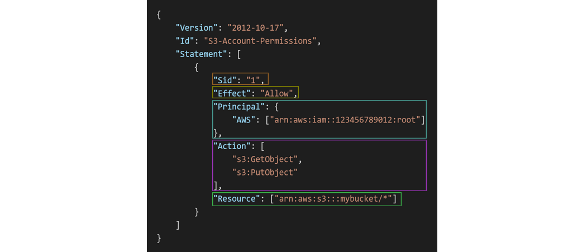

* Consists of
  * **Version:** Policy Language Version, always include “2012-10-17”
  * **Id:** An Identifier for the Policy (optional)
  * **Statement:** One or more individual Statements (required)
* Statements consists of
  * **Sid:** An identifier for the Statement (optional)
  * **Effect:** Whether the Statement allows or denies access (Allow, Deny)
  * **Principal:** Account/User/Role to which this Policy applied to
  * **Action:** List of Actions this Policy allows or denies
  * **Resource:** List of Resources to which the Actions applied to
  * **Condition:** Conditions for when this Policy is in effect (optional)

### About Policies
* We can `Attach/Dettach` Policies to `Users/Groups`.
  * Go to `Users/Groups`
  * In `Permissions`, we can Add/Remove `Permissions policies`.
* We can create Policies of your Own
  * Go to `Policies`
  * Click `Create policy`
    * Select `Service`, `Actions allowed` and `Resources`
    * Give `Policy name`
    * Click `Create policy`.
* In `Policies`, click on `Policy name`
  * It shows `Permissions defined in this policy`
  * Click on `JSON` to show that Policy JSON Format.

## IAM Password Policy
* Strong Passwords = higher security for your account.
* In AWS, you can setup a Password Policy:
  * Set a minimum password length
  * Require specific character types:
    * including uppercase letters
    * lowercase letters
    * numbers
    * non-alphanumeric characters
  * Allow all IAM Users to change their own Passwords
  * Require Users to change their Password after some time (password expiration)
  * Prevent Password re-use

### Create Password Policy
* In IAM, go to `Account settings` in Access management.
* In Password policy, click `Edit`.
* Select `Custom` to Apply customized password requirements.
* Select required Options and click `Save changes`.

## Multi Factor Authentication (MFA)
* Users have access to your Account and can possibly change Configurations or Delete Resources in your AWS Account.
* You protect your Root Accounts and IAM users using MFA.
* MFA = Password you know + Security Device you own.
* **Main benefit of MFA:** If a Password is stolen or hacked, the Account is not compromised.

### Add MFA to Root Account
* In AWS Console, click on Root Username and select `Security credentials`.
* In `Multi-factor authentication (MFA)`, select `Assign MFA device`.
  * Step 1 - `Select MFA device`
    * Give `Device name`
    * Select `Device options` (In this case we are using `Authenticator app`)
  * Step 2 - `Set up device`
    * Click `Show QR code` and Scan the QR Code with Authenticator App.
    * Add Authenticator App Codes in `Type two consecutive MFA codes below`
  * Click `Add MFA`.

## How Can Users Access AWS
* To Access AWS, we have three options:
  * **AWS Management Console:** Protected by Password + MFA
  * **AWS Command Line Interface (CLI):** Protected by Access Keys
  * **AWS Software Developer Kit (SDK):** For Code: Protected by Access Keys
* Access Keys are generated through the AWS Console.
  * Users manage their own Access Keys.
  * Access Keys are Secret, just like a Password. Don’t share them
    * Access Key ID ~= Username
    * Secret Access Key ~= Password

### AWS CLI
* A Tool that enables you to interact with AWS Services using commands in your Command-Line Shell.
* Direct access to the Public APIs of AWS Services.
* You can develop scripts to manage your Resources.
* Alternative to using AWS Management Console.

#### Install & Configure AWS CLI
* [Refer Here](https://docs.aws.amazon.com/cli/latest/userguide/getting-started-install.html) for Official Site.
* In that select your Operating System and follow the Steps.
* After installation check the version `aws --version`
* Create Access Keys and Configure AWS. Use command `aws configure`
  * Provide Access Key, Secret Access Key and Region.
* After successful Configuration, check the configuration using basic command `aws iam list-users --> List the IAM Users`.

#### Create Access Keys
* Go to `IAM Users` and click on User.
* In User `Security credentials`, navigate to `Access keys` and click `Create access key`.
  * Step 1 - `Access key best practices & alternatives`
    * In Use case, select `Command Line Interface (CLI)`
  * Step 2 - `Set description tag`
    * Provide `Description tag value`
    * Click `Create access key`.
  * Step 3 - `Retrieve access keys`
    * Save `Access key & Secret access key` by clicking `Download .csv file`

### AWS SDK (Software Development Kit)
* Language-specific APIs (set of libraries).
* Enables you to access and manage AWS Services Programmatically.
* Embedded within your Application.
* Supports
  * SDKs (JavaScript, Python, PHP, .NET, Ruby, Java, Go, Node.js, C++)
  * Mobile SDKs (Android, iOS, …)
  * IoT Device SDKs (Embedded C, Arduino, …)
* Example: AWS CLI is built on AWS SDK for Python.

## AWS CloudShell
* AWS CloudShell is available on top right side .
* AWS CloudShell is a Terminal in AWS Console comes with AWS CLI pre-installed.
* In AWS CloudShell
  * `Actions:` Used to Upload and Download files.
  * `Settings:` Used to change Display Preferences.

## IAM Roles for Services
* Some AWS service will need to perform actions on your behalf.
* To do so, we will assign Permissions to AWS services with IAM Roles.
* **Common Roles:**
  * EC2 Instance Roles
  * Lambda Function Roles
  * Roles for CloudFormation
  

### Create Role
* Go to IAM, in Access management select `Roles`.
* Click `Create role`.
  * Step 1 - Select trusted entity
    * Select `Trusted entity type` to `AWS service`
    * Select `Use case`
  * Step 2 - `Add permissions`
    * Provide `Permissions policies`
  * Step 3 - `Name, review, and create`
    * Give `Role name`
    * Check Details and click `Create role`.

## IAM Security Tools
* **IAM Credentials Report (Account-Level)**
  * A report that lists all your Account's Users and the status of their various Credentials.
  * For `Credentials Report:`
    * Go to IAM, In Access reports select `Credential report`
    * Click `Download credentials report`.
* **IAM Access Advisor (User-Level)**
  * Access advisor shows the Service permissions granted to a User and when those Services were last accessed.
  * You can use this information to revise your Policies.
  * For `Access Advisor Report:`
    * Go to IAM Users and select User.
    * Select `Last Accessed` and it shows the Report.

## IAM Guidelines & Best Practices
* Don’t use the root account except for AWS account setup.
* One Physical User = One AWS User.
* Assign Users to Groups and assign Permissions to Groups.
* Create a Strong Password Policy.
* Use and enforce the use of Multi Factor Authentication (MFA).
* Create and use Roles for giving Permissions to AWS Services.
* Use Access Keys for Programmatic Access (CLI / SDK).
* Audit Permissions of your Account using IAM Credentials Report & IAM Access Advisor.
* Never share IAM Users & Access Keys.

## IAM Section – Summary
* **Users:** Mapped to a Physical User, has a Password for AWS Console.
* **Groups:** Contains Users only.
* **Policies:** JSON document that outlines Permissions for Users or Groups.
* **Roles:** For EC2 Instances or AWS Services.
* **Security:** MFA + Password Policy.
* **AWS CLI:** Manage your AWS Services using the Command-Line.
* **AWS SDK:** Manage your AWS Services using a Programming Language.
* **Access Keys:** Access AWS using the CLI or SDK.
* **Audit:** IAM Credential Reports & IAM Access Advisor.

## AWS Budget Setup
* Click on Account Username and select `Billing and Cost Management`.
* IAM Users are by default they didn't have access to `Billing and Cost Management` even they have `Administrator Access`.
  * To Enable,
    * Go to IAM Root User Account and click Username, select `Account`.
    * In that navigate to `IAM user and role access to Billing information` and click `Edit`.
    * Select `Activate IAM Access` and click `Update`.
  * Now IAM Users can access `Billing and Cost Management` who have Administrator Access.

### Create Budget
* Go to Billing and Cost Management, select `Budgets` in Budgets and Planning.
* Click `Create budget`.
  * Select `Budget setup` - Use a template (simplified).
  * Select `Templates` based on requirement.
  * Give `Budget name` and provide `Email recipients`.
  * Click `Create budget`.


# Amazon EC2
* EC2 is one of the most popular of AWS offering.
* EC2 = Elastic Compute Cloud = Infrastructure as a Service.
* It mainly consists in the capability of
  * Renting Virtual Machines (EC2)
  * Storing Data on Virtual Drives (EBS)
  * Distributing load across Machines (ELB)
  * Scaling the Services using an Auto-Scaling Group (ASG)
* Knowing EC2 is fundamental to understand how the Cloud works.

## EC2 Sizing & Configuration Options
* Operating System (**OS**): Linux, Windows or MacOS
* How much Compute Power & Cores (**CPU**)
* How much Random-Access Memory (**RAM**)
* How much Storage Space:
  * Network-Attached (**EBS & EFS**)
  * Hardware (**EC2 Instance Store**)
* Network Card: Speed of the Card, Public IP Address
* Firewall Rules: **Security Group**
* Bootstrap Script (Configure at first Launch): **EC2 User Data**

## EC2 User Data
* It is possible to bootstrap our Instances using an EC2 User Data Script.
* Bootstrapping means Launching Commands when a Machine Starts.
* That Script is only run once at the Instance first Start.
* EC2 User Data is used to Automate boot Tasks such as:
  * Installing Updates
  * Installing Software
  * Downloading Common Files from the Internet
  * Anything you can think of
* The EC2 User Data Script runs with the Root User.

## Launch instance
* Go to EC2 and click `Launch instance`.
* Give `Name` in Name and tags.
* Select `AMI` in Application and OS Images (Amazon Machine Image).
* Select `Instance type`.
* Create or Add `Key pair (login)`
  * Click `Create new key pair`
  * Give `Key pair name` and click `Create key pair`.
* In `Network settings`, Create New Security Group or Select an Existing Security Group.
  * Select required Ports to allow Traffic.
* `Configure storage`, in that change Volume Size if required.
* In `Advanced details`, navigate to `User data` and provide required User Data.
  * User Data is knowthing but Commands
  * In User Data, we first provide `#!/bin/bash` and then give Commands.
  * Sample User Data:
    ```
    #!/bin/bash
    # install httpd on Amazon Linux
    yum update -y
    yum install -y httpd
    systemctl start httpd
    systemctl enable httpd
    echo "<h1>Hello World from $(hostname -f)</h1>" > /var/www/html/index.html
    ```
* Check `Summary`.
* Click `Launch instance`.

### Start/Stop/Terminate Instance
* Select Instance and click `Instance state`.
* Select required Action.

## Instance Types
* We can use different types of EC2 Instances that are optimised for different use cases.
* [Refer Here](https://aws.amazon.com/ec2/instance-types/) for Official docs.
* Instance Types are
  * General Purpose
  * Compute Optimized
  * Memory Optimized
  * Accelerated Computing
  * Storage Optimized
  * HPC Optimized
  * Instance Features
  * Measuring Instance Performance
* AWS has the naming convention: **m5.2xlarge**
  * `m:` Instance Class
  * `5:` Generation (AWS Improves then over Time)
  * `2xlarge:` Size within the Instance Class
#### General Purpose
* Great for a diversity of `Workloads` such as Web Servers or Code Repositories.
* Balance between:
  * Compute
  * Memory
  * Networking
* In the course, we will be using the t2.micro which is a General Purpose EC2 Instance.
#### Compute Optimized
* Great for compute-intensive tasks that require `high performance processors`:
  * Batch Processing Workloads
  * Media Transcoding
  * High Performance Web Servers
  * High Performance Computing (HPC)
  * Scientific Modeling & Machine Learning
  * Dedicated Gaming Servers
#### Memory Optimized
* Fast performance for workloads that process `large data sets in memory`
* Use cases:
  * High performance, relational/non-relational databases
  * Distributed web scale cache stores
  * In-memory databases optimized for BI (business intelligence)
  * Applications performing real-time processing of big unstructured data
#### Storage Optimized
* Great for `storage-intensive tasks` that require high, sequential read and write access to large data sets on local storage.
* Use cases:
  * High frequency online transaction processing (OLTP) systems
  * Relational & NoSQL databases
  * Cache for in-memory databases (for example, Redis)
  * Data warehousing applications
  * Distributed file systems

## Security Groups
* Security Groups are the fundamental of Network Security in AWS.
* They control how traffic is allowed into or out of our EC2 Instances.
  
* Security groups only contain rules.
* Security groups rules can reference by IP or by security group.
* Security groups are acting as a “firewall” on EC2 instances
* They regulate:
  * Access to Ports
  * Authorised IP ranges – IPv4 and IPv6
  * Control of inbound network (from other to the instance)
  * Control of outbound network (from the instance to other)
* Security Groups Diagram
  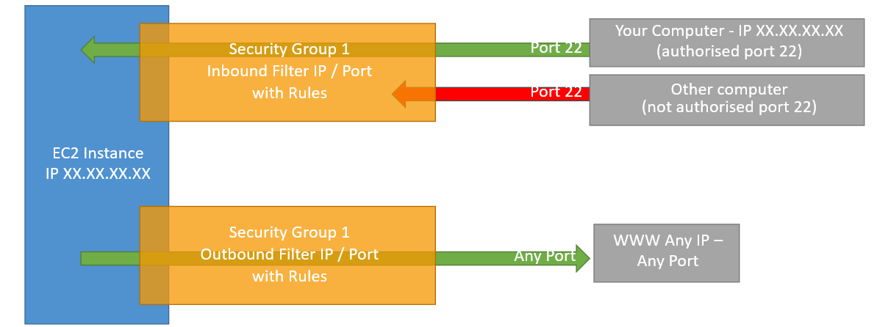
* Referencing other Security Groups Diagram
  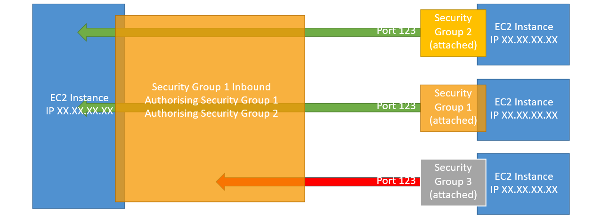

### Security Groups Good to know
* Can be attached to multiple instances.
* Locked down to a region / VPC combination.
* Does live “outside” the EC2 – if traffic is blocked the EC2 instance won’t see it.
* It’s good to maintain one separate security group for SSH access.
* If your application is not accessible (time out), then it’s a security group issue.
* If your application gives a “connection refused“ error, then it’s an application error or it’s not launched.
* All inbound traffic is blocked by default.
* All outbound traffic is authorised by default.

### Classic Ports to know
* 22 = SSH (Secure Shell) - log into a Linux instance.
* 21 = FTP (File Transfer Protocol) – upload files into a file share.
* 22 = SFTP (Secure File Transfer Protocol) – upload files using SSH.
* 80 = HTTP – access unsecured websites.
* 443 = HTTPS – access secured websites.
* 3389 = RDP (Remote Desktop Protocol) – log into a Windows instance.

### Create Security Group
* Go to EC2, in Network & Security click `Security Groups`.
* Click `Create security group`.
  * Give `Security group name`, `Description` and select `VPC`.
  * Add `Inbound rules`
    * Click `Add rule`
    * Select `Type`, `Protocol`, `Port range` and `Source`
    * Provide `Tags`
  * Click `Create security group`.

### Update Inbound Rules to Security Group
* Go to Instances, select Instance.
  * Select `Security`, in `Security details` attached Security Groups are available in `Security groups`.
  * Click on required Security Group.
<center> (or) </center>

* Go to EC2, in Network & Security click `Security Groups`.
  * Select required Security Group.
* In `Inbound rules`, we can Add/Remove Inbound Rules.
  * Click `Edit inbound rules`
  * Click `Add rule`
  * Select `Type`, `Protocol`, `Port range` and `Source`
  * Click `Save rules`.

## SSH into EC2 Instance
* SSH is one of the most important function. It allows you to control a remote machine, all using the command line.
  ```
  ssh -i <.pem file along with path> <username>@<publicIP>
  ```

## EC2 Instance Connect
* Connect to your EC2 instance within your browser.
* No need to use your key file that was downloaded.
* The “magic” is that a temporary key is uploaded onto EC2 by AWS.
* Need to make sure the port 22 is still opened!
* Connect to Instance:
  * Select Instance and click `Connect`.
  * Choose `EC2 Instance Connect` and click `Connect`.
* Now SSH Connection is established to Instance.
* EC2 Instance Connect is a feature of AWS that provides a secure way to connect to your Linux Instances over Secure Shell.

## EC2 Instances Purchasing Options
* **On-Demand Instances:** short workload, predictable pricing, pay by second
* **Reserved:** (1 & 3 years)
  * **Reserved Instances:** long workloads
  * **Convertible Reserved Instances:** long workloads with flexible instances
* **Savings Plans:** commitment to an amount of usage, long workload (1 & 3 years)
* **Spot Instances:** short workloads, cheap, can lose instances (less reliable)
* **Dedicated Hosts:** book an entire physical server, control instance placement
* **Dedicated Instances:** no other customers will share your hardware
* **Capacity Reservations:** reserve capacity in a specific AZ for any duration

### EC2 On Demand
* Pay for what you use:
  * Linux or Windows - billing per second, after the first minute
  * All other operating systems - billing per hour 
* Has the highest cost but no upfront payment
* No long-term commitment
* Recommended for **short-term** and **un-interrupted workloads**, where you can't predict how the application will behave

### EC2 Reserved Instances
* **Up to 72% discount** compared to On-demand
* You reserve a specific instance attributes (**Instance Type, Region, Tenancy, OS**)
* **Reservation Period – 1 year** (+discount) or **3 years** (+++discount)
* **Payment Options** – **No Upfront** (+), **Partial Upfront** (++), **All Upfront** (+++)
* **Reserved Instance’s Scope** – **Regional** or **Zonal** (reserve capacity in an AZ)
* Recommended for steady-state usage applications (think database)
* You can buy and sell in the Reserved Instance Marketplace
* **Convertible Reserved Instance**
  * Can change the EC2 instance type, instance family, OS, scope and tenancy
  * Up to 66% discount

### EC2 Savings Plans
* Get a discount based on long-term usage (up to 72% - same as RIs)
* Commit to a certain type of usage ($10/hour for 1 or 3 years)
* Usage beyond EC2 Savings Plans is billed at the On-Demand price
* Locked to a specific instance family & AWS region (e.g., M5 in us-east-1)
* Flexible across:
  * Instance Size (e.g., m5.xlarge, m5.2xlarge)
  * OS (e.g., Linux, Windows)
  * Tenancy (Host, Dedicated, Default)

### EC2 Spot Instances
* Can get a **discount of up to 90%** compared to On-demand
* Instances that you can “lose” at any point of time if your max price is less than the current spot price
* The **MOST cost-efficient** instances in AWS
* **Useful for workloads that are resilient to failure**
  * Batch jobs
  * Data analysis
  * Image processing
  * Any **distributed** workloads
  * Workloads with a flexible start and end time
* **Not suitable for critical jobs or databases**

### EC2 Dedicated Hosts
* A physical server with EC2 instance capacity fully dedicated to your use
* Allows you address **compliance requirements** and **use your existing server- bound software licenses** (per-socket, per-core, pe—VM software licenses)
* Purchasing Options:
  * **On-demand** – pay per second for active Dedicated Host
  * **Reserved** - 1 or 3 years (No Upfront, Partial Upfront, All Upfront)
* The most expensive option
* Useful for software that have complicated licensing model (BYOL – Bring Your Own License)
* Or for companies that have strong regulatory or compliance needs

### EC2 Dedicated Instances
* Instances run on hardware that’s dedicated to you
* May share hardware with other instances in same account
* No control over instance placement (can move hardware after Stop / Start)

### EC2 Capacity Reservations
* Reserve **On-Demand** instances capacity in a specific AZ for any duration
* You always have access to EC2 capacity when you need it
* **No time commitment** (create/cancel anytime), **no billing discounts**
* Combine with Regional Reserved Instances and Savings Plans to benefit from billing discounts
* You’re charged at On-Demand rate whether you run instances or not
* Suitable for short-term, uninterrupted workloads that needs to be in a specific AZ

### Which purchasing option is right for me?
* **On demand:** coming and staying in resort whenever we like, we pay the full price
* **Reserved:** like planning ahead and if we plan to stay for a long time, we may get a good discount.
* **Savings Plans:** pay a certain amount per hour for certain period and stay in any room type (e.g., King, Suite, Sea View, …)
* **Spot instances:** the hotel allows people to bid for the empty rooms and the highest bidder keeps the rooms. You can get kicked out at any time
* **Dedicated Hosts:** We book an entire building of the resort
* **Capacity Reservations:** you book a room for a period with full price even you don’t stay in it

## AWS Charges for IPv4 Addresses
* Starting February 1st 2024, there’s a charge for all Public IPv4 created in your account
* **0.005`$` per hour of Public IPv4 (~3.6`$` per month)**
* For new accounts in AWS, you have a free tier for the **EC2 service:** 750 hours of Public IPv4 per month for the first 12 months
* **For all other services there is no free tier**
  
* **What about IPv6?**
  * Unfortunately, many Internet Service Provider (ISP) around the world don’t support IPv6
  * We can test IPv6 by going to  https://test-ipv6.com/ 
  * If you use IPv6 in this course, you’re on your own (security groups, networking…) but you can do it! 
* **How to troubleshoot charges?**
  * Go into your AWS Bill
  * Look into the AWS Public IP Insights service
  * [Refer Here](https://repost.aws/articles/ARknH_OR0cTvqoTfJrVGaB8A/why-am-i-seeing-charges-for-public-ipv4-addresses-when-i-am-under-the-aws-free-tier) for Article

## Amazon VPC IP Address Manager
* Amazon VPC IP Address Manager (IPAM) is a feature provided by AWS to help you manage IP addresses efficiently and securely within your AWS environment.
* It is particularly useful when you are working with large or complex network architectures involving multiple Virtual Private Clouds (VPCs), on-premises networks, and hybrid environments.

### Create IPAM 
* Go to `Amazon VPC IP Address Manager (IPAM)`
  * `Allow data replication`
  * Select `IPAM tier`
  * In `IPAM settings`,
    * Give `Name tag`
    * Select `Operating Regions`
  * Click `Create IPAM`
* In Amazon VPC IP Address Manager (IPAM), click `Public IP insights`
  * In that shows All Public IP Address Types.

## EC2 Spot Instance Requests
* Can get a discount of up to 90% compared to On-demand
* Define **max spot price** and get the instance while **current spot price < max**
  * The hourly spot price varies based on offer and capacity
  * If the current spot price > your max price you can choose to stop or terminate your instance with a 2 minutes grace period.
* Other strategy: **Spot Block**
  * “block” spot instance during a specified time frame (1 to 6 hours) without interruptions
  * In rare situations, the instance may be reclaimed
* **Used for batch jobs, data analysis, or workloads that are resilient to failures**. 
* **Not great for critical jobs or databases**
* **EC2 Spot Instances Pricing:**
  
* **How to terminate Spot Instances:**
  

### Spot Fleets
* Spot Fleets = set of Spot Instances + (optional) On-Demand Instances
* The Spot Fleet will try to meet the target capacity with price constraints
  * Define possible launch pools: instance type (m5.large), OS, Availability Zone
  * Can have multiple launch pools, so that the fleet can choose
  * Spot Fleet stops launching instances when reaching capacity or max cost
* Strategies to allocate Spot Instances:
  * **lowestPrice:** from the pool with the lowest price (cost optimization, short workload)
  * **diversified:** distributed across all pools (great for availability, long workloads)
  * **capacityOptimized:** pool with the optimal capacity for the number of instances
  * **priceCapacityOptimized (recommended):** pools with highest capacity available, then select the pool with the lowest price (best choice for most workloads)
* Spot Fleets allow us to automatically request Spot Instances with the lowest price

## EC2 Instance Roles
* Always prefer IAM Roles for EC2 Instances when your Application need to access AWS Resources.
* EC2 Instance Roles are better because they are more secure, esier to manage and eliminate the need for hardcoded Credentials.
* We create Roles with required Policies and attach that Roles to Instance. This can be accessed without AWS Configuration.

### Attach Roles to Instance
* Go to EC2 Instance and select Instance.
* Click `Actions --> Security --> Modify IAM Role`.
  * Select `IAM role`.
  * Click `Update IAM role`.
* Now the Instance was access that particular Resource.

## Private vs Public IP (IPv4)
* Networking has two sorts of IPs. IPv4 and IPv6:
  * IPv4: `1.160.10.240`
  * IPv6: `3ffe:1900:4545:3:200:f8ff:fe21:67cf`
* In this course, we will only be using IPv4.
* IPv4 is still the most common format used online.
* IPv6 is newer and solves problems for the Internet of Things (IoT).
* IPv4 allows for 3.7 billion different addresses in the public space
* IPv4: `[0-255].[0-255].[0-255].[0-255]`
* Private vs Public IP (IPv4) Example:
  

### Private vs Public IP (IPv4) Fundamental Differences
* **Public IP:**
  * Public IP means the machine can be identified on the internet (WWW)
  * Must be unique across the whole web (not two machines can have the same public IP).
  * Can be geo-located easily
* **Private IP:**
  * Private IP means the machine can only be identified on a private network only
  * The IP must be unique across the private network
  * BUT two different private networks (two companies) can have the same IPs. 
  * Machines connect to WWW using a NAT + internet gateway (a proxy)
  * Only a specified range of IPs can be used as private IP
* **Private vs Public IP (IPv4) in AWS:**
  * By default, your EC2 machine comes with:
    * A private IP for the internal AWS Network
    * A public IP, for the WWW
  * When we are doing SSH into our EC2 machines:
    * We can’t use a private IP, because we are not in the same network 
    * We can only use the public IP. 
  * If your machine is stopped and then started, **the public IP can change**.

## Elastic IPs
* When you stop and then start an EC2 instance, it can change its public IP.
* If you need to have a fixed public IP for your instance, you need an Elastic IP
* An Elastic IP is a public IPv4 IP you own as long as you don’t delete it
* You can attach it to one instance at a time
* With an Elastic IP address, you can mask the failure of an instance or software by rapidly remapping the address to another instance in your account. 
* You can only have 5 Elastic IP in your account (you can ask AWS to increase that).
* Overall, try to avoid using Elastic IP:
  * They often reflect poor architectural decisions
  * Instead, use a random public IP and register a DNS name to it
  * Or, as we’ll see later, use a Load Balancer and don’t use a public IP

### Allocate Elastic IP address
* In EC2, select `Elastic IPs` in Network & Security.
* Click `Allocate Elastic IP address`.
  * Give `Tags`.
  * Click `Allocate`.
* **Attach Elastic IP to Instance:**
  * Select Elastic IP.
  * Click `Actions --> Associate Elastic IP address`.
    * Select `Resource type` (Instance)
    * Select `Instance` and `Private IP address`.
    * Click `Associate`.
* **Delete Elastic IP:**
  * First `Dissociate Elastic IP address`.
  * Then click `Actions --> Release Elastic IP addresses`.
  * Click `Release`.

## Placement Groups
* Sometimes you want control over the EC2 Instance placement strategy
* That strategy can be defined using placement groups
* When you create a placement group, you specify one of the following strategies for the group:
  * **Cluster:** clusters instances into a low-latency group in a single Availability Zone
  * **Spread:** spreads instances across underlying hardware (max 7 instances per group per AZ)
  * **Partition:** spreads instances across many different partitions (which rely on different sets of racks) within an AZ. Scales to 100s of EC2 instances per group (Hadoop, Cassandra, Kafka)

### Cluster - Placement Groups
* Pros: Great network (10 Gbps bandwidth between instances with Enhanced Networking enabled - recommended)
* Cons: If the AZ fails, all instances fails at the same time
* Use case: 
  * Big Data job that needs to complete fast
  * Application that needs extremely low latency and high network throughput
  

### Spread - Placement Groups
* Pros:
  * Can span across Availability Zones (AZ)
  * Reduced risk is simultaneous failure
  * EC2 Instances are on different physical hardware
* Cons: 
  * Limited to 7 instances per AZ per placement group
* Use case: 
  * Application that needs to maximize high availability
  * Critical Applications where each instance must be isolated from failure from each other
  

### Partition - Placements Groups
* Up to 7 partitions per AZ
* Can span across multiple AZs in the same region
* Up to 100s of EC2 instances
* The instances in a partition do not share racks with the instances in the other partitions
* A partition failure can affect many EC2 but won’t affect other partitions
* EC2 instances get access to the partition information as metadata
* Use cases: HDFS, HBase, Cassandra, Kafka
  

### Create Placement Group
* Go to EC2, click `Placement Groups` in Network & Security.
* Click `Create placement group`.
  * Give `Name`
  * Select `Placement strategy`
  * Click `Create group`.
* **Placement Groups are selected during Launch Instance:**
  * During Launch Instance, go to `Advanced details`
  * In that select `Placement group`.

## Elastic Network Interfaces (ENI)
* Logical component in a VPC that represents a **virtual network card**
* The ENI can have the following attributes:
  * Primary private IPv4, one or more secondary IPv4
  * One Elastic IP (IPv4) per private IPv4
  * One Public IPv4
  * One or more security groups
  * A MAC address 
* You can create ENI independently and attach them on the fly (move them) on EC2 instances for failover
* Bound to a specific availability zone (AZ)
* It helpful when we are using Instance Private IP. If that Instance fails, we create another Instance but that Instance have different Public IP
  * To overcome this, we create ENI and attach to Instance
  * If the Instance fails, we create another Instance and attach the same ENI to that Instance
  * In both times we can use ENI Private IP
  

### Create Network Interface (ENI)
* Go to EC2, select `Network Interfaces` in Network & Security.
* Click `Create network interface`.
  * Give `Description`
  * Select `Subnet` (Must match with Instance)
  * Add `Security groups`
  * Click `Create network interface`.
* **Attach ENI to Instance:**
  * Select ENI.
  * Click `Actions --> Attach`.
    * Select `VPC` and `Instance`
    * Click `Attach`.
* Select Instance, click `Networking`
  * In that shows attached `Network Interfaces`.

## EC2 Hibernate
* We know we can stop, terminate instances
  * **Stop:** the data on disk (EBS) is kept intact in the next start
  * **Terminate:** any EBS volumes (root) also set-up to be destroyed is lost
* On start, the following happens:
  * **First start:** the OS boots & the EC2 User Data script is run
  * **Following starts:** the OS boots up 
  * Then your application starts, caches get warmed up, and that can take time!
* Introducing EC2 Hibernate:
  * The in-memory (RAM) state is preserved
  * The instance boot is much faster! (the OS is not stopped / restarted)
  * Under the hood: the RAM state is written to a file in the root EBS volume
  * **The root EBS volume must be encrypted**
* Use cases:
  * Long-running processing
  * Saving the RAM state
  * Services that take time to initialize
  

### EC2 Hibernate – Good to know
* **Supported Instance Families:** C3, C4, C5, I3, M3, M4, R3, R4, T2, T3, …
* **Instance RAM Size:** must be less than 150 GB.
* **Instance Size:** not supported for bare metal instances.
* **AMI:** Amazon Linux 2, Linux AMI, Ubuntu, RHEL, CentOS & Windows… 
* **Root Volume:** must be EBS, encrypted, not instance store, and large
* Available for **On-Demand, Reserved** and **Spot Instances**
* An instance can **NOT be hibernated more than 60 days**

### EC2 Hibernate Creation
* We can select Hibernate during Launch Instance.
* During `Launch instance`, click `Advanced details`
  * Navigate to `Stop - Hibernate behavior` and `Enable` it.
  * Also need to Encrypt Volume
    * In `Configure storage`, click `Advanced`
    * Select the Volume
    * In Encrypted `-->` `Encrypted` it.
    * In KMS key, select default keys
  * Then provide all necessary information and click `Launch instance`.
* **To Hibernate Instance:**
  * Select Instance
  * Click `Instance state --> Hibernate instance`.
* We can identify using `uptime` command:
  * For Normal Instances, when we Stop and Start the Instance the uptime is starts from `0`.
  * But for Hibernate Instances the uptime continuous.


# EC2 Instance Storage
## EBS Volume
* **An EBS (Elastic Block Store) Volume is a network drive** you can attach to your instances while they run
* It allows your instances to persist data, even after their termination
* **They can only be mounted to one instance at a time** (at the CCP level)
* They are bound to **a specific Availability Zone**
* Analogy: Think of them as a “network USB stick” 
* Free tier: 30 GB of free EBS storage of type General Purpose (SSD) or Magnetic per month
* It’s a network drive (i.e. not a physical drive)
  * It uses the network to communicate the instance, which means there might be a bit of latency
  * It can be detached from an EC2 instance and attached to another one quickly
* It’s locked to an Availability Zone (AZ)
  * An EBS Volume in us-east-1a cannot be attached to us-east-1b
  * To move a volume across, you first need to snapshot it
* Have a provisioned capacity (size in GBs, and IOPS)
  * You get billed for all the provisioned capacity
  * You can increase the capacity of the drive over time
* EBS Volume Example:
  

### EBS – Delete on Termination attribute
* Controls the EBS behaviour when an EC2 instance terminates
  * By default, the root EBS volume is deleted (attribute enabled)
  * By default, any other attached EBS volume is not deleted (attribute disabled)
* This can be controlled by the AWS console / AWS CLI
* **Use case: preserve root volume when instance is terminated**
* We can change this `Termination Policy during Launch Instance`
  * In `Configure storage`, click `Advanced`
  * Select Volume, in `Delete on termination` change the behaviour if requirement.
  

### Create Volume
* Go to EC2, select `Volumes` in Elastic Block Store.
* Click `Create volume`.
  * Select `Volume type`
  * Give `Size (GiB)`
  * Select `Availability Zone` (Must match with Instance AZ)
  * Add `Tags`
  * Click `Create volume`.
* **Attach Volume to Instance:**
  * Select Volume.
  * Click `Actions --> Attach volume`
  * Select `Instance` and `Device name`
  * Click `Attach volume`.
* Select `Instance` and click `Storage`
  * In `Block devices`, shows attached Volumes.

## EBS Snapshots
* Make a backup (Snapshot) of your EBS volume at a point in time
* Not necessary to detach volume to do snapshot, but recommended
* Can copy snapshots across AZ or Region
  

### EBS Snapshots Features
* **EBS Snapshot Archive**
  * Move a Snapshot to an ”archive tier” that is 75% cheaper
  * Takes within 24 to 72 hours for restoring the archive
* **Recycle Bin for EBS Snapshots**
  * Setup rules to retain deleted snapshots so you can recover them after an accidental deletion
  * Specify retention (from 1 day to 1 year)
* **Fast Snapshot Restore (FSR)**
  * Force full initialization of snapshot to have no latency on the first use ($$$)
  

### Create Snapshot
* Go to EC2 Volumes and select Volume.
* Click `Actions --> Create snapshot`.
  * Give `Description` and `Tags`
  * Click `Create snapshot`.
* Go to EC2, select `Snapshots` in Elastic Block Store.
  * The Snapshots are available here.
#### Create Volume from Snapshot
* Go to Snapshots and select Snapshot.
* Click `Actions --> Create volume from snapshot`.
  * Select `Volume type`
  * Give `Size (GiB)`
  * Select `Availability Zone`
  * Add `Tags`
  * Click `Create volume`.
* **By using this process, we can move Volume from one AZ to another AZ.**
#### Copy Snapshot to Different Regions
* Go to Snapshots and select Snapshot.
* Click `Actions --> Copy snapshot`.
  * Select `Destination Region`
  * Give `Tags`
  * Select `Copy snapshot`.
* **By using this we can copy Volumes from one Region to another Region.**

### Protect Snapshots from Accidental Deletion
* To protect Snapshots from accidental deletion, we are using Recycle Bin.
* Recycle Bin Protect your Amazon EBS Snapshots and Amazon Machine Images (AMIs) from accidental deletion.
* **Create Recycle Bin:**
  * Go to Snapshots and click `Recycle Bin`.
  * Click `Create retention rule`.
    * Give `Retention rule name` and `Retention rule description`.
    * Select `Resource type` to EBS Snapshots.
      * Select Apply Match.
    * Give `Retention period`
    * Click `Create retention rule`.
* If we delete the Snapshot, it stores in `Recycle Bin --> Resources`.
  * We can Recover it to our Snapshots.
  * Go to `Recycle Bin --> Resources`, in that select deleted Snapshot and click `Recover`.
  * Click `Recover resources`.

### Archive Snapshot
* Select Snapshot.
* Click `Actions --> Archiving --> Archive snapshot`.
* Click `Archive snapshot`.
* We want to use Archive Snapshot, first Restore the Snapshot.
* Restoration takes 24 to 72 hours.
* For Archived Snapshots, the `Storage tier` is changed from `Standard` to `Archive`.
* **For Restoring the Snapshot:**
  * Select Snapshot
  * Click `Actions --> Archiving --> Restore snapshot from archive`
  * Select `Restore type`
  * Click `Restore snapshot`.

## AMI (Amazon Machine Image)
* AMI are a **customization** of an EC2 instance
  * You add your own software, configuration, operating system, monitoring…
  * Faster boot / configuration time because all your software is pre-packaged
* AMI are built for a **specific region** (and can be copied across regions)
* You can launch EC2 instances from:
  * **A Public AMI:** AWS provided
  * **Your own AMI:** you make and maintain them yourself
  * **An AWS Marketplace AMI:** an AMI someone else made (and potentially sells)
* **AMI Process (from an EC2 instance)**
  * Start an EC2 instance and customize it
  * Stop the instance (for data integrity)
  * Build an AMI – this will also create EBS snapshots
  * Launch instances from other AMIs
  

### Create AMI from Instance
* Go to EC2 Instances and select Instance.
* Click `Actions --> Image and templates --> Create image`.
  * Give `Image name` and `Image description`
  * Provide `Tags`
  * Click `Create image`.
* Click `AMIs` in Images, in that Created Images are available.
* Once the Image is available, you can Launch Instances from Images.

### Launch Instance from Created Image
* Click `AMIs` in Images and select required AMI.
  * Click `Launch instance from AMI`
  * Provide all required information and click `Launch instance`.
<center> (or) </center>

* Go to EC2 and click `Launch instance`.
* In `Application and OS Images (Amazon Machine Image)`, click `My AMIs`
  * Select `Amazon Machine Image (AMI)`
  * Provide remaining all required information and click `Launch instance`.

## EC2 Instance Store
* EBS volumes are **network drives** with good but “limited” performance
* **If you need a high-performance hardware disk, use EC2 Instance Store**
* Better I/O performance
* EC2 Instance Store lose their storage if they’re stopped (ephemeral)
* Good for buffer / cache / scratch data / temporary content 
* Risk of data loss if hardware fails
* Backups and Replication are your responsibility

## EBS Volume Types
* EBS Volumes come in 6 types
  * **gp2 / gp3 (SSD):** General purpose SSD volume that balances price and performance for a wide variety of workloads
  * **io1 / io2 Block Express (SSD):** Highest-performance SSD volume for mission-critical low-latency or high-throughput workloads
  * **st1 (HDD):** Low cost HDD volume designed for frequently accessed, throughput-intensive workloads
  * **sc1 (HDD):** Lowest cost HDD volume designed for less frequently accessed workloads
* EBS Volumes are characterized in Size | Throughput | IOPS (I/O Ops Per Sec)
* When in doubt always consult the AWS documentation – it’s good!
* **Only gp2/gp3 and io1/io2 Block Express can be used as boot volumes**

### EBS Volume Types Use cases
#### General Purpose SSD
* Cost effective storage, low-latency 
* System boot volumes, Virtual desktops, Development and test environments
* 1 GiB - 16 TiB
* gp3:
  * Baseline of 3,000 IOPS and throughput of 125 MiB/s
  * Can increase IOPS up to 16,000 and throughput up to 1000 MiB/s independently
* gp2:
  * Small gp2 volumes can burst IOPS to 3,000
  * Size of the volume and IOPS are linked, max IOPS is 16,000
  * 3 IOPS per GB, means at 5,334 GB we are at the max IOPS
#### Provisioned IOPS (PIOPS) SSD
* Critical business applications with sustained IOPS performance
* Or applications that need more than 16,000 IOPS
* Great for **databases workloads** (sensitive to storage perf and consistency)
* io1 (4 GiB - 16 TiB):
  * Max PIOPS: 64,000 for Nitro EC2 instances & 32,000 for other
  * Can increase PIOPS independently from storage size
* io2 Block Express (4 GiB – 64 TiB):
  * Sub-millisecond latency
  * Max PIOPS: 256,000 with an IOPS:GiB ratio of 1,000:1
* Supports EBS Multi-attach
#### Hard Disk Drives (HDD)
* Cannot be a boot volume
* 125 GiB to 16 TiB
* Throughput Optimized HDD (st1)
  * Big Data, Data Warehouses, Log Processing
  * Max throughput 500 MiB/s – max IOPS 500
* Cold HDD (sc1):
  * For data that is infrequently accessed
  * Scenarios where lowest cost is important
  * Max throughput 250 MiB/s – max IOPS 250

### EBS –Volume Types Summary
  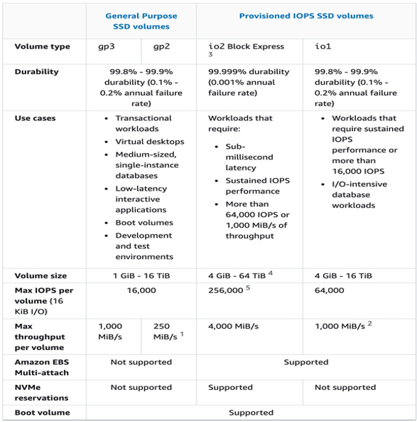
  

## EBS Multi-Attach – io1/io2 family
* Attach the same EBS volume to multiple EC2 instances in the same AZ
* Each instance has full read & write permissions to the high-performance volume
* Use case:
  * Achieve **higher application availability** in clustered Linux applications (ex: Teradata)
  * Applications must manage concurrent write operations
* **Up to 16 EC2 Instances at a time**
* Must use a file system that’s cluster-aware (not XFS, EXT4, etc…)
  

## EBS Encryption
* When you create an encrypted EBS volume, you get the following:
  * Data at rest is encrypted inside the volume
  * All the data in flight moving between the instance and the volume is encrypted
  * All snapshots are encrypted
  * All volumes created from the snapshot
* Encryption and decryption are handled transparently (you have nothing to do)
* Encryption has a minimal impact on latency
* EBS Encryption leverages keys from KMS (AES-256)
* Copying an unencrypted snapshot allows encryption
* Snapshots of encrypted volumes are encrypted

### Encryption: Encrypt an Unencrypted EBS Volume
* Create an EBS snapshot of the volume
* Encrypt the EBS snapshot ( using copy )
* Create new ebs volume from the snapshot ( the volume will also be encrypted ) 
* Now you can attach the encrypted volume to the original instance
#### Encrypt an unencrypted EBS volume
* Create a Snapshot for that UnEncrypted EBS Volume.
* Encrypt the Snapshot using Copy snapshot
  * Select Snapshot and click `Actions --> Copy snapshot`
  * In `Encryption`, tick `Encrypt this snapshot`
    * Select `KMS key`
  * Click `Copy snapshot`.
* Select Encrypted Snapshot and create Volume
  * Select Snapshot and click `Actions --> Create volume from snapshot`
  * In that we can see `Encryption` is enabled
  * Click `Create volume`.
<center> (or) </center>

* Create a Snapshot for that UnEncrypted EBS Volume.
* Create a Volume from that Snapshot.
  * Go to Snapshots, select Snapshot and click `Actions --> Create volume from snapshot`
  * In `Encryption`, tick `Encrypt this snapshot`
    * Select `KMS key`
  * Click `Create volume`.

## Amazon EFS – Elastic File System
* Managed NFS (network file system) that can be mounted on many EC2
* EFS works with EC2 instances in multi-AZ
* Highly available, scalable, expensive (3x gp2), pay per use
  

* Use cases: content management, web serving, data sharing, Wordpress
* Uses NFSv4.1 protocol
* Uses security group to control access to EFS
* **Compatible with Linux based AMI (not Windows)**
* Encryption at rest using KMS
* POSIX file system (~Linux) that has a standard file API
* File system scales automatically, pay-per-use, no capacity planning!

### EFS – Performance & Storage Classes
* **EFS Scale**
  * 1000s of concurrent NFS clients, 10 GB+ /s throughput
  * Grow to Petabyte-scale network file system, automatically
* **Performance Mode (set at EFS creation time)**
  * **General Purpose (default)** – latency-sensitive use cases (web server, CMS, etc…)
  * **Max I/O** – higher latency, throughput, highly parallel (big data, media processing)
* **Throughput Mode**
  * **Bursting** – 1 TB = 50MiB/s + burst of up to 100MiB/s
  * **Provisioned** – set your throughput regardless of storage size, ex: 1 GiB/s for 1 TB storage
  * **Elastic** – automatically scales throughput up or down based on your workloads
    * Up to 3GiB/s for reads and 1GiB/s for writes
    * Used for unpredictable workloads

### EFS – Storage Classes
* **Storage Tiers (lifecycle management feature – move file after N days)**
  * **Standard:** for frequently accessed files
  * **Infrequent access (EFS-IA):** cost to retrieve files, lower price to store. 
  * **Archive:** rarely accessed data (few times each year), 50% cheaper
  * Implement **lifecycle policies** to move files between storage tiers
* **Availability and durability**
  * Standard: Multi-AZ, great for prod
  * One Zone: One AZ, great for dev, backup enabled by default, compatible with IA (EFS One Zone-IA)
* Over 90% in cost savings
  

### Create Amazon Elastic File System (EFS)
* Go to `EFS`.
* Click `Create file system` and click `Customize`.
* Step 1 - `File system settings`
  * Give `Name`
  * Select `File system type`
    * `Regional:` Offers multiple AZ's within an AWS region. Chooses for Production.
    * `One Zone:` Offers single AZ. Chooses for Development.
  * In Automatic backups, `Enable automatic backups` its recommended.
  * Select `Lifecycle management`
    * Used to move data across different Storage tiers to save costs.
    * In Encryption, `Enable encryption of data at rest`
  * In Performance settings, select required `Throughput mode`
    * `Bursting:` Provides throughput that scales with the amount of storage for workloads with basic performance requirements.
    * `Elastic:` Use this mode for workloads with unpredictable I/O. With Elastic Throughput, performance automatically scales with your workload activity and you only pay for the throughput you use.
    * `Provisioned:` Use this mode if you can estimate your workload's throughput requirements. With Provisioned mode, you configure your file system's throughput and pay for throughput provisioned.
* Step 2 - `Network access`
  * Select `Virtual Private Cloud (VPC)`
  * In `Mount targets`, select `Security groups` for AZs
* Step 3 - `File system policy`
  * It's optional
* Step 4 - `Review and create`
  * Check details and click `Create`.
* After that, open created File System
  * `Metered size:` Its shows the Size we used. We can pay only for the Storage used.

### Mount EFS to Instance
* Go to EC2 Instances and click `Launch instances`.
* In `Network settings`, click `Edit`
  * Select `Subnet`
* In `Configure storage`, File systems click `Edit`
  * Select `EFS`
  * Select `Add shared file system`
    * Select `File system` and `Mount point` (/mnt/efs/fs1)
* Add all other required information and click `Launch instance`.
* **Work Scenario:**
  * Launch Two Instances with EFS (Same File System & Mount Point) and select different Subnets.
  * Now connect both Instances and check Mount Point is present or not `ls /mnt/efs/fs1`
  * From One Instance, create a Text file with some data in that Mount Point
  * Next, in other Instance check the Mount Point and that Created Text file is available.

## EBS vs EFS
* **Elastic Block Storage:**
  * EBS volumes…
    * one instance (except multi-attach io1/io2)
    * are locked at the Availability Zone (AZ) level
    * gp2: IO increases if the disk size increases
    * gp3 & io1: can increase IO independently
  * To migrate an EBS volume across AZ
    * Take a snapshot 
    * Restore the snapshot to another AZ
    * EBS backups use IO and you shouldn’t run them while your application is handling a lot of traffic 
  * Root EBS Volumes of instances get terminated by default if the EC2 instance gets terminated. (you can disable that)
  
* **Elastic File System:**
  * Mounting 100s of instances across AZ
  * EFS share website files (WordPress)
  * Only for Linux Instances (POSIX)
  * EFS has a higher price point than EBS
  * Can leverage Storage Tiers for cost savings
  * Remember: EFS vs EBS vs Instance Store
  


# High Availability and Scalability: ELB & ASG
## Scalability & High Availability
* Scalability means that an application / system can handle greater loads by adapting. 
* There are two kinds of scalability:
  * Vertical Scalability
  * Horizontal Scalability (= elasticity)
* **Scalability is linked but different to High Availability**

### Vertical Scalability
* Vertically scalability means increasing the size of the instance
* For example, your application runs on a t2.micro
* Scaling that application vertically means running it on a t2.large
* Vertical scalability is very common for non distributed systems, such as a database. 
* RDS, ElastiCache are services that can scale vertically. 
* There’s usually a limit to how much you can vertically scale (hardware limit)

### Horizontal Scalability
* Horizontal Scalability means increasing the number of instances / systems for your application
* Horizontal scaling implies distributed systems.
* This is very common for web applications / modern applications
* It’s easy to horizontally scale thanks the cloud offerings such as Amazon EC2

### High Availability
* High Availability usually goes hand in hand with horizontal scaling
* High availability means running your application / system in at least 2 data centers (== Availability Zones)
* The goal of high availability is to survive a data center loss
* The high availability can be passive (for RDS Multi AZ for example)
* The high availability can be active (for horizontal scaling)

### High Availability & Scalability For EC2
* Vertical Scaling: Increase instance size (= scale up / down)
  * From: t2.nano - 0.5G of RAM, 1 vCPU
  * To: u-12tb1.metal – 12.3 TB of RAM, 448 vCPUs
* Horizontal Scaling: Increase number of instances (= scale out / in)
  * Auto Scaling Group
  * Load Balancer
* High Availability: Run instances for the same application across multi AZ
  * Auto Scaling Group multi AZ
  * Load Balancer multi AZ

## Load Balancing
* Load Balances are servers that forward traffic to multiple servers (e.g., EC2 instances) downstream
  
* **Use of Load Balancer:**
  * Spread load across multiple downstream instances
  * Expose a single point of access (DNS) to your application
  * Seamlessly handle failures of downstream instances
  * Do regular health checks to your instances
  * Provide SSL termination (HTTPS) for your websites
  * Enforce stickiness with cookies
  * High availability across zones
  * Separate public traffic from private traffic
* **Use of an Elastic Load Balancer:**
  * An Elastic Load Balancer is a **managed load balancer**
    * AWS guarantees that it will be working
    * AWS takes care of upgrades, maintenance, high availability
    * AWS provides only a few configuration knobs
  * It costs less to setup your own load balancer but it will be a lot more effort on your end
  * It is integrated with many AWS offerings / services
    * EC2, EC2 Auto Scaling Groups, Amazon ECS
    * AWS Certificate Manager (ACM), CloudWatch
    * Route 53, AWS WAF, AWS Global Accelerator

### Health Checks
* Health Checks are crucial for Load Balancers
* They enable the load balancer to know if instances it forwards traffic to are available to reply to requests
* The health check is done on a port and a route (/health is common)
* If the response is not 200 (OK), then the instance is unhealthy
  

### Types of Load Balancer on AWS
* AWS has **4 kinds of managed Load Balancers**
  * **Classic Load Balancer** (v1 - old generation) – 2009 – CLB
    * HTTP, HTTPS, TCP, SSL (secure TCP)
  * **Application Load Balancer** (v2 - new generation) – 2016 – ALB 
    * HTTP, HTTPS, WebSocket
  * **Network Load Balancer** (v2 - new generation) – 2017 – NLB 
    * TCP, TLS (secure TCP), UDP
  * **Gateway Load Balancer** – 2020 – GWLB 
    * Operates at layer 3 (Network layer) – IP Protocol
* Overall, it is recommended to use the newer generation load balancers as they provide more features
* Some load balancers can be setup as internal (private) or external (public) ELBs

### Load Balancer Security Groups
  

### Classic Load Balancers (v1)
* Supports TCP (Layer 4), HTTP & HTTPS (Layer 7)
* Health checks are TCP or HTTP based
* Fixed hostname XXX.region.elb.amazonaws.com
  

### Application Load Balancer (v2)
* Application load balancers is Layer 7 (HTTP)
* Load balancing to multiple HTTP applications across machines (target groups)
* Load balancing to multiple applications on the same machine (ex: containers)
* Support for HTTP/2 and WebSocket
* Support redirects (from HTTP to HTTPS for example)
* Routing tables to different target groups:
  * Routing based on path in URL (example.com/users & example.com/posts)
  * Routing based on hostname in URL (one.example.com & other.example.com)
  * Routing based on Query String, Headers (example.com/users?id=123&order=false)
* ALB are a great fit for micro services & container-based application (example: Docker & Amazon ECS)
* Has a port mapping feature to redirect to a dynamic port in ECS
* In comparison, we’d need multiple Classic Load Balancer per application
* **Application Load Balancer HTTP Based Traffic:**
  

#### Application Load Balancer Target Groups
* EC2 instances (can be managed by an Auto Scaling Group) – HTTP 
* ECS tasks (managed by ECS itself) – HTTP 
* Lambda functions – HTTP request is translated into a JSON event
* IP Addresses – must be private IPs
* ALB can route to multiple target groups
* Health checks are at the target group level
* **Application Load Balancer Query Strings/Parameters Routing:**
  

#### Application Load Balancer Good to Know
* Fixed hostname (XXX.region.elb.amazonaws.com)
* The application servers don’t see the IP of the client directly
  * The true IP of the client is inserted in the header X-Forwarded-For
  * We can also get Port (X-Forwarded-Port) and proto (X-Forwarded-Proto)
  
* We have an Application that running on more than One Instance, we want use One URL for accessing Application and distributing Taffic amoung all Instances. For that we are using Application Load Balancer.

#### Create Application Load Balancer
* Go to EC2, select `Load Balancers` in Load Balancing.
* Click `Create load balancer`.
* In Load balancer types, select `Application Load Balancer` and click `Create`.
* In `Basic configuration`
  * Give `Load balancer name`
  * Select `Scheme` and `Load balancer IP address type`
* In `Network mapping`
  * Select `VPC`
  * In Mappings, select `Availability Zones`
* In `Security groups`
  * Remove default Security group
  * Create new Security group with required Inbound Rules (HTTP & HTTPS from Anywhere) and attach to it.
* In `Listeners and routing`
  * In `Default action`, select `Create target group`
    * Create Target Group and add to it.
    * Target Group is knowthing but group of Instances that access Load Balancer.
* In Review, check `Summary` and click `Create load balancer`.
* Go to Created Load Balancer. Once the Load Balancer is Active, Copy DNS Name and Browse it.
  * It access Attached Instances and Distribute the Traffic among them.

#### Create Target Group
* Step 1 - `Specify group details`
  * `Choose a target type` (Instances)
  * Give `Target group name`
  * Select `Protocol : Port` (HTTP : 80)
  * Select `IP address type` (IPv4)
  * Select `VPC`
  * Choose `Protocol version` (HTTP1)
  * In `Health checks`, go to `Advanced health check settings` and change `Success codes` based on `your Application Success Code`.
    * To check your Application Success Code, go to Website and click `F12`.
    * In that select `Network` and give that `Status` code.
* Step 2 - `Register targets`
  * In `Available instances`, select required Instances.
  * In `Ports for the selected instances`, give Application Port Number.
  * Click `Include as pending below`.
* Click `Create target group`.
* Go to Created Target Group. In that `Targets`, shows attached Instances `Health status`.

#### Increase Security
* **Access Application through Load Balancer Only:**
  * For that change Instances Securiy Group Inbound Rules.
  * Go to Instance Security Group.
    * In Inbound rules, click `Edit inbound rules`.
    * Delete Previous Rule and click `Add rule`.
    * In `Type`, select `HTTP` and In `Source`, select `Load Balancer Security Group`.
    * Click `Save rules`.
  * Now the Application only access through Load Balancer and didn't access directly.
* **Add ALB Rules:**
  * Go to created Load Balancer and select `Listeners and rules`.
  * Click on attached Listeners and rules.
  * In Rules, click `Add rule`.
  * Step 1 - `Add rule`
    * Give `Name`
  * Step 2 - `Define rule conditions`
    * Click `Add condition`
    * Select `Rule condition types` (Select `Path` and give `/error`)
  * Step 3 - `Define rule actions`
    * Choose `Action types Routing actions` (Return fixed response)
    * Give `Response code` (404)
    * Give `Response body` (error return!)
  * Step 4 - `Set rule priority`
    * Provide `Priority` (1 is highest priority, give 5)
  * Step 5 - `Review and create`
    * Check all details and click `Create`.
  * If you access Load Balancer DNS Name with `/error`, it should print `Rule Action Response body`.

### Network Load Balancer (v2)
* Network load balancers (Layer 4) allow to:
  * **Forward TCP & UDP traffic to your instances**
  * Handle millions of request per seconds
  * Ultra-low latency
* **NLB has one static IP per AZ, and supports assigning Elastic IP** (helpful for whitelisting specific IP)
* NLB are used for extreme performance, TCP or UDP traffic
* Not included in the AWS free tier
* **Network Load Balancer TCP (Layer 4) Based Traffic:**
  

#### Network Load Balancer – Target Groups
* **EC2 instances**
* **IP Addresses** – must be private IPs
* **Application Load Balancer**
* Health Checks support the **TCP, HTTP and HTTPS Protocols**
  

#### Create Network Load Balancer
* Go to EC2, select `Load Balancers` in Load Balancing.
* Click `Create load balancer`.
* In Load balancer types, select `Network Load Balancer` and click `Create`.
* In `Basic configuration`
  * Give `Load balancer name`
  * Select `Scheme` and `Load balancer IP address type`
* In `Network mapping`
  * Select `VPC`
  * In Mappings, select `Availability Zones`
* In `Security groups`
  * Remove default Security group
  * Create new Security group with required Inbound Rules (HTTP & HTTPS from Anywhere) and attach to it.
* In `Listeners and routing`
  * In `Default action`, select `Create target group`
    * Create Target Group and add to it.
    * Target Group is knowthing but group of Instances that access Load Balancer.
* In Review, check `Summary` and click `Create load balancer`.
* Go to Created Load Balancer. Once the Load Balancer is Active, Copy DNS Name and Browse it.
  * It access Attached Instances and Distribute the Traffic among them.

#### Create Target Group
* Step 1 - `Specify group details`
  * `Choose a target type` (Instances)
  * Give `Target group name`
  * Select `Protocol : Port` (HTTP : 80)
  * Select `IP address type` (IPv4)
  * Select `VPC`
  * In `Health checks`, go to `Advanced health check settings` and change `Success codes` based on `your Application Success Code`.
    * To check your Application Success Code, go to Website and click `F12`.
    * In that select `Network` and give that `Status` code.
* Step 2 - `Register targets`
  * In `Available instances`, select required Instances.
  * In `Ports for the selected instances`, give Application Port Number.
  * Click `Include as pending below`.
* Click `Create target group`.
* Go to Created Target Group. In that `Targets`, shows attached Instances `Health status`.

### Gateway Load Balancer
* Deploy, scale, and manage a fleet of 3rd party network virtual appliances in AWS
* Example: Firewalls, Intrusion Detection and Prevention Systems, Deep Packet Inspection Systems, payload manipulation, …
* Operates at Layer 3 (Network Layer) – IP Packets
* Combines the following functions:
  * **Transparent Network Gateway** – single entry/exit for all traffic
  * **Load Balancer** – distributes traffic to your virtual appliances
* Uses the **GENEVE** protocol on port **6081**
  

#### Gateway Load Balancer – Target Groups
* **EC2 instances**
* **IP Addresses** – must be private IPs
  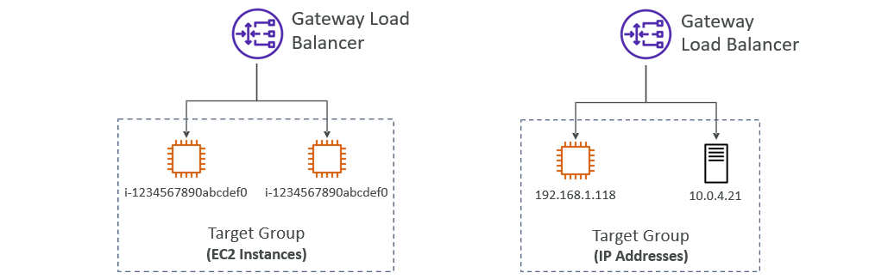

### Sticky Sessions (Session Affinity)
* It is possible to implement stickiness so that the same client is always redirected to the same instance behind a load balancer
* This works for **Classic Load Balancer, Application Load Balancer, and Network Load Balancer**
* For both CLB & ALB, the “cookie” used for stickiness has an expiration date you control
* Use case: make sure the user doesn’t lose his session data
* Enabling stickiness may bring imbalance to the load over the backend EC2 instances
  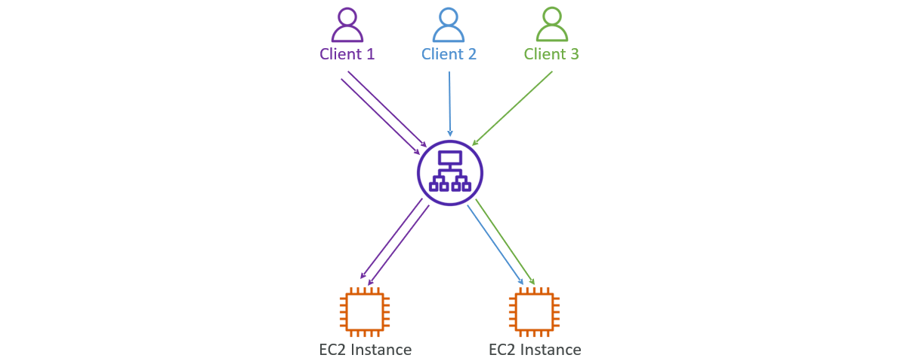
#### Sticky Sessions – Cookie Names
* **Application-based Cookies**
  * **Custom cookie**
    * Generated by the target
    * Can include any custom attributes required by the application
    * Cookie name must be specified individually for each target group 
    * Don’t use **AWSALB, AWSALBAPP** or **AWSALBTG** (reserved for use by the ELB)
  * **Application cookie**
    * Generated by the load balancer
    * Cookie name is **AWSALBAPP**
* **Duration-based Cookies**
  * Cookie generated by the load balancer 
  * Cookie name is **AWSALB** for ALB, **AWSELB** for CLB
#### Enable Sticky Sessions (Stickiness)
* To enable this, go to Load Balancer Target Group.
* Select `Attributes` and click `Edit`.
* Navigate to `Target selection configuration`, in that tick to `Turn on stickiness`.
* Click `Save changes`.

### Cross-Zone Load Balancing
  
* **Application Load Balancer**
  * Enabled by default (can be disabled at the Target Group level)
  * No charges for inter AZ data
* **Network Load Balancer & Gateway Load Balancer**
  * Disabled by default
  * You pay charges ($) for inter AZ data if enabled
* **Classic Load Balancer**
  * Disabled by default
  * No charges for inter AZ data if enable
#### Change Cross-Zone Load Balancing Behaviour
* **For Network Load Balancer & Gateway Load Balancer:**
  * To Change Cross-Zone Load Balancing Behaviour, go to Load Balancer.
  * Select `Attributes` and click `Edit`.
  * In that change the behaviour of `Cross-zone load balancing` (Enable/Disable)
  * Click `Save changes`.
* **For Application Load Balancer:**
  * In Application Load Balancer, the Cross-Zone Load Balancing is Enabled by default.
  * To change this behaviour, go to Load Balancer Target Group.
    * In Target Group select `Attributes` and click `Edit`.
    * Naviagte `Target selection configuration`, in that change `Cross-zone load balancing` behaviour to `Off`.

### SSL/TLS - Basics
* An SSL Certificate allows traffic between your clients and your load balancer to be encrypted in transit (in-flight encryption)
* **SSL** refers to Secure Sockets Layer, used to encrypt connections
* **TLS** refers to Transport Layer Security, which is a newer version
* Nowadays, **TLS certificates are mainly used**, but people still refer as SSL 
* Public SSL certificates are issued by Certificate Authorities (CA)
* Comodo, Symantec, GoDaddy, GlobalSign, Digicert, Letsencrypt, etc… 
* SSL certificates have an expiration date (you set) and must be renewed
#### Load Balancer - SSL Certificates
  
* The load balancer uses an X.509 certificate (SSL/TLS server certificate)
* You can manage certificates using ACM (AWS Certificate Manager)
* You can create upload your own certificates alternatively
* HTTPS listener:
  * You must specify a default certificate
  * You can add an optional list of certs to support multiple domains
  * **Clients can use SNI (Server Name Indication) to specify the hostname they reach**
  * Ability to specify a security policy to support older versions of SSL / TLS (legacy clients)
#### SSL – Server Name Indication (SNI)
  
* SNI solves the problem of loading **multiple SSL certificates onto one web server** (to serve multiple websites)
* It’s a “newer” protocol, and requires the client to indicate the hostname of the target server in the initial SSL handshake
* The server will then find the correct certificate, or return the default one
* Note:
  * Only works for ALB & NLB (newer generation), CloudFront
  * Does not work for CLB (older gen)
#### Elastic Load Balancers – SSL Certificates
* **Classic Load Balancer (v1)**
  * Support only one SSL certificate
  * Must use multiple CLB for multiple hostname with multiple SSL certificates
* **Application Load Balancer (v2)**
  * Supports multiple listeners with multiple SSL certificates
  * Uses Server Name Indication (SNI) to make it work
* **Network Load Balancer (v2)**
  * Supports multiple listeners with multiple SSL certificates
  * Uses Server Name Indication (SNI) to make it work
#### Adding SSL Certificates to Elastic Load Balancers 
* Go to Load Balancer and select `Listeners and rules`.
* Remove all Listeners
  * Select Listeners and click `Manage listener --> Delete listener`.
* Click `Add listener`.
  * Give `Protocol` and `Port` (HTTP & 80)
  * In Routing actions, select `Redirect to URL`
  * Give `Protocol` and `Port` (HTTPS & 443)
  * Click `Add`.
  * **This Listener tells Route HTTP Request to HTTPS.**
* Add another Listener.
  * Click `Add listener`.
  * Give `Protocol` and `Port` (HTTPS & 443)
  * In Routing actions, select `Forward to target groups`
  * Select `Target group`
  * In Secure listener settings, select `Certificate source` (From ACM) and `Certificate`
    * Click `Request new ACM certificate`, Create and Add ACM Certificate.
  * Click `Add`.
  * **This Listener tells Route HTTPS Request to Target Group.**
* Then go Domain Website and DNS Record:
  * Type: `CNAME`
  * Name: `Sub Domain`
  * Value: `Load Balancer DNS Name`
#### AWS Certificate Manager
* Go to AWS Certificate Manager and click `Request a certificate`.
* Select `Certificate type` (Request a public certificate)
* In Domain names, give `Fully qualified domain name` (Example: sureshdevops.in)
  * Click `Add another name to this certificate` and provide `Fully qualified domain name` (Example: *.sureshdevops.in)
  * **By using `*`, we can use any Sub Domain before Main Domain**
* In Validation method , select `DNS validation`.
* In Key algorithm, select `RSA 2048`.
* Click `Request`.
* Go to Domain Website and add
  * Domain Type: `CNAME`
  * Domain Name: `CNAME name`
  * Domain Value: `CNAME value`
* After that, wait untill the Status is changed to `Issued` in AWS Certificate Manager.

### Connection Draining
* **Feature naming**
  * Connection Draining – for CLB
  * Deregistration Delay – for ALB & NLB
* Time to complete “in-flight requests” while the instance is de-registering or unhealthy
* Stops sending new requests to the EC2 instance which is de-registering
* Between 1 to 3600 seconds (default: 300 seconds)
* Can be disabled (set value to 0)
* Set to a low value if your requests are short
  

## Auto Scaling Group
* In real-life, the load on your websites and application can change
* In the cloud, you can create and get rid of servers very quickly
* The goal of an Auto Scaling Group (ASG) is to:
  * Scale out (add EC2 instances) to match an increased load
  * Scale in (remove EC2 instances) to match a decreased load
  * Ensure we have a minimum and a maximum number of EC2 instances running
  * Automatically register new instances to a load balancer
  * Re-create an EC2 instance in case a previous one is terminated (ex: if unhealthy)
* ASG are free (you only pay for the underlying EC2 instances)
* **Auto Scaling Group in AWS:**
  
* **Auto Scaling Group in AWS With Load Balancer:**
  

### Auto Scaling Group Attributes
* A Launch Template (older “Launch Configurations” are deprecated)
  * AMI + Instance Type
  * EC2 User Data
  * EBS Volumes
  * Security Groups
  * SSH Key Pair
  * IAM Roles for your EC2 Instances
  * Network + Subnets Information
  * Load Balancer Information
* Min Size / Max Size / Initial Capacity
* Scaling Policies

### Auto Scaling - CloudWatch Alarms & Scaling
* It is possible to scale an ASG based on CloudWatch alarms
* An alarm monitors a metric (such as Average CPU, or a custom metric)
* Metrics such as Average CPU are computed for the overall ASG instances
* Based on the alarm:
  * We can create scale-out policies (increase the number of instances)
  * We can create scale-in policies (decrease the number of instances)
  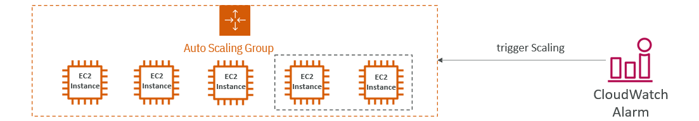

### Create Auto Scaling Group
* Go to EC2, select `Auto Scaling Groups` in Auto Scaling.
* Click `Create Auto Scaling group`.
* Step 1 - `Choose launch template`
  * Give `Auto Scaling group name`
  * Select `Launch template`
    * Select `Create a launch template`, Create Launch Template and add to it.
* Step 2 - `Choose instance launch options`
  * In `Instance type requirements`, we can change configurations of Launch Template by using `Override launch template`
  * In `Network`, select `VPC` and `Availability Zones and subnets`
* Step 3 - Configure advanced options
  * Select `Load balancing`
  * Provide `Health checks`
* Step 4 - `Configure group size and scaling`
  * In `Group size`, provide `Desired capacity`
  * In `Scaling`, provide `Min desired capacity` and `Max desired capacity`
  * Select `No scaling policies` for now in `Automatic scaling`
  * Select `Instance maintenance policy `
* Step 5 - `Add notifications`
  * `Add notifications` if required
* Step 6 - `Add tags`
  * `Add tags`
* Step 7 - `Review`
  * Review all details and click `Create Auto Scaling group`.

#### Create Launch Template
* In `Launch template name and description`
  * Give `Launch template name` and `Template version description`
* In `Launch template contents`
  * Select `Application and OS Images (Amazon Machine Image)`
  * Select `Instance type`, `Key pair (login)`, `Network settings` and `Storage (volumes)`
  * In `Advanced details`, provide `User data`
* Check Summary and Click `Create launch template`.

### Auto Scaling Groups – Scaling Policies
* **Dynamic Scaling**
  * **Target Tracking Scaling**
    * Simple to set-up
    * Example: I want the average ASG CPU to stay at around 40%
  * **Simple / Step Scaling**
    * When a CloudWatch alarm is triggered (example CPU > 70%), then add 2 units
    * When a CloudWatch alarm is triggered (example CPU < 30%), then remove 1
* **Scheduled Scaling**
  * Anticipate a scaling based on known usage patterns
  * Example: increase the min capacity to 10 at 5 pm on Fridays
* **Predictive scaling**
  * Continuously forecast load and schedule scaling ahead
  

### Good Metrics to Scale On
* **CPUUtilization:** Average CPU utilization across your instances
* **RequestCountPerTarget:** to make sure the number of requests per EC2 instances is stable
* **Average Network In / Out** (if you’re application is network bound)
* **Any custom metric** (that you push using CloudWatch)
  

### Auto Scaling Groups - Scaling Cooldowns
* After a scaling activity happens, you are in the **cooldown period (default 300 seconds)**
* During the cooldown period, the ASG will not launch or terminate additional instances (to allow for metrics to stabilize)
* **Advice:** Use a ready-to-use AMI to reduce configuration time in order to be serving request fasters and reduce the cooldown period
  

### Add Scaling Policies to Auto Scaling Group
* Go to Auto Scaling Group and select `Automatic scaling`.
* Select required `Scaling Policies`, click `Create` and provide all required information.
  * **Dynamic scaling policies:**
    * Click `Create dynamic scaling policy`
    * Select `Policy type` and give `Scaling policy name`
    * Select `Metric type` and provide remaining details.
    * Click `Create`.
  * **Predictive scaling policies:**
    * Click `Create predictive scaling policy`
    * Give `Scaling policy name`
    * In `Turn on scaling`, enable `Scale based on forecast`
    * Select `Metrics and target utilization`
    * Click `Create`.
  * **Scheduled actions:**
    * Click `Create scheduled action`
    * Give `Name`
    * Provide `Desired capacity`, `Min` and `Max`
    * Select `Recurrence` (Provide periodic time)
    * Select `Time zone`
    * Provide `Specific start time` and `End time`
    * Click `Create`.
* **Check Scaling Policies Operation:**
  * Create Dynamic Scaling Policy with CPU Utilization.
  * When you create Dynamic Scaling Policy with CPU Utilization, it creates two AWS CloudWatch Alarms
    1. Alarm High for Scale Out (Increase)
    2. Alarm Low for Scale In (Decreases)
  * Go to Instance and install Stress `sudo yum install stress -y`.
    * Increase the Stress `stress -c 4`.
  * When CPU Utilization is increases, it triggers the AWS CloudWatch High Alarm and Auto Scaling Group increases the capacity to Maximum Capacity.
  * When CPU Utilization is decreases, it triggers the AWS CloudWatch Low Alarm and Auto Scaling Group decreaes the capacity to Desired State.


# AWS Fundamentals: RDS, Aurora & ElastiCache
## Amazon RDS
* RDS stands for Relational Database Service
* It’s a managed DB service for DB use SQL as a query language. 
* It allows you to create databases in the cloud that are managed by AWS
  *  Postgres
  *  MySQL
  *  MariaDB
  *  Oracle
  *  Microsoft SQL Server
  *  IBM DB2
  *  Aurora (AWS Proprietary database)

### Advantage over using RDS versus deploying DB on EC2
* RDS is a managed service:
  * Automated provisioning, OS patching
  * Continuous backups and restore to specific timestamp (Point in Time Restore)!
  * Monitoring dashboards
  * Read replicas for improved read performance
  * Multi AZ setup for DR (Disaster Recovery)
  * Maintenance windows for upgrades
  * Scaling capability (vertical and horizontal)
  * Storage backed by EBS 
* BUT you can’t SSH into your instances

### RDS – Storage Auto Scaling
* Helps you increase storage on your RDS DB instance dynamically
* When RDS detects you are running out of free database storage, it scales automatically
* Avoid manually scaling your database storage
* You have to set **Maximum Storage Threshold** (maximum limit for DB storage)
* Automatically modify storage if:
  * Free storage is less than 10% of allocated storage
  * Low-storage lasts at least 5 minutes
  * 6 hours have passed since last modification
* Useful for applications with **unpredictable workloads**
* Supports all RDS database engines
  

### RDS Read Replicas for read scalability
* Up to 15 Read Replicas
* Within AZ, Cross AZ or Cross Region
* Replication is **ASYNC**, so reads are eventually consistent
* Replicas can be promoted to their own DB
* Applications must update the connection string to leverage read replicas
  

### RDS Read Replicas – Use Cases
* You have a production database that is taking on normal load
* You want to run a reporting application to run some analytics
* You create a Read Replica to run the new workload there
* The production application is unaffected
* Read replicas are used for SELECT (=read) only kind of statements (not INSERT, UPDATE, DELETE)
  

### RDS Read Replicas – Network Cost 
* In AWS there’s a network cost when data goes from one AZ to another 
* **For RDS Read Replicas within the same region, you don’t pay that fee**
  

### RDS Multi AZ (Disaster Recovery)
* **SYNC** replication
* One DNS name – automatic app failover to standby
* Increase **availability**
* Failover in case of loss of AZ, loss of network, instance or storage failure
* No manual intervention in apps
* Not used for scaling
* **Note:** The Read Replicas be setup as Multi AZ for Disaster Recovery (DR)
  

### RDS – From Single-AZ to Multi-AZ
* Zero downtime operation (no need to stop the DB)
* Just click on `modify` for the database and select `enable Multi AZ`
* The following happens internally:
  * A snapshot is taken
  * A new DB is restored from the snapshot in a new AZ
  * Synchronization is established between the two databases
  

### Create Database (MySQL)
* Go to Amazon RDS and select `Databases`
* Click `Create database`
* `Choose a database creation method` (Standard create)
* In `Engine options`
  * Select `Engine type` (MySQL)
  * Choose `Engine version`
* Choose `Templates`
* In `Availability and durability`
  * Select `Deployment options` (Single DB instance)
* In `Settings`
  * Give `DB instance identifier`
  * Provide `Credentials Settings`
    * Give `Master username` and `Password`
* In `Instance configuration`
  * Select `DB instance class` (Burstable classes)
* In `Storage`
  * Select `Storage type`
  * Provide `Allocated storage`
  * Provide `Storage autoscaling`
* In `Connectivity`
  * Select `Compute resource`
  * Select `Virtual private cloud (VPC)` and `DB subnet group`
  * Choose `Public access`
  * Select `VPC security group (firewall)`
    * `Create new`
    * Give `New VPC security group name`
  * In `Additional configuration`, shows `Database port`
* In `Database authentication`
  * Select `Database authentication options` (Password authentication)
* In `Monitoring`
  * Enable/Disable `Enhanced Monitoring`
* Select `Additional configuration`
  * In `Database options`
    * Give `Initial database name`
  * Enable `Backup` (if required and provide remaining data)
  * Enable `Encryption` (if required and provide remaining data)
  * Provide `Log exports` (if required)
  * Select `Maintenance`
  * Enable `Deletion Protection`
* Click `Create database`.
#### Explore Database
* **Connectivity & security:**
  * `Endpoint`: Which is used to Connect Database.
* **Create Read Replica:**
  * Click `Actions --> Create read replica`
* **Create RDS Snapshot:**
  * Click `Actions --> Take snapshot`
* **Delete Database:**
  * First Remove `Deletion protection`
    * Click `Modify --> Disable Deletion protection` and click `Continue`
    * Tick `Apply immediately` and Click `Modify DB instance`
  * Then click `Actions --> Delete`

### SQL Electron
* SQL Electron is a SQL Client, that we are using to connect Databases.
* [Refer Here](https://sqlectron.github.io/) for download link
  * Click `Download GUI` and select required OS
  * Extract Zip file and open `sqlectron.exe`
* Click `Add`
  * Give `Name` and select `Database Type`
  * Give `Server Address` (DB Endpoint)
  * Give `User`, `Password` and `Initial Database`
  * Click `Test`.
  * If Test Connection is Sucessful, then click `Save`.
* Click `Connect`.
  * We can Create Tables and Add Data.

### RDS Custom
* **Managed Oracle and Microsoft SQL Server Database with OS and database customization**
* RDS: Automates setup, operation, and scaling of database in AWS
* Custom: access to the underlying database and OS so you can
  * Configure settings
  * Install patches
  * Enable native features
  * Access the underlying EC2 Instance using **SSH** or **SSM Session Manager**
* **De-activate Automation Mode** to perform your customization, better to take a DB snapshot before
* RDS vs. RDS Custom
  * RDS: entire database and the OS to be managed by AWS
  * RDS Custom: full admin access to the underlying OS and the database
  

### Amazon Aurora
* Aurora is a proprietary technology from AWS (not open sourced)
* Postgres and MySQL are both supported as Aurora DB (that means your drivers will work as if Aurora was a Postgres or MySQL database)
* Aurora is “AWS cloud optimized” and claims 5x performance improvement over MySQL on RDS, over 3x the performance of Postgres on RDS
* Aurora storage automatically grows in increments of 10GB, up to 128  TB. 
* Aurora can have up to 15 replicas and the replication process is faster than MySQL (sub 10 ms replica lag)
* Failover in Aurora is instantaneous. It’s HA (High Availability) native. 
* Aurora costs more than RDS (20% more) – but is more efficient.

#### Aurora High Availability and Read Scaling
* 6 copies of your data across 3 AZ:
  * 4 copies out of 6 needed for writes
  * 3 copies out of 6 need for reads
  * Self healing with peer-to-peer replication
  * Storage is striped across 100s of volumes
* One Aurora Instance takes writes (master)
* Automated failover for master in less than 30 seconds
* Master + up to 15 Aurora Read Replicas serve reads
* **Support for Cross Region Replication**
  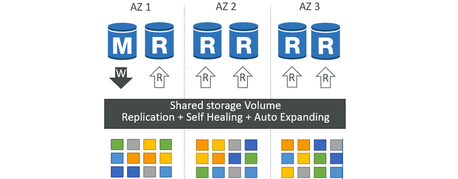

#### Aurora DB Cluster
  

#### Features of Aurora
  * Automatic fail-over
  * Backup and Recovery
  * Isolation and security
  * Industry compliance
  * Push-button scaling
  * Automated Patching with Zero Downtime
  * Advanced Monitoring
  * Routine Maintenance
  * Backtrack: restore data at any point of time without using backups

#### Create Amazon Aurora Database
* Go to Amazon RDS and select `Databases`
* Click `Create database`
* `Choose a database creation method` (Standard create)
* In `Engine options`
  * Select `Engine type` (Aurora - MySQL Compatible)
  * Choose `Engine version`
* Choose `Templates`
* In `Settings`
  * Give `DB cluster identifier`
  * Provide `Credentials Settings`
    * Give `Master username` and `Password`
* In `Cluster storage configuration`
  * Choose `Configuration options` (Aurora Standard)
* In `Instance configuration`
  * Choose `DB instance class` (Burstable classes)
* In `Availability & durability`
  * Provide `Multi-AZ deployment`
* In `Connectivity`
  * Select `Compute resource` & `Network type`
  * Select `Virtual private cloud (VPC)` and `DB subnet group`
  * Choose `Public access`
  * Select `VPC security group (firewall)`
    * `Create new`
    * Give `New VPC security group name`
  * In `Additional configuration`, shows `Database port`
* Provide `Read replica write forwarding`, `Tags`, `Database authentication` and `Monitoring` (if required)
* Select `Additional configuration`
  * In `Database options`
    * Give `Initial database name`
  * Enable `Backup` (if required and provide remaining data)
  * Enable `Encryption` (if required and provide remaining data)
  * Provide `Log exports` (if required)
  * Select `Maintenance`
  * Enable `Deletion Protection`
* Click `Create database`.

#### Explore Cluster Database
* **Connectivity & security:**
  * We have Two Endpoints
    1. Writer instance Endpoint
    2. Reader instance Endpoint
* **Add Readers into Cluster:**
  * Click `Actions --> Add reader`
* **Add Readers into Cluster using Replica Auto Scaling:**
  * We can add more Readers into Cluster using Replica Auto Scaling based on Triggers.
  * Click `Actions --> Add replica auto scaling`
    * In `Policy details`, 
      * Give `Policy name`
      * Select `Target metric` and give `Target value`
    * In `Cluster capacity details`
      * Give `Minimum capacity` and `Maximum capacity`
    * Click `Add policy`.
* **Delete Aurora Database:**
  * First we need to delete Reader and Writer Databses, then delete Cluster Database.

#### Aurora Replicas - Auto Scaling
  

#### Aurora – Custom Endpoints
* Define a subset of Aurora Instances as a Custom Endpoint
* Example: Run analytical queries on specific replicas
* The Reader Endpoint is generally not used after defining Custom Endpoints
  

#### Aurora Serverless
* Automated database instantiation and auto scaling based on actual usage
* Good for infrequent, intermittent or unpredictable workloads
* No capacity planning needed
* Pay per second, can be more cost-effective
  

#### Global Aurora
* **Aurora Cross Region Read Replicas:**
  * Useful for disaster recovery
  * Simple to put in place
* **Aurora Global Database (recommended):**
  * 1 Primary Region (read / write)
  * Up to 5 secondary (read-only) regions, replication lag is less than 1 second
  * Up to 16 Read Replicas per secondary region
  * Helps for decreasing latency
  * Promoting another region (for disaster recovery) has an RTO of < 1 minute
  * **Typical cross-region replication takes less than 1 second**
  

#### Aurora Machine Learning
* Enables you to add ML-based predictions to your applications via SQL
* Simple, optimized, and secure integration between Aurora and AWS ML services
* Supported services
  * Amazon SageMaker (use with any ML model)
  * Amazon Comprehend (for sentiment analysis)
  * You don’t need to have ML experience
  * Use cases: fraud detection, ads targeting, sentiment analysis, product recommendations
  

### Backups
#### RDS Backups
* Automated backups:
  * Daily full backup of the database (during the backup window)
  * Transaction logs are backed-up by RDS every 5 minutes
  * => ability to restore to any point in time (from oldest backup to 5 minutes ago)
  * 1 to 35 days of retention, set 0 to disable automated backups
* Manual DB Snapshots
  * Manually triggered by the user
  * Retention of backup for as long as you want
* Trick: in a stopped RDS database, you will still pay for storage. If you plan on stopping it for a long time, you should snapshot & restore instead
#### Aurora Backups
* Automated backups
  * 1 to 35 days (cannot be disabled)
  * point-in-time recovery in that timeframe 
* Manual DB Snapshots
  * Manually triggered by the user
  * Retention of backup for as long as you want

### RDS & Aurora Restore options
* **Restoring a RDS / Aurora backup or a snapshot** creates a new database
* **Restoring MySQL RDS database from S3**
  * Create a backup of your on-premises database
  * Store it on Amazon S3 (object storage)
  * Restore the backup file onto a new RDS instance running MySQL
* **Restoring MySQL Aurora cluster from S3**
  * Create a backup of your on-premises database using Percona XtraBackup
  * Store the backup file on Amazon S3
  * Restore the backup file onto a new Aurora cluster running MySQL

### Aurora Database Cloning
* Create a new Aurora DB Cluster from an existing one
* Faster than snapshot & restore
* Uses **copy-on-write** protocol
  * Initially, the new DB cluster uses the same data volume as the original DB cluster (fast and efficient – no copying is needed)
  * When updates are made to the new DB cluster data, then additional storage is allocated and data is copied to be separated
* Very fast & cost-effective
* Useful to create a “staging” database from a “production” database without impacting the production database
  

### RDS & Aurora Security
* **At-rest encryption:**
  * Database master & replicas encryption using AWS KMS – must be defined as launch time
  * If the master is not encrypted, the read replicas cannot be encrypted
  * To encrypt an un-encrypted database, go through a DB snapshot & restore as encrypted
* **In-flight encryption:**  TLS-ready by default, use the AWS TLS root certificates client-side
* **IAM Authentication:** IAM roles to connect to your database (instead of username/pw)
* **Security Groups:** Control Network access to your RDS / Aurora DB
* **No SSH available** except on RDS Custom
* **Audit Logs can be enabled** and sent to CloudWatch Logs for longer retention

### Amazon RDS Proxy
* Fully managed database proxy for RDS
* Allows apps to pool and share DB connections established with the database
* **Improving database efficiency by reducing the stress on database resources (e.g., CPU, RAM) and minimize open connections (and timeouts)**
* Serverless, autoscaling, highly available (multi-AZ)
* **Reduced RDS & Aurora failover time by up 66%**
* Supports RDS (MySQL, PostgreSQL, MariaDB, MS SQL Server) and Aurora (MySQL, PostgreSQL)
* No code changes required for most apps
* **Enforce IAM Authentication for DB, and securely store credentials in AWS Secrets Manager**
* **RDS Proxy is never publicly accessible (must be accessed from VPC)**
  

## Amazon ElastiCache
* The same way RDS is to get managed Relational Databases…
* ElastiCache is to get managed Redis or Memcached
* Caches are in-memory databases with really high performance, low latency
* Helps reduce load off of databases for read intensive workloads
* Helps make your application stateless
* AWS takes care of OS maintenance / patching, optimizations, setup, configuration, monitoring, failure recovery and backups
* **Using ElastiCache involves heavy application code changes**

### ElastiCache Solution Architecture
#### DB Cache
* Applications queries ElastiCache, if not available, get from RDS and store in ElastiCache.
* Helps relieve load in RDS
* Cache must have an invalidation strategy to make sure only the most current data is used in there. 
  
#### User Session Store
* User logs into any of the application
* The application writes the session data into ElastiCache
* The user hits another instance of our application
* The instance retrieves the data and the user is already logged in
  

### ElastiCache – Redis vs Memcached
  

### Create ElastiCache
* Go to ElastiCache and click `Get started`
* From list (`Valkey`, `Memcached` and `Redis`), select `Redis`.
* **Step:1** `Create Redis OSS cache`
  * In `Configuration`,
    * Select `Deployment option` (Design your own cache) and `Creation method` (Cluster cache)
  * Enable/Disable the `Cluster mode` (Disabled it)
  * In `Cluster info`,
    * Give `Name` & `Description`
  * In `Location`,
    * Select `Location` (AWS Cloud)
    * Enable/Disable `Multi-AZ`
    * If we Disable Multi-AZ, we can also Enable/Disable `Auto-failover`
  * In `Cluster settings`,
    * Select `Node type`
    * Provide `Number of replicas`
  * In `Subnet group settings`,
    * Choose/Create `Subnet groups`
    * Select `VPC ID`
  * Choose `Availability Zone placements`
* **Step:2** `Advanced settings`
  * In `Security`,
    * Enable `Encryption` (if required)
  * Select `Backup`, `Maintenance`, `Logs` and `Tags` (if required)
* **Step:3** `Review and create`
  * Review all provided details and click `Create`.

### ElastiCache – Cache Security
* ElastiCache supports **IAM Authentication for Redis**
* IAM policies on ElastiCache are only used for AWS API-level security
* **Redis AUTH**
  * You can set a “password/token” when you create a Redis cluster
  * This is an extra level of security for your cache (on top of security groups)
  * Support SSL in flight encryption
* Memcached
  * Supports SASL-based authentication (advanced)
  

### Patterns for ElastiCache
* **Lazy Loading:** all the read data is cached, data can become stale in cache
* **Write Through:** Adds or update data in the cache when written to a DB (no stale data)
* **Session Store:** store temporary session data in a cache (using TTL features)
  

### ElastiCache – Redis Use Case
* Gaming Leaderboards are computationally complex
* **Redis Sorted sets** guarantee both uniqueness and element ordering
* Each time a new element added, it’s ranked in real time, then added in correct order
  


# Amazon Route 53
## DNS
* Domain Name System which translates the human friendly hostnames into the machine IP addresses
* `www.google.com` => `172.217.18.36`
* DNS is the backbone of the Internet
* DNS uses hierarchical naming structure
  ```
             .com
      example.com
  www.example.com
  api.example.com
  ```

### DNS Terminologies
* **Domain Registrar:** Amazon Route 53, GoDaddy, …
* **DNS Records:** A, AAAA, CNAME, NS, …
* **Zone File:** contains DNS records
* **Name Server:** resolves DNS queries (Authoritative or Non-Authoritative)
* **Top Level Domain (TLD):** .com, .us, .in, .gov, .org, …
* **Second Level Domain (SLD):** amazon.com, google.com, …
  

### DNS Workflow
  

## Route 53
* A highly available, scalable, fully managed and Authoritative DNS
  * Authoritative = the customer (you) can update the DNS records 
* Route 53 is also a Domain Registrar
* Ability to check the health of your resources
* The only AWS service which provides 100% availability SLA (Service Level Agreement)
* Why Route 53? 53 is a reference to the traditional DNS port
  

### Route 53 - Records
* How you want to route traffic for a domain
* Each record contains:
  * **Domain/subdomain Name** – e.g., example.com
  * **Record Type** – e.g., A or AAAA
  * **Value** – e.g., 12.34.56.78
  * **Routing Policy** – how Route 53 responds to queries
  * **TTL** – amount of time the record cached at DNS Resolvers
* Route 53 supports the following DNS record types:
  * (must know) A / AAAA / CNAME / NS
  * (advanced) CAA / DS / MX / NAPTR / PTR / SOA / TXT / SPF / SRV
* **Record Types:**
  * **A** – maps a hostname to IPv4
  * **AAAA** – maps a hostname to IPv6
  * **CNAME** – maps a hostname to another hostname
    * The target is a domain name which must have an A or AAAA record
    * Can’t create a CNAME record for the top node of a DNS namespace (Zone Apex)
    * Example: you can’t create for example.com, but you can create for www.example.com
  * **NS** – Name Servers for the Hosted Zone
    * Control how traffic is routed for a domain

### Route 53 – Hosted Zones
* A container for records that define how to route traffic to a domain and its subdomains
* **Public Hosted Zones** – contains records that specify how to route traffic on the Internet (public domain names) `application1.mypublicdomain.com`
* **Private Hosted Zones** – contain records that specify how you route traffic within one or more VPCs (private domain names) `application1.company.internal`
* You pay $0.50 per month per hosted zone
* **Public vs. Private Hosted Zones:**
  

### Route 53 - Domain Registration
* Go to Route 53 and select `Registered domains` in Domains.
* Click `Register domains`
  * In `Search for domain`, give required Domain Name and click `Search`
  * Shows `Search result` with Domain & Price/year
  * Choose required Domain and click `Select`
  * Then click `Proceed to checkout`.
* **Step-1** `Pricing`
  * In Domain pricing options, select `Duration` and Enable `Auto-renew` if required
* **Step-2** `Contact information`
  * In Registrant contact, provide all `General information` 
    * Also provide `Admin contact`, `Tech contact` & `Billing contact`
  * Enable `Privacy protection`
* **Step-3** `Review and submit`
  * Review all details and click `Submit`.
* After Successfull Registration of Domain Name in Route 53, AWS will automatically create a `public hosted zone for that domain`.

### Create Record
* Go to created Hosted Zones
* Select Records and click `Create record`
  * Give `Record name`
  * Select `Record type`
  * Give `Value`
* Click `Create records`

### Route 53 – Records TTL (Time To Live)
* **High TTL – e.g., 24 hr**
  * Less traffic on Route 53
  * Possibly outdated records
* **Low TTL – e.g., 60 sec.**
  * More traffic on Route 53 ($$)
  * Records are outdated for less time
  * Easy to change records
* **Except for Alias records, TTL is mandatory for each DNS record**
  
* During Record Creation, we can provide `TTL (seconds)`
* TTL stores the cache of Domain Records in system for particular time. Only after completion of TTL time, it get the Domain Record again and cache it.

### CNAME vs Alias
* AWS Resources (Load Balancer, CloudFront...) expose an AWS hostname: 
  * `lb1-1234.us-east-2.elb.amazonaws.com and you want myapp.mydomain.com`
* **CNAME:**
  * Points a hostname to any other hostname. `(app.mydomain.com => blabla.anything.com)`
  * **ONLY FOR NON ROOT DOMAIN (aka.something.mydomain.com)** 
* **Alias:**
  * Points a hostname to an AWS Resource `(app.mydomain.com => blabla.amazonaws.com)`
  * **Works for ROOT DOMAIN and NON ROOT DOMAIN (aka.mydomain.com)**
  * Free of charge 
  * Native health check

#### Alias Records
* Maps a hostname to an AWS resource
* An extension to DNS functionality
* Automatically recognizes changes in the resource’s IP addresses
* Unlike CNAME, it can be used for the top node of a DNS namespace (Zone Apex), e.g.: example.com  
* Alias Record is always of type A/AAAA for AWS resources (IPv4 / IPv6)
* **You can’t set the TTL**
  

####  Alias Records Targets
* Elastic Load Balancers
* CloudFront Distributions
* API Gateway
* Elastic Beanstalk environments
* S3 Websites
* VPC Interface Endpoints
* Global Accelerator accelerator
* Route 53 record in the same hosted zone
* **You cannot set an ALIAS record for an EC2 DNS name**

#### Create CNAME Record
* Go to Hosted Zones Records and click `Create record`
  *  Give `Record name`
  * Select `Record type` to `CNAME`
  * Give `Value`
* Click `Create records`

#### Create Alias Record
* Go to Hosted Zones Records and click `Create record`
  *  Give `Record name`
  * Select `Record type` to `A`
  * In `Value`, Enable `Alias`
    * `Choose endpoint`, `Choose Region` and select particular one
* Click `Create records`
* We need to use Domain without Sub-Domain, for that we are using `Alias Record`.

### Health Checks
* HTTP Health Checks are only for **public resources**
* Health Check => Automated DNS Failover:
  1. Health checks that monitor an endpoint (application, server, other AWS resource)
  2. Health checks that monitor other health checks (Calculated Health Checks)
  3. Health checks that monitor CloudWatch Alarms (full control !!) – e.g., throttles of DynamoDB, alarms on RDS, custom metrics, … (helpful for private resources)
* Health Checks are integrated with CW metrics
  

#### Monitor an Endpoint Health Checks
* **About 15 global health checkers will check the endpoint health**
  * Healthy/Unhealthy Threshold – 3 (default)
  * Interval – 30 sec (can set to 10 sec – higher cost)
  * Supported protocol: HTTP,  HTTPS and TCP
  * If  > 18% of health checkers report the endpoint is healthy, Route 53 considers it **Healthy**. Otherwise, it’s **Unhealthy**
  * Ability to choose which locations you want Route 53 to use
* Health Checks pass only when the endpoint responds with the 2xx and 3xx status codes
* Health Checks can be setup to pass / fail based on the text in the first **5120 bytes** of the response
* Configure you router/firewall to allow incoming requests from Route 53 Health Checkers
  
* **Create Health Checks - Monitor an Endpoint**
  * In Route 53, go to Health checks and click `Create health check`.
    * Give `Name`
    * Select `Resource` (Endpoint)
    * `Specify endpoint by` (IP address/Domain name)
    * In `IP address/Domain name`, select `Protocol` and give particular Endpoint
    * Click `Advanced configuration` to give additional configuration
    * Add `Tags`
    * Click `Create health check`.

#### Calculated Health Checks
* Combine the results of multiple Health Checks into a single Health Check
* You can use **OR**, **AND**, or **NOT**
* Can monitor up to 256 Child Health Checks
* Specify how many of the health checks need to pass to make the parent pass
* Usage: perform maintenance to your website without causing all health checks to fail
  
* **Create Health Checks - Calculated Health Checks**
  * In Route 53, go to Health checks and click `Create health check`.
    * Give `Name`
    * Select `Resource` (Calculated health check)
    * In `Health checks to monitor`, select Created Health Checks
    * Select `Report healthy when`
    * Add `Tags`
    * Click `Create health check`.

#### Private Hosted Zones Health Checks (Based on CloudWatch alarm)
* Route 53 health checkers are outside the VPC
* They can’t access **private** endpoints (private VPC or on-premises resource)
* You can create a **CloudWatch Metric** and associate a **CloudWatch Alarm**, then create a Health Check that checks the alarm itself
  
* **Create Health Checks - CloudWatch alarm**
  * In Route 53, go to Health checks and click `Create health check`.
    * Give `Name`
    * Select `Resource` (CloudWatch alarm)
    * Select `CloudWatch Region` and `CloudWatch alarm`
    * Select `Health check status for INSUFFICIENT state alarm`
    * Add `Tags`
    * Click `Create health check`.

### Routing Policies
* Define how Route 53 responds to DNS queries
* Don’t get confused by the word “Routing”
  * It’s not the same as Load balancer routing which routes the traffic
  * DNS does not route any traffic, it only responds to the DNS queries
* Route 53 Supports the following Routing Policies
  * Simple
  * Weighted
  * Failover
  * Latency based
  * Geolocation
  * Multi-Value Answer
  * Geoproximity (using Route 53 Traffic Flow feature)

#### Simple Routing Policy
* Typically, route traffic to a single resource
* Can specify multiple values in the same record
* **If multiple values are returned, a random one is chosen by the client**
* When Alias enabled, specify only one AWS resource
* Can’t be associated with Health Checks
* Choose Routing Policy `Simple routing` during Record Creation
  * In `Values`, we can also provide multiple IP Addresses.
  

#### Weighted Routing Policy
* Control the % of the requests that go to each specific resource
* Assign each record a relative weight:
  * 
  * Weights don’t need to sum up to 100
* DNS records must have the same name and type
* Can be associated with Health Checks
* Use cases: load balancing between regions, testing new application versions…
* **Assign a weight of 0 to a record to stop sending traffic to a resource**
* **If all records have weight of 0, then all records will be returned equally**
* Choose Routing Policy `Weighted` during Record Creation
  * Create different `Records` using Weighted Routing Policy with same `Record Name` with different `Values` & `Weights`. Also provide `Record ID`.
  * This sends the traffic to provided Values based on Weights we given.
  

#### Latency-based Routing Policy
* Redirect to the resource that has the least latency close to us
* Super helpful when latency for users is a priority 
* **Latency is based on traffic between users and AWS Regions**
* Germany users may be directed to the US (if that’s the lowest latency)
* Can be associated with Health Checks (has a failover capability)
* Choose Routing Policy `Latency` during Record Creation
  * Create different `Records` using Latency Routing Policy with same `Record Name` with different `Values`. Select `Region` and provide `Record ID`.
  * We get the response from Values based on our location near to Region.
  

#### Failover Routing Policy
  
* Choose Routing Policy `Failover` during Record Creation
  * Create Two `Records` using Failover Routing Policy with same `Record Name` with different `Values`
  * Select `Failover record type` (One is Primary & Second One is Secondary)
  * For Primary Failover record type, provide `Health check ID`
  * Give `Record ID`
* When Primary Record is Fail, then sends the traffic to Secondary Record.

#### Geolocation Routing Policy
* Different from Latency-based!
* **This routing is based on user location**
* Specify location by Continent, Country or by US State (if there’s overlapping, most precise location selected)
* Should create a **“Default”** record (in case there’s no match on location)
* Use cases: website localization, restrict content distribution, load balancing, …
* Can be associated with Health Checks
  
* Choose Routing Policy `Geolocation` during Record Creation
  * Create different `Records` using Geolocation Routing Policy with same `Record Name` with different `Values`. Select `Location` and provide `Record ID`.
* This Records sends the requests based on their Location. If provided Location is Default, it accepts the requests rather then given Locations.

#### Geoproximity Routing Policy
* Route traffic to your resources based on the geographic location of users and resources
* Ability **to shift more traffic to resources based** on the defined **bias**
* To change the size of the geographic region, specify **bias** values:
  * To expand (1 to 99) – more traffic to the resource
  * To shrink (-1 to -99) – less traffic to the resource
* Resources can be:
  * AWS resources (specify AWS region)
  * Non-AWS resources (specify Latitude and Longitude)
* You must use Route 53 **Traffic Flow** to use this feature
  
  

#### IP-based Routing Policy
* **Routing is based on clients’ IP addresses**
* **You provide a list of CIDRs for your clients** and the corresponding endpoints/locations (user-IP-to-endpoint mappings)
* Use cases: Optimize performance, reduce network costs…
* Example: route end users from a particular ISP to a specific endpoint
  

#### Multi-Value Routing Policy
* Use when routing traffic to multiple resources
* Route 53 return multiple values/resources
* Can be associated with Health Checks (return only values for healthy resources)
* Up to 8 healthy records are returned for each Multi-Value query
* **Multi-Value is not a substitute for having an ELB**
  

### Domain Registar vs. DNS Service
* You buy or register your domain name with a Domain Registrar typically by paying annual charges (e.g., GoDaddy, Amazon Registrar Inc., …)
* The Domain Registrar usually provides you with a DNS service to manage your DNS records
* But you can use another DNS service to manage your DNS records
* Example: purchase the domain from GoDaddy and use Route 53 to manage your DNS records
  

#### GoDaddy as Registrar & Route 53 as DNS Service
  

#### 3rd Party Registrar with Amazon Route 53
* **If you buy your domain on a 3rd party registrar, you can still use Route 53 as the DNS Service provider**
  1. Create a Hosted Zone in Route 53
  2. Update NS Records on 3rd party website to use Route 53 **Name Servers**
* **Domain Registrar != DNS Service**
* But every Domain Registrar usually comes with some DNS features


# Classic Solutions Architecture
* Let’s understand how all the technologies we’ve seen work together
* We’ll see the progression of a Solution’s architect mindset through many sample case studies:
  * WhatIsTheTime.Com
  * MyClothes.Com
  * MyWordPress.Com
  * Instantiating applications quickly
  * Beanstalk

## Stateless Web App - WhatIsTheTime.com
* WhatIsTheTime.com allows people to know what time it is
* **We don’t need a database**
* We want to start small and can accept downtime
* We want to fully scale vertically and horizontally, no downtime
* Let’s go through the Solutions Architect journey for this app
* Let’s see how we can proceed!
* **Starting Simple:**
  
  * When App is getting more traffic and certainly the T2 is not enough.
  * Need to Scale Vertically from T2 to M5.
* **Scaling Vertically:**
  
  * Using Vertical Scalling, we experienced downtime.
  * When App is more popular getting more & more traffic, need to Scale App Horizontally by increasing number of Instances.
* **Scaling Horizontally:**
  
  * These Instances have different Elastic IPs and Users need to remember some IPs and this is not a good approach.
  * Improve App by removing Elastic IPs and attach DNS using Route 53 - A Record with TTL 1 Hour.
* **Scaling Horizontally & Attach DNS using A Record:**
  
* **Scaling Horizontally, Adding & Removing Instances:**
  
  * Using this, when One Instance amoung these Fail, Users connected that Instance getting Downtime because of TTL 1 Hour.
  * Users are not able to connect other Instances until TTL complete, that was not good.
  * Overcome this by adding Load Balancer.
  * Attach Load Balancer to DNS with Route 53 - Alias Record.
* **Scaling Horizontally with a Load Balancer:**
  
  * Based on load, need to add/remove Instances manually, this is not a good approach.
  * Overcome this by adding Auto-Scaling Group instead of Adding/Removing Instances manually.
* **Scaling Horizontally with an Auto-Scaling Group:**
  
  * Make App highly available from disasters, enable Multi-AZ.
* **Making our App Multi-AZ:**
  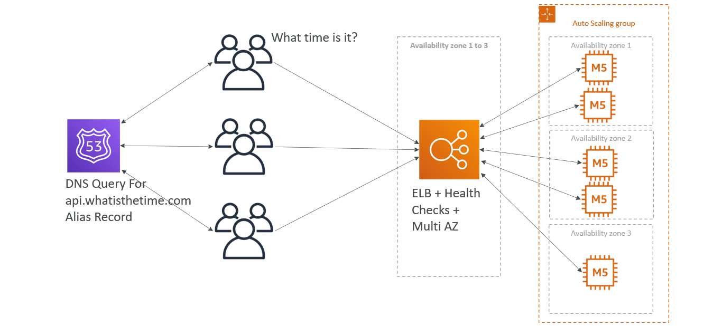
  * App required minimum capacity 2, for that use Reserved Instances for Cost Savings.
* **For Minimum Capacity use Reserved Instances:**
  
### Key Points
* Public vs Private IP and EC2 instances
* Elastic IP vs Route 53 vs Load Balancers
* Route 53 TTL, A records and Alias Records
* Maintaining EC2 instances manually vs Auto Scaling Groups
* Multi AZ to survive disasters
* ELB Health Checks
* Security Group Rules
* Reservation of capacity for costing savings when possible

## Stateful Web App - MyClothes.com
* MyClothes.com allows people to buy clothes online.
* There’s a shopping cart 
* Our website is having hundreds of users at the same time
* We need to scale, maintain horizontal scalability and keep our web application as stateless as possible
* Users should not lose their shopping cart
* Users should have their details (address, etc) in a database
* Let’s see how we can proceed!
  
  * User access App and add something to Cart. When User refresh, it reach to another Instance and User lost their Cart.
  * This is not good. Which can overcome using Stickiness of ELB feature.
* **Introduce Stickiness (Session Affinity):**
  
  * This can improve using User Cookies.
* **Introduce User Cookies:**
  
  * But using User Cookies, the HTTP requests getting heviour and also some level of Security risk.
  * This can improve by using concept of Server Session. This works with ElastiCache by sending the Session-id of User.
* **Introduce Server Session:**
  
* **Storing User Data in a Database:**
  
  * When App load is increases, more Users access App and getting product information.
  * The read capability is increased by adding Read Replicas.
* **Scaling Reads:**
  
* **Scaling Reads (Alternative) – Lazy Loading:**
  
* **Multi AZ – Survive Disasters:**
  
* **Security Groups:**
  
### Key Points (3-tier Architectures for Web Applications)
* ELB sticky sessions
* Web clients for storing cookies and making our web app stateless
* ElastiCache
  * For storing sessions (alternative: DynamoDB)
  * For caching data from RDS
  * Multi AZ
* RDS 
  * For storing user data
  * Read replicas for scaling reads
  * Multi AZ for disaster recovery
* Tight Security with security groups referencing each other

## Stateful Web App - MyWordPress.com
* We are trying to create a fully scalable WordPress website
* We want that website to access and correctly display picture uploads
* Our user data, and the blog content should be stored in a MySQL database
* Let’s see how we can achieve this!
* **RDS layer:**
  
* **Scaling with Aurora: Multi AZ & Read Replicas:**
  
* **Storing images with EBS:**
  
  
  * When User store the data, it store in Instance EBS Volume and when it redirect to another Instance, the data is not available.
  * This can overcome using EFS.
* **Storing images with EFS:**
  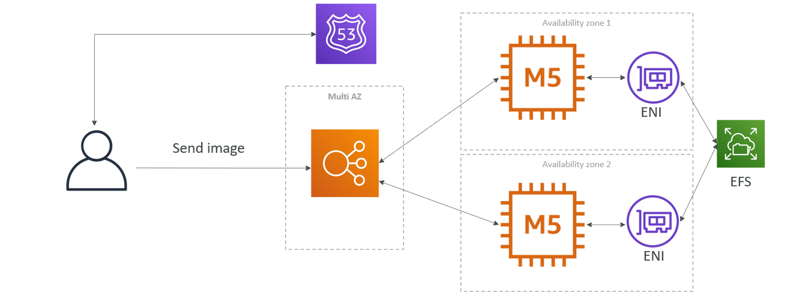
### Key Points
* Aurora Database to have easy Multi-AZ and Read-Replicas
* Storing data in EBS (single instance application)
* Vs Storing data in EFS (distributed application)

## Instantiating Applications Quickly
* When launching a full stack (EC2, EBS, RDS), it can take time to:
  * Install applications
  * Insert initial (or recovery) data
  * Configure everything
  * Launch the application
* We can take advantage of the cloud to speed that up!
* EC2 Instances:
  * **Use a Golden AMI:** Install your applications, OS dependencies etc.. beforehand and launch your EC2 instance from the Golden AMI
  * **Bootstrap using User Data:** For dynamic configuration, use User Data scripts
  * **Hybrid:** mix Golden AMI and User Data (Elastic Beanstalk)
* RDS Databases:
  * Restore from a snapshot: the database will have schemas and data ready!
* EBS Volumes:
  * Restore from a snapshot: the disk will already be formatted and have data!

## Typical architecture - Web App 3-tier
  
### Developer Problems on AWS
* Managing infrastructure
* Deploying Code
* Configuring all the databases, load balancers, etc
* Scaling concerns
* Most web apps have the same architecture (ALB + ASG)
* All the developers want is for their code to run!
* Possibly, consistently across different applications and environments

## Elastic Beanstalk
* Elastic Beanstalk is a developer centric view of deploying an application on AWS
* It uses all the component’s we’ve seen before: EC2, ASG, ELB, RDS, … 
* Managed service
  * Automatically handles capacity provisioning, load balancing, scaling, application health monitoring, instance configuration, …
  * Just the application code is the responsibility of the developer
* We still have full control over the configuration
* Beanstalk is free but you pay for the underlying instances

### Elastic Beanstalk – Components
* **Application:** collection of Elastic Beanstalk components (environments, versions, configurations, …)
* **Application Version:** an iteration of your application code
* **Environment**
  * Collection of AWS resources running an application version (only one application version at a time)
  * **Tiers:** Web Server Environment Tier & Worker Environment Tier
  * You can create multiple environments (dev, test, prod, …)
  

### Elastic Beanstalk – Supported Platforms
* Go
* Java SE
* Java with Tomcat
* .NET Core on Linux
* .NET on Windows Server 
* Node.js
* PHP
* Python
* Ruby
* Packer Builder
* Single Container Docker
* Multi-container Docker
* Preconfigured Docker

### Web Server Tier vs. Worker Tier
  
* Scale based on the number of SQS messages
* Can push messages to SQS queue from another Web Server Tier

### Elastic Beanstalk Deployment Modes
  

### Create Elastic Beanstalk
* Go to Elastic Beanstalk and click `Create application`.
* **Step-1** `Configure environment`
  * Select `Environment tier`
  * Give `Application name`
  * In Environment information,
    * Give `Environment name`
    * Give `Domain` or `Leave blank for autogenerated value`
    * Give `Environment description`
  * In Platform,
    * Select `Platform type`
    * Select `Platform`
  * Select `Application code`
  * Select `Presets`
* **Step-2** `Configure service access`
  * Select `Service role` (Create and use new service role)
  * Give `Service role name`
  * In `EC2 instance profile`, Create a Role for Beanstalk and Add to it.
    ```
    # Create Role: Go to IAM --> Roles --> Create role
      * Select 'AWS service' in Trusted entity type
      * Select 'EC2' in Use case
      * In 'Permissions policies', add
        * AWSElasticBeanstalkMulticontainerDocker
        * AWSElasticBeanstalkWebTier
        * AWSElasticBeanstalkWorkerTier
      * Give `Role name`
      * Click `Create role`.
    ```
* **Step-3**, **Step-4** & **Step-5** (optional)
* **Step-6** `Review`
  * Review all details and click `Submit`.

#### Key Points
* Go to Created Environment,
  * In Events, some Events are happening and these Events are actually come from a Service CloudFormation.
* Go to CloudFormation. In Stacks, select `awseb-stack`
  * `Events` shows all Steps that happened.
  * `Resources` shows Created Resources.
  * In `Template`, click on `View in Application Composer`
    * It shows Visually what was Created.
* Beanstalk Environment Health is Ok, we can access it by using Domain link.
* Upload New Version of Code
  * Click `Upload and deploy`
  * Choose a file and click `Deploy`.
* To change Configuration,
  * Go to Environment and click `Configuration` in left side menu.


# Amazon S3
* Amazon S3 is one of the main building blocks of AWS
* It’s advertised as ”infinitely scaling” storage 
* Many websites use Amazon S3 as a backbone
* Many AWS services use Amazon S3 as an integration as well

## S3 Use cases
* Backup and storage
* Disaster Recovery
* Archive
* Hybrid Cloud storage
* Application hosting
* Media hosting
* Data lakes & big data analytics
* Software delivery
* Static website

## S3 - Buckets
* Amazon S3 allows people to store objects (files) in “buckets” (directories)
* Buckets must have a **globally unique name (across all regions all accounts)**
* Buckets are defined at the region level 
* S3 looks like a global service but buckets are created in a region
* Naming convention
  * No uppercase, No underscore
  * 3-63 characters long
  * Not an IP
  * Must start with lowercase letter or number
  * Must NOT start with the prefix **xn-**
  * Must NOT end with the suffix **-s3alias**

## S3 - Objects
* Objects (files) have a Key
* The `key` is the **FULL** path:
  * s3://my-bucket/`my_file.txt`
  * s3://my-bucket/`my_folder1/another_folder/my_file.txt`
* The key is composed of `prefix` + **object name**
  * s3://my-bucket/`my_folder1/another_folder/`**my_file.txt**
* There’s no concept of “directories” within buckets (although the UI will trick you to think otherwise)
* Just keys with very long names that contain slashes (“/”)
* Object values are the content of the body:
  * Max. Object Size is 5TB (5000GB)
  * If uploading more than 5GB, must use “multi-part upload”
* Metadata (list of text key / value pairs – system or user metadata)
* Tags (Unicode key / value pair – up to 10) – useful for security / lifecycle
* Version ID (if versioning is enabled)

## Create S3 Bucket
* Go to Amazon S3 and click `Create bucket`
* Select `Bucket type` (General purpose)
* Give `Bucket name`
* In `Block Public Access settings for this bucket`, Block or Unblock Public Access
* Enable/Disable `Bucket Versioning`
* In `Default encryption`, 
  * Select `Encryption type` to `Server-side encryption with Amazon S3 managed keys (SSE-S3)`
  * Enable `Bucket Key`
* Click `Create bucket`.

### Upload Files/Folders
* Go to Bucket and click `Upload`
  * Click `Add files/Add folder` based on requirement
  * `Add files/Add folder` and click `Upload`.
* Click on that Added File
  * Click `Open` to see the file
  * `Object URL` is used to access the file from Internet.

## S3 – Security
* **User-Based**
  * **IAM Policies** – which API calls should be allowed for a specific user from IAM
* **Resource-Based**
  * **Bucket Policies** – bucket wide rules from the S3 console - allows cross account
  * **Object Access Control List (ACL)** – finer grain (can be disabled)
  * **Bucket Access Control List (ACL)** – less common (can be disabled)
* **Note:** an IAM principal can access an S3 object if
  * The user IAM permissions ALLOW it OR the resource policy ALLOWS it
  * AND there’s no explicit DENY
* **Encryption:** encrypt objects in Amazon S3 using encryption keys

### S3 Bucket Policies
* JSON based policies
  * Resources: buckets and objects
  * Effect: Allow / Deny
  * Actions: Set of API to Allow or Deny
  * Principal: The account or user to apply the policy to
* Use S3 bucket for policy to:
  * Grant public access to the bucket
  * Force objects to be encrypted at upload
  * Grant access to another account (Cross Account)
  
* **Examples:**
  * **Public Access - Use Bucket Policy:**
    
  * **User Access to S3 – IAM Permissions:**
    
  * **EC2 Instance Access - Use IAM Roles:**
    
  * **Cross-Account Access – Use Bucket Policy**
    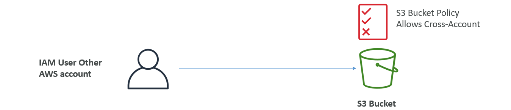

### Bucket Settings for Block Public Access
  
* **These settings were created to prevent company data leaks**
* If you know your bucket should never be public, leave these on
* Can be set at the account level

### Enable Public Access
* When Objects in Bucket are not accessable from Internet, means it blocks the Public Access. Need to change Permissions
  * Go to S3 Bucket `Permissions`
  * In `Block public access`, Disable `Block all public access`
  * In `Bucket policy`, click `Edit`
    * Click `Policy generator`
    * **Step-1:** `Select Policy Type`
      * In `Select Type of Policy`, select `S3 Bucket Policy`
    * **Step-2:** `Add Statement(s)`
      * In `Effect`, select `Allow`
      * In `Principal`, give `*`
      * In `Actions`, select `GetObject`
      * In `Amazon Resource Name (ARN)`, copy Bucket ARN and give it with `/*`
      * Then click `Add Statement`
    * **Step-3:** `Generate Policy`
      * Click `Generate Policy` and copy Generate Policy.
    * Paste in Bucket Policy and click `Save changes`.

## S3 – Static Website Hosting
* S3 can host static websites and have them accessible on the Internet
* The website URL will be (depending on the region)
  * **http://bucket-name.s3-website-aws-region.amazonaws.com**
<center>OR</center>

  * **http://bucket-name.s3-website.aws-region.amazonaws.com**
* If you get a **403 Forbidden** error, make sure the bucket policy allows public reads!
  

### Create Static Website Hosting
* Go to S3 Bucket `Properties`
* In `Static website hosting`, click `Edit`
  * `Enable` Static website hosting
  * In `Hosting type`, select `Host a static website`
  * In `Index document`, give `index.html`
  * Click `Save changes`
* In Bucket, Upload `index.html` file
* In Static website hosting, shows the `Bucket website endpoint`
  * This endpoint is used to access the Website.

## S3 - Versioning
* You can version your files in Amazon S3
* It is enabled at the **bucket level**
* Same key overwrite will change the “version”: 1, 2, 3….
* It is best practice to version your buckets
  * Protect against unintended deletes (ability to restore a version)
  * Easy roll back to previous version 
* Notes:
  * Any file that is not versioned prior to enabling versioning will have version “null”
  * Suspending versioning does not delete the previous versions
  

### Enable Versioning
* Go to S3 Bucket `Properties`
  * In `Bucket Versioning`, click `Edit`
  * `Enable` Bucket Versioning and click `Save changes`.
* When we Upload the New Version of File, but we required Old Version of File
  * Click `Show versions`
  * Select New File and click Delete, it permanently delete the file.
  * Then we go back to Previous Version.
* When we delete any file and it is available in Previous Version. It doesn't delete permanently.
  * Click `Show versions`
  * The deleted file shows like `Delete marker`
  * When we delete that file, we recover that file from previous Version.

## S3 – Replication (CRR & SRR)
* **Must enable Versioning** in source and destination buckets
* **Cross-Region Replication (CRR)**
* **Same-Region Replication (SRR)**
* Buckets can be in different AWS accounts
* Copying is asynchronous
* Must give proper IAM permissions to S3
* Use cases:
  * **CRR** – compliance, lower latency access, replication across accounts
  * **SRR** – log aggregation, live replication between production and test accounts
  
* After you enable Replication, only new objects are replicated
* Optionally, you can replicate existing objects using **S3 Batch Replication**
  * Replicates existing objects and objects that failed replication
* For DELETE operations
  * **Can replicate delete markers** from source to target (optional setting)
  * Deletions with a version ID are not replicated (to avoid malicious deletes)
* **There is no “chaining” of replication**
  * If bucket 1 has replication into bucket 2, which has replication into bucket 3
  * Then objects created in bucket 1 are not replicated to bucket 3

### Enable Replication
* We required Two Buckets with Versioning is Enabled. (Buckets with Same Region or Different Regions, based on requirement)
* Assume One Bucket is Source Bucket and Another Bucket is Destination Bucket.
* To enable Replication, go to Source Bucket `Management`.
  * In Replication rules, click `Create replication rule`
    * Give `Replication rule name`
    * Enable `Status`
    * In Source bucket, `Choose a rule scope`
    * Select `Destination`
    * In IAM role, select `Create new role`
    * Click `Save`
  * A popup `Replicate existing objects?` is opens, in that select required one and click `Submit`.
* When we Upload any files in Source Bucket, it replicate to Destination Bucket.
* When `Delete marker replication` is Enable, it replicates only `Delete Marker Files` and Not replicate `Permanently Deleted Files`.
  * Go to Replication Rule and click `Edit`
  * In `Additional replication options`, enable `Delete marker replication`
  * Click `Save`

## S3 Durability and Availability
* Durability:
  * High durability (99.999999999%, 11 9’s) of objects across multiple AZ
  * If you store 10,000,000 objects with Amazon S3, you can on average expect to incur a loss of a single object once every 10,000 years
  * Same for all storage classes
* Availability:
  * Measures how readily available a service is
  * Varies depending on storage class
  * Example: S3 standard has 99.99% availability = not available 53 minutes a year

## S3 Storage Classes
* S3 Storage Classes are
  * S3 Standard - General Purpose
  * S3 Standard-Infrequent Access (IA)
  * S3 One Zone-Infrequent Access
  * S3 Glacier Instant Retrieval
  * S3 Glacier Flexible Retrieval
  * S3 Glacier Deep Archive
  * S3 Intelligent Tiering
* Can move between classes manually or using S3 Lifecycle configurations

### S3 Standard – General Purpose
* 99.99% Availability
* Used for frequently accessed data
* Low latency and high throughput
* Sustain 2 concurrent facility failures
* Use Cases: Big Data analytics, mobile & gaming applications, content distribution…

### S3 Infrequent Access Storage Classes
* For data that is less frequently accessed, but requires rapid access when needed
* Lower cost than S3 Standard
* **Amazon S3 Standard-Infrequent Access (S3 Standard-IA)**
  * 99.9% Availability
  * Use cases: Disaster Recovery, backups
* **Amazon S3 One Zone-Infrequent Access (S3 One Zone-IA)**
  * High durability (99.999999999%) in a single AZ; data lost when AZ is destroyed
  * 99.5% Availability
  * Use Cases: Storing secondary backup copies of on-premises data, or data you can recreate

### S3 Glacier Storage Classes
* Low-cost object storage meant for archiving / backup
* Pricing: price for storage + object retrieval cost
* **Amazon S3 Glacier Instant Retrieval**
  * Millisecond retrieval, great for data accessed once a quarter
  * Minimum storage duration of 90 days
* **Amazon S3 Glacier Flexible Retrieval** (formerly Amazon S3 Glacier):
  * Expedited (1 to 5 minutes), Standard (3 to 5 hours), Bulk (5 to 12 hours) – free
  * Minimum storage duration of 90 days
* **Amazon S3 Glacier Deep Archive – for long term storage:**
  * Standard (12 hours), Bulk (48 hours)
  * Minimum storage duration of 180 days

### S3 Intelligent-Tiering
* Small monthly monitoring and auto-tiering fee
* Moves objects automatically between Access Tiers based on usage
* There are no retrieval charges in S3 Intelligent-Tiering
* Frequent Access tier (automatic): default tier
* Infrequent Access tier (automatic): objects not accessed for 30 days
* Archive Instant Access tier (automatic): objects not accessed for 90 days
* Archive Access tier (optional): configurable from 90 days to 700+ days
* Deep Archive Access tier (optional): config. from 180 days to 700+ days

### Change Objects Storage Classes
* **During Upload Files,**
  * We have an option `Properties`
  * In that `Storage class` are available
  * Select required Class and click `Upload`
* **After Uploading Files, we can change Storage Class:**
  * Open that File and go to `Properties`
  * In `Storage class`, click `Edit`
  * Select required Storage Class and click `Save changes`
* **Automate Objects Moving to different Storage Classes:**
  * Go to Bucket `Management`
  * In Lifecycle rules, click `Create lifecycle rule`
  * Give `Lifecycle rule name`
  * `Choose a rule scope`
  * In `Lifecycle rule actions`, select `Transition current versions of objects between storage classes`
  * Provide `Transition current versions of objects between storage classes`
    * `Choose storage class transitions`
    * `Days after object creation`
    * We can `Add Multiple transition`
  * Then click `Create rule`

## Moving between Storage Classes
* You can transition objects between storage classes 
* For infrequently accessed object, move them to **Standard IA**
* For archive objects that you don’t need fast access to, move them to **Glacier or Glacier Deep Archive**
* Moving objects can be automated using a **Lifecycle Rules**
  

### Lifecycle Rules
* **Transition Actions** – configure objects to transition to another storage class
  * Move objects to Standard IA class 60 days after creation
  * Move to Glacier for archiving after 6 months
* **Expiration actions** – configure objects to expire (delete) after some time
  * Access log files can be set to delete after a 365 days
  * **Can be used to delete old versions of files (if versioning is enabled)**
  * Can be used to delete incomplete Multi-Part uploads
* Rules can be created for a certain prefix (example: s3://mybucket/mp3/*)
* Rules can be created for certain objects Tags (example: Department: Finance)
#### Lifecycle Rules (Scenario 1)
* Your application on EC2 creates images thumbnails after profile photos are uploaded to Amazon S3. These thumbnails can be easily recreated, and only need to be kept for 60 days. The source images should be able to be immediately retrieved for these 60 days, and afterwards, the user can wait up to 6 hours. How would you design this?
  * S3 source images can be on **Standard**, with a lifecycle configuration to transition them to **Glacier** after 60 days
  * S3 thumbnails can be on **One-Zone IA**, with a lifecycle configuration to expire them (delete them) after 60 days
#### Lifecycle Rules (Scenario 2)
* A rule in your company states that you should be able to recover your deleted S3 objects immediately for 30 days, although this may happen rarely. After this time, and for up to 365 days, deleted objects should be recoverable within 48 hours.
  * **Enable S3 Versioning** in order to have object versions, so that “deleted objects” are in fact hidden by a “delete marker” and can be recovered
  * Transition the “noncurrent versions” of the object to **Standard IA**
  * Transition afterwards the “noncurrent versions” to **Glacier Deep Archive**

### Create Lifecycle Rule
* Go to Bucket `Management`
* In Lifecycle rules, click `Create lifecycle rule`
* Give `Lifecycle rule name`
* `Choose a rule scope`
* Select required `Lifecycle rule actions`
  * **Transition current versions of objects between storage classes**: For Latest Version of Objects
    * `Choose storage class transitions`
    * Provide `Days after object creation`
  * **Transition noncurrent versions of objects between storage classes:** For All Previous Version of Objects
    * `Choose storage class transitions`
    * Provide `Days after objects become noncurrent`
  * **Expire current versions of objects:** Automatically Deletes the Latest Version of Objects
    * Provide `Days after object creation`
  * **Permanently delete noncurrent versions of objects:** Removes the Older Version of Objects
    * Provide `Days after objects become noncurrent`
* Check `Review transition and expiration actions`
* Then click `Create rule`.

## S3 Analytics – Storage Class Analysis
* Help you decide when to transition objects to the right storage class
* Recommendations for **Standard** and **Standard IA**
  * Does NOT work for One-Zone IA or Glacier
* Report is updated daily
* 24 to 48 hours to start seeing data analysis
* Good first step to put together Lifecycle Rules (or improve them)!
  

## S3 – Requester Pays
* In general, bucket owners pay for all Amazon S3 storage and data transfer costs associated with their bucket
* **With Requester Pays buckets**, the requester instead of the bucket owner pays the cost of the request and the data download from the bucket
* Helpful when you want to share large datasets with other accounts
* The requester must be authenticated in AWS (cannot be anonymous)
  

## S3 Event Notifications
* S3:ObjectCreated, S3:ObjectRemoved, S3:ObjectRestore, S3:Replication…
* Object name filtering possible (*.jpg)
* Use case: generate thumbnails of images uploaded to S3
* **Can create as many “S3 events” as desired**
* S3 event notifications typically deliver events in seconds but can sometimes take a minute or longer
  
* **S3 Event Notifications – IAM Permissions:**
  
* **S3 Event Notifications with Amazon EventBridge:**
  
  * **Advanced filtering** options with JSON rules (metadata, object size, name...)
  * **Multiple Destinations** – ex Step Functions, Kinesis Streams / Firehose…
  * **EventBridge Capabilities** – Archive, Replay Events, Reliable delivery

### Setup S3 Event Notifications
* Go to Bucket `Properties`
* In `Amazon EventBridge`, click `Edit`
  * `On` - Send notifications to Amazon EventBridge for all events in this bucket
  * Click `Save changes`
* In `Event notifications`, click `Create event notification`
  * Give `Event name`
  * Select `Event types` to Send Notifications
  * Select `Destination` (Consider `SQS queue` is Destination)
    * In `Specify SQS queue`, select `Choose from your SQS queues`
    * Choose `SQS queue`

### Create SQS Queue
* Go to Amazon SQS and click `Create queue`
  * Select `Type` (Standard)
  * Give `Name`
  * Click `Create queue`
* Open Created Queue and click `Edit`
  * In `Access policy`, click `Policy generator`
  * **Step-1** `Select Policy Type`
    * Select Type of Policy: `SQS Queue Policy`
  * **Step-2** `Add Statement(s)`
    * Effect: `Allow`
    * Principal: `*`
    * Actions: `SendMessage`
    * Amazon Resource Name (ARN): `Copy from Previous Access Policy`
    * Click `Add Statement`
  * **Step-3** `Generate Policy`
    * Click `Generate Policy`
    * Copy Policy and Add in SQS Queue `Access policy`
  * Click `Save`
* Go to Created Queue and click `Send and receive messages`
  * Click `Poll for messages`
  * In `Messages`, click on `Id` to check Details of particular Message.
  * When you do any operations related Objects, a New Message was Created with relevent Operation.
  * You need to click `Poll for messages` everytime.
  * Click on `Message Id` to check Details.

## S3 Baseline Performance
* Amazon S3 automatically scales to high request rates, latency 100-200 ms
* Your application can achieve at least **3,500 PUT/COPY/POST/DELETE or 5,500 GET/HEAD requests per second per prefix in a bucket**
* There are no limits to the number of prefixes in a bucket. 
* Example (object path => prefix):
  * bucket/folder1/sub1/file  => /folder1/sub1/
  * bucket/folder1/sub2/file  => /folder1/sub2/
  * bucket/1/file             => /1/
  * bucket/2/file             => /2/
* If you spread reads across all four prefixes evenly, you can achieve 22,000 requests per second for GET and HEAD

### S3 Performance
* **Multi-Part upload:**
  * recommended for files > 100MB, must use for files > 5GB
  * Can help parallelize uploads (speed up transfers)
  
* **S3 Transfer Acceleration** 
  * Increase transfer speed by transferring file to an AWS edge location which will forward the data to the S3 bucket in the target region
  * Compatible with multi-part upload
  

### S3 Performance – S3 Byte-Range Fetches
* Parallelize GETs by requesting specific byte ranges
* Better resilience in case of failures
  

## S3 Batch Operations
* Perform bulk operations on existing S3 objects with a single request, example:
  * Modify object metadata & properties
  * Copy objects between S3 buckets
  * **Encrypt un-encrypted objects**
  * Modify ACLs, tags
  * Restore objects from S3 Glacier
  * Invoke Lambda function to perform custom action on each object
* A job consists of a list of objects, the action to perform, and optional parameters
* S3 Batch Operations manages retries, tracks progress, sends completion notifications, generate reports …
* **You can use S3 Inventory to get object list and use S3 Select to filter your objects**
  

## S3 – Storage Lens
* Understand, analyze, and optimize storage across entire AWS Organization
* Discover anomalies, identify cost efficiencies, and apply data protection best practices across entire AWS Organization (30 days usage & activity metrics)
* Aggregate data for Organization, specific accounts, regions, buckets, or prefixes
* Default dashboard or create your own dashboards
* Can be configured to export metrics daily to an S3 bucket (CSV, Parquet)
  

### Storage Lens – Default Dashboard
* Visualize summarized insights and trends for both free and advanced metrics
* Default dashboard shows Multi-Region and Multi-Account data
* Preconfigured by Amazon S3
* Can’t be deleted, but can be disabled
* [Refer Here](https://aws.amazon.com/blogs/aws/s3-storage-lens/) for Official docs.
  

### Storage Lens – Metrics
* **Summary Metrics**
  * General insights about your S3 storage
  * StorageBytes, ObjectCount…
  * Use cases: identify the fastest-growing (or not used) buckets and prefixes
* **Cost-Optimization Metrics**
  * Provide insights to manage and optimize your storage costs
  * NonCurrentVersionStorageBytes, IncompleteMultipartUploadStorageBytes…
  * Use cases: identify buckets with incomplete multipart uploaded older than 7 days, Identify which objects could be transitioned to lower-cost storage class
* **Data-Protection Metrics**
  * Provide insights for data protection features
  * VersioningEnabledBucketCount, MFADeleteEnabledBucketCount, SSEKMSEnabledBucketCount, CrossRegionReplicationRuleCount…
  * Use cases: identify buckets that aren’t following data-protection best practices
* **Access-management Metrics**
  * Provide insights for S3 Object Ownership
  * ObjectOwnershipBucketOwnerEnforcedBucketCount…
  * Use cases: identify which Object Ownership settings your buckets use
* **Event Metrics**
  * Provide insights for S3 Event Notifications
  * EventNotificationEnabledBucketCount (identify which buckets have S3 Event Notifications configured)
* **Performance Metrics**
  * Provide insights for S3 Transfer Acceleration
  * TransferAccelerationEnabledBucketCount (identify which buckets have S3 Transfer Acceleration enabled)
* **Activity Metrics**
  * Provide insights about how your storage is requested
  * AllRequests, GetRequests, PutRequests, ListRequests, BytesDownloaded…
* **Detailed Status Code Metrics**
  * Provide insights for HTTP status codes
  * 200OKStatusCount, 403ForbiddenErrorCount, 404NotFoundErrorCount…

### Storage Lens – Free vs. Paid
* **Free Metrics**
  * Automatically available for all customers
  * Contains around 28 usage metrics
  * Data is available for queries for 14 days
* **Advanced Metrics and Recommendations**
  * Additional paid metrics and features
  * **Advanced Metrics** – Activity, Advanced Cost Optimization, Advanced Data Protection, Status Code
  * **CloudWatch Publishing** – Access metrics in CloudWatch without additional charges
  * **Prefix Aggregation** – Collect metrics at the prefix level
  * Data is available for queries for 15 months

## S3 Security - Object Encryption
* You can encrypt objects in S3 buckets using one of 4 methods
* **Server-Side Encryption (SSE)**
  * **Server-Side Encryption with Amazon S3-Managed Keys (SSE-S3) - Enabled by Default**
    * Encrypts S3 objects using keys handled, managed, and owned by AWS
  * **Server-Side Encryption with KMS Keys stored in AWS KMS (SSE-KMS)**
    * Leverage AWS Key Management Service (AWS KMS) to manage encryption keys
  * **Server-Side Encryption with Customer-Provided Keys (SSE-C)**
    * When you want to manage your own encryption keys
* **Client-Side Encryption**
* It’s important to understand which ones are for which situation.

### S3 Encryption – SSE-S3
* Encryption using keys handled, managed, and owned by AWS
* Object is encrypted server-side
* Encryption type is **AES-256**
* Must set header **"x-amz-server-side-encryption": "AES256"**
* **Enabled by default for new buckets & new objects**
  

### S3 Encryption – SSE-KMS
* Encryption using keys handled and managed by AWS KMS (Key Management Service)
* KMS advantages: user control + audit key usage using CloudTrail
* Object is encrypted server side
* Must set header **"x-amz-server-side-encryption": "aws:kms"**
  
#### SSE-KMS Limitation
* If you use SSE-KMS, you may be impacted by the KMS limits 
* When you upload, it calls the **GenerateDataKey** KMS API
* When you download, it calls the **Decrypt** KMS API
* Count towards the KMS quota per second (5500, 10000, 30000 req/s based on region)
* You can request a quota increase using the Service Quotas Console
  

### S3 Encryption – SSE-C
* Server-Side Encryption using keys fully managed by the customer outside of AWS
* Amazon S3 does **NOT** store the encryption key you provide
* **HTTPS must be used**
* Encryption key must provided in HTTP headers, for every HTTP request made
  

### S3 Encryption – Client-Side Encryption
* Use client libraries such as **Amazon S3 Client-Side Encryption Library**
* Clients must encrypt data themselves before sending to Amazon S3
* Clients must decrypt data themselves when retrieving from Amazon S3
* Customer fully manages the keys and encryption cycle
  

### S3 – Encryption in transit (SSL/TLS)
* Encryption in flight is also called SSL/TLS 
* Amazon S3 exposes two endpoints:
  * **HTTP Endpoint** – non encrypted
  * **HTTPS Endpoint** – encryption in flight
* **HTTPS is recommended**
* **HTTPS is mandatory for SSE-C**
* Most clients would use the HTTPS endpoint by default

### S3 – Force Encryption in Transit aws:SecureTransport
  

### S3 – Default Encryption vs. Bucket Policies
* **SSE-S3 encryption is automatically applied to new objects stored in S3 bucket**
* Optionally, you can “force encryption” using a bucket policy and refuse any API call to PUT an S3 object without encryption headers (SSE-KMS or SSE-C)
  
* **Note: Bucket Policies are evaluated before “Default Encryption”**

### Hands-on Encryption
* Create S3 Bucket with Versioning Enabled.
* Every Bucket has by default Encryption is Enabled (SSE-S3).
* **Change Encryption of Objects in Bucket:**
  * Open Uploaded File
  * In `Properties`, navigate to `Server-side encryption settings` and click `Edit`
    * In `Encryption settings`, select `Override bucket settings for default encryption`
    * Select `Encryption type`, (SSE-KMS)
    * In AWS KMS key, `Choose from your AWS KMS keys`
    * Select `Available AWS KMS keys`
  * Then click `Save changes`.
  * When we Change the Encryption Type, ir creates a New Version of Object.
  * Now we have Two Versions for that Object
    1. Encryption Type `-->` SSE-S3
    2. Encryption Type `-->` SSE-KMS
* **Choose Encryption Type during Object Upload:**
  * Click `Upload` and `Add file`
  * Go to `Properties` `-->` `Server-side encryption`
    * Select `Specify an encryption key`
    * In `Encryption settings`, select `Override bucket settings for default encryption`
    * Select `Encryption type`
* **Change Bucket Encryption:**
  * Go to Bucket `Properties`
  * Navigate to `Default encryption`, click `Edit`
  * Select required `Encryption type`

## CORS (Cross-Origin Resource Sharing)
* **Origin = scheme (protocol) + host (domain) + port**
  * example: https://www.example.com (implied port is 443 for HTTPS, 80 for HTTP)
* **Web Browser** based mechanism to allow requests to other origins while visiting the main origin
* Same origin: http://example.com/app1 & http://example.com/app2
* Different origins: http://www.example.com & http://other.example.com
* The requests won’t be fulfilled unless the other origin allows for the requests, using **CORS Headers** (example: **Access-Control-Allow-Origin**)
  

### S3 – CORS (Cross-Origin Resource Sharing)
* If a client makes a cross-origin request on our S3 bucket, we need to enable the correct CORS headers
* You can allow for a specific origin or for * (all origins)
  

### Enable CORS (Cross-Origin Resource Sharing) in S3
* Go to Destination S3 Bucket `Permissions` (Where the Files need to access from Other Region Servers) 
* Naviagate to `Cross-origin resource sharing (CORS)` and click `Edit`
  * Add below JSON Data
    ```json
    [
        {
            "AllowedHeaders": [
                "Authorization"
            ],
            "AllowedMethods": [
                "GET"
            ],
            "AllowedOrigins": [
                "<url of first bucket with http://...without slash at the end>"
            ],
            "ExposeHeaders": [],
            "MaxAgeSeconds": 3000
        }
    ]
    ```
      * `AllowedOrigins` is `*`, it allows all Domains.
  * Then click `Save changes`.

## S3 – MFA Delete
* **MFA (Multi-Factor Authentication)** – force users to generate a code on a device (usually a mobile phone or hardware) before doing important operations on S3
* MFA will be required to:
  * Permanently delete an object version
  * Suspend Versioning on the bucket
* MFA won’t be required to:
  * Enable Versioning
  * List deleted versions
* To use MFA Delete, **Versioning must be enabled** on the bucket
* **Only the bucket owner (root account) can enable/disable MFA Delete**

### Enable MFA Delete
* Go to Bucket `Properties`. In `Bucket Versioning`, shows `Multi-factor authentication (MFA) delete`
  * By default `Multi-factor authentication (MFA) delete` was `Disabled`
  * We cann't Enable through AWS Console and need to use `AWS CLI`
* `MFA` should be setup for Root Account and create `Access Keys` for Root Account
* Configure `AWS CLI` using Root Account Access Keys
* Then Enable S3 MFA Delete using below command
  ```
  aws s3api put-bucket-versioning --bucket <Bucket-Name> --versioning-configuration Status=Enabled,MFADelete=Enabled --mfa "<arn-of-MFA-device> <MFA-Code>"
  ```
  * **ARN-of-MFA-Device**
    * Go to `Security Credentials` of Root Account
    * Provide `Identifier` of MFA Device
* Then go to Bucket `Properties` `-->` `Bucket Versioning`, in that `Multi-factor authentication (MFA) delete` was `Enabled`
* By `Enabled` the `Multi-factor authentication (MFA) delete`, we are not able to delete file permanently.
* To Disable S3 MFA Delete using below command
  ```
  aws s3api put-bucket-versioning --bucket <Bucket-Name> --versioning-configuration Status=Enabled,MFADelete=Disabled --mfa "<arn-of-MFA-device> <MFA-Code>"
  ```

## S3 Access Logs
* For audit purpose, you may want to log all access to S3 buckets
* Any request made to S3, from any account, authorized or denied, will be logged into another S3 bucket
* That data can be analyzed using data analysis tools…
* The target logging bucket must be in the same AWS region
* [Refer Here](https://docs.aws.amazon.com/AmazonS3/latest/userguide/LogFormat.html) for Official docs.
  
* **S3 Access Logs - Warning:**
  * Do not set your logging bucket to be the monitored bucket
  * It will create a logging loop, and **your bucket will grow exponentially**
    

### Enable S3 Access Logs
* Create a Separate Bucket for Logs.
* Go to Source Bucket `Properties` (Which Bucket Logs we want to Store)
* Navigate to `Server access logging` and click `Edit`
  * `Enable` Server access logging
  * Select `Destination` Bucket
  * Choose `Log object key format`
* Then Access Logs of Source Bucket was Stored in Destination Bucket.

## S3 – Pre-Signed URLs
* Generate pre-signed URLs using the **S3 Console, AWS CLI** or **SDK**
* **URL Expiration**
  * **S3 Console** – 1 min up to 720 mins (12 hours)
  * **AWS CLI** – configure expiration with --expires-in parameter in seconds (default 3600 secs, max. 604800 secs ~ 168 hours)
* Users given a pre-signed URL inherit the permissions of the user that generated the URL for GET / PUT
* Examples: 
  * Allow only logged-in users to download a premium video from your S3 bucket
  * Allow an ever-changing list of users to download files by generating URLs dynamically
  * Allow temporarily a user to upload a file to a precise location in your S3 bucket
  

### Assign Pre-Signed URLs for Objects
* Open Object and click `Object actions --> Share with a presigned URL`
* Provide `Time interval until the presigned URL expires`
* Click `Create presigned URL`
* Click `Copy presigned URL` and provide this URL to Users who want to access Object.

## S3 Glacier Vault Lock
* Adopt a WORM (Write Once Read Many) model
* Create a Vault Lock Policy
* Lock the policy for future edits (can no longer be changed or deleted)
* Helpful for compliance and data retention
  

## S3 Object Lock (versioning must be enabled)
* Adopt a WORM (Write Once Read Many) model
* Block an object version deletion for a specified amount of time
* **Retention mode - Compliance:**
  * Object versions can't be overwritten or deleted by any user, including the root user
  * Objects retention modes can't be changed, and retention periods can't be shortened
* **Retention mode - Governance:** 
  * Most users can't overwrite or delete an object version or alter its lock settings 
  * Some users have special permissions to change the retention or delete the object
* **Retention Period:** protect the object for a fixed period, it can be extended 
* **Legal Hold:** 
  * protect the object indefinitely, independent from retention period
  * can be freely placed and removed using the `s3:PutObjectLegalHold` IAM permission

## S3 – Access Points
  
* Access Points simplify security management for S3 Buckets
* Each Access Point has:
  * its own DNS name (Internet Origin or VPC Origin)
  * an access point policy (similar to bucket policy) – manage security at scale

### S3 – Access Points – VPC Origin
* We can define the access point to be accessible only from within the VPC
* You must create a VPC Endpoint to access the Access Point (Gateway or Interface Endpoint)
* The VPC Endpoint Policy must allow access to the target bucket and Access Point
  

## S3 Object Lambda
* Use AWS Lambda Functions to change the object before it is retrieved by the caller application
* Only one S3 bucket is needed, on top of which we create **S3 Access Point** and **S3 Object Lambda Access Points**. 
* Use Cases:
  * Redacting personally identifiable information for analytics or non-production environments.
  * Converting across data formats, such as converting XML to JSON.
  * Resizing and watermarking images on the fly using caller-specific details, such as the user who requested the object.
  


# CloudFront & Global Accelerator
## Amazon CloudFront
* Content Delivery Network (CDN)
* **Improves read performance, content is cached at the edge**
* Improves users experience
* 216 Point of Presence globally (edge locations)
* **DDoS  protection (because worldwide), integration with Shield, AWS Web Application Firewall**
  
* **CloudFront at a high level:**
  

### CloudFront – Origins
* **S3 bucket**
  * For distributing files and caching them at the edge
  * Enhanced security with CloudFront **Origin Access Control (OAC)**
  * OAC is replacing Origin Access Identity (OAI)
  * CloudFront can be used as an ingress (to upload files to S3)
* **Custom Origin (HTTP)**
  * Application Load Balancer
  * EC2 instance
  * S3 website (must first enable the bucket as a static S3 website)
  * Any HTTP backend you want
* **CloudFront – S3 as an Origin:**
  
* **CloudFront – ALB or EC2 as an origin:**
  

### Create CloudFront
* Create S3 Bucket and Upload Objects.
  * These Objects are not access through Internet because Public Access was not Enabled.
  * These Objects can access through Internet without making them as Public using CloudFront.
* Open CloudFront and click `Create a CloudFront distribution`
  * Choose `Origin domain` (Select S3 Bucket Domain Name)
  * Give `Name`
  * In `Origin access`, select `Origin access control settings`
  * In `Origin access control`, click `Create new OAC`
    * Go with default options and click `Create`
    * **Note:** You must update the S3 bucket policy
  * In `Web Application Firewall (WAF)`, select `Do not enable security protections`
  * In `Settings`, give `Default root object`(optional)
  * Click `Create distribution`.
#### Bucket Policy
* After Creating Distribution, there was a message shows `The S3 bucket policy needs to be updated`, click `Copy policy` and add into S3 Bucket Policy. 
<center>(or)</center>

* We can also Copy Policy from Distribution.
  * Go to `Distribution --> Origins`
  * Select Origin and click Edit
  * From there we can `Copy policy`
#### Key Points
* After successful creation of Distribution, copy Distribution Domain Name and access through Internet.
* In CloudFront Dashboard, click `Origin access` in Security
  * In this, Origin Access Controls are available.

### CloudFront vs S3 Cross Region Replication
* CloudFront:
  * Global Edge network
  * Files are cached for a TTL (maybe a day)
  * **Great for static content that must be available everywhere**
* S3 Cross Region Replication:
  * Must be setup for each region you want replication to happen
  * Files are updated in near real-time
  * Read only
  * **Great for dynamic content that needs to be available at low-latency in few regions**

### CloudFront Geo Restriction
* You can restrict who can access your distribution
  * **Allowlist:** Allow your users to access your content only if they're in one of the countries on a list of approved countries.
  * **Blocklist:** Prevent your users from accessing your content if they're in one of the countries on a list of banned countries.
* The “country” is determined using a 3rd party Geo-IP database
* Use case: Copyright Laws to control access to content

#### CloudFront Geo Restriction Hands-on
* Go to CloudFront Distribution `Security`
* Under `Security`, select `CloudFront geographic restrictions`
  * In `Countries`, click `Edit`
  * Select `Restriction type` and `Countries`
* Click `Save changes`.

### CloudFront - Pricing
* CloudFront Edge locations are all around the world
* The cost of data out per edge location varies
  
* **CloudFront – Price Classes:**
  * You can reduce the number of edge locations for **cost reduction**
  * Three price classes:
    1. Price Class All: all regions – best performance 
    2. Price Class 200: most regions, but excludes the most expensive regions
    3. Price Class 100: only the least expensive regions
  
  

### CloudFront – Cache Invalidations
* In case you update the back-end origin, CloudFront doesn’t know about it and will only get the refreshed content after the TTL has expired
* However, you can force an entire or partial cache refresh (thus bypassing the TTL) by performing a **CloudFront Invalidation**
* You can invalidate all files (`*`) or a special path (/images/`*`)
  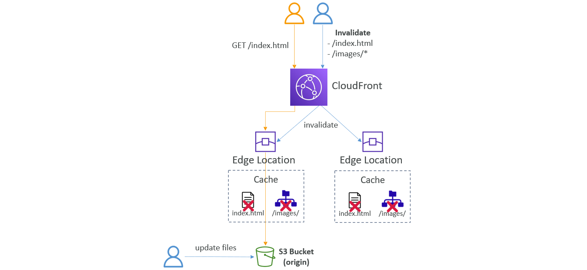

## AWS Global Accelerator
* **Global users for our application:**
  * You have deployed an application and have global users who want to access it directly. 
  * They go over the public internet, which can add a lot of latency due to many hops
  * We wish to go as fast as possible through AWS network to minimize latency
  
* **Unicast IP vs Anycast IP:**
  * **Unicast IP:** one server holds one IP address
  
  * **Anycast IP:** all servers hold the same IP address and the client is routed to the nearest one
  
* **AWS Global Accelerator:**
  * Leverage the AWS internal network to route to your application
  * **2 Anycast IP** are created for your application
  * The Anycast IP send traffic directly to Edge Locations
  * The Edge locations send the traffic to your application
  
  * Works with **Elastic IP, EC2 instances, ALB, NLB, public or private**
  * Consistent Performance
    * Intelligent routing to lowest latency and fast regional failover
    * No issue with client cache (because the IP doesn’t change)
    * Internal AWS network
  * Health Checks
    * Global Accelerator performs a health check of your applications
    * Helps make your application global (failover less than 1 minute for unhealthy)
    * Great for disaster recovery (thanks to the health checks)
  * Security
    * only 2 external IP need to be whitelisted 
    * DDoS protection thanks to AWS Shield

### Create Global Accelerator
* First Launch two Instances in different regions
* Then go to `AWS Global Accelerator` and click `Create accelerator`
  * **Step-1** `Enter name`
    * Give `Accelerator name`
  * **Step-2** `Add listeners`
    * Give `Ports` and select `Protocol`
  * **Step-3** `Add endpoint groups`
    * Choose `Region` and give `Traffic dial`
    * `Configure health checks`
    * Add `Endpoint group` for each Region
  * **Step-4** `Add endpoints`
    * Click `Add endpoint`
    * Choose `Endpoint type` and `Endpoint`
    * `Add endpoint` for each Region
  * Click `Create accelerator`
#### Key Points
* Created Accelerator has Two Static IPs (Global Anycast IP Addresses) and DNS Name
* Open created Accelerator and navigate to `Listeners`
  * Open Listener, it has `Endpoint groups`
  * Open Endpoint groups, it shows the Endpoints
  * In that shows Endpoint Health Checks

## AWS Global Accelerator vs CloudFront
* They both use the AWS global network and its edge locations around the world
* Both services integrate with AWS Shield for DDoS protection.
* **CloudFront**
  * Improves performance for both cacheable content (such as images and videos) 
  * Dynamic content (such as API acceleration and dynamic site delivery)
  * Content is served at the edge
* **Global Accelerator**
  * Improves performance for a wide range of applications over TCP or UDP 
  * Proxying packets at the edge to applications running in one or more AWS Regions.
  * Good fit for non-HTTP use cases, such as gaming (UDP), IoT (MQTT), or Voice over IP
  * Good for HTTP use cases that require static IP addresses 
  * Good for HTTP use cases that required deterministic, fast regional failover


# AWS Storage Extras
## AWS Snow Family
* Highly-secure, portable devices to collect and process **data at the edge**, and **migrate data into and out of AWS**
  
* **Data Migrations with AWS Snow Family:**
  * **Challenges:**
    * Limited connectivity
    * Limited bandwidth
    * High network cost
    * Shared bandwidth (can’t maximize the line)
    * Connection stability
  
* **AWS Snow Family: offline devices to perform data migrations** (If it takes more than a week to transfer over the network, use Snowball devices!)
* **Direct upload to S3:**
  
* **With Snow Family:**
  

### Snow Family – Usage Process
* Request Snowball devices from the AWS console for delivery
* Install the snowball client / AWS OpsHub on your servers
* Connect the snowball to your servers and copy files using the client
* Ship back the device when you’re done (goes to the right AWS facility)
* Data will be loaded into an S3 bucket
* Snowball is completely wiped

### Edge Computing
* Process data while it’s being created on an **edge location**
  * A truck on the road, a ship on the sea, a mining station underground... 
* These locations may have limited internet and no access to computing power
* We setup a **Snowball Edge / Snowcone** device to do edge computing
  * Snowcone: 2 CPUs, 4 GB of memory, wired or wireless access
  * Snowball Edge Compute Optimized (dedicated for that use case) & Storage Optimized
  * Run EC2 Instances or Lambda functions at the edge
* Use cases: preprocess data, machine learning, transcoding media

### Order an AWS Snow Family Device
* Go to AWS Snow Family and click `Order an AWS Snow family device`
* **Step-1** `Job type`
  * Give `Job name`
  * `Choose a job type`
* **Step-2** `Compute and storage`
  * Select `Snow devices`
  * `Choose your pricing option`
  * `Select the storage type`
  * Select `Compute using EC2-compatible instances`
  * `Select your S3 buckets`
* **Step-3** `Features and options`
* **Step-4** `Security, shipping, and notification preferences`
  * Choose `Encryption`
  * `Choose service access type`
  * Add `Shipping address`
  * Choose `Shipping speed`
  * `Set notifications`
* **Step-5** `Job summary`
  * Check the Job Summary and click `Create Job`.

### Solution Architecture: Snowball into Glacier
* **Snowball cannot import to Glacier directly**
* You must use Amazon S3 first, in combination with an S3 lifecycle policy
  

## Amazon FSx
* **Launch 3rd party high-performance file systems on AWS**
* Fully managed service
* FSx types are
  * FSx for Lustre
  * FSx for Windows File Server
  * FSx for NetApp ONTAP
  * FSx for OpenZFS

### Amazon FSx for Windows (File Server)
* **FSx for Windows** is a fully managed **Windows** file system share drive
* Supports SMB protocol & Windows NTFS
* Microsoft Active Directory integration, ACLs, user quotas
* **Can be mounted on Linux EC2 instances**
* Supports **Microsoft's Distributed File System (DFS) Namespaces** (group files across multiple FS)
* Scale up to 10s of GB/s, millions of IOPS, 100s PB of data
* Storage Options:
  * **SSD** – latency sensitive workloads (databases, media processing, data analytics, …)
  * **HDD** – broad spectrum of workloads (home directory, CMS, …)
* Can be accessed from your on-premises infrastructure (VPN or Direct Connect)
* Can be configured to be Multi-AZ (high availability)
* Data is backed-up daily to S3

### Amazon FSx for Lustre
* Lustre is a type of parallel distributed file system, for large-scale computing
* The name Lustre is derived from “Linux” and "cluster"
* Machine Learning, **High Performance Computing (HPC)**
* Video Processing, Financial Modeling, Electronic Design Automation
* Scales up to 100s GB/s, millions of IOPS, sub-ms latencies
* Storage Options:
  * **SSD** – low-latency, IOPS intensive workloads, small & random file operations
  * **HDD** – throughput-intensive workloads, large & sequential file operations
* **Seamless integration with S3**
  * Can “read S3” as a file system (through FSx)
  * Can write the output of the computations back to S3 (through FSx)
  * **Can be used from on-premises servers (VPN or Direct Connect)**
#### FSx Lustre - File System Deployment Options
* **Scratch File System:**
  * Temporary storage
  * Data is not replicated (doesn’t persist if file server fails)
  * High burst (6x faster, 200MBps per TiB)
  * Usage: short-term processing, optimize costs
  
* **Persistent File System:**
  * Long-term storage
  * Data is replicated within same AZ 
  * Replace failed files within minutes
  * Usage: long-term processing, sensitive data
  

### Amazon FSx for NetApp ONTAP
* Managed NetApp ONTAP on AWS
* **File System compatible with NFS, SMB, iSCSI protocol**
* Move workloads running on ONTAP or NAS to AWS
* Works with:
  * Linux
  * Windows
  * MacOS 
  * VMware Cloud on AWS
  * Amazon Workspaces & AppStream 2.0
  * Amazon EC2, ECS and EKS
* Storage shrinks or grows automatically
* Snapshots, replication, low-cost, compression and data  de-duplication
* **Point-in-time instantaneous cloning (helpful for testing new workloads)**
  

### Amazon FSx for OpenZFS
* Managed OpenZFS file system on AWS
* File System compatible with NFS (v3, v4, v4.1, v4.2)
* Move workloads running on ZFS to AWS
* Works with:
  * Linux
  * Windows
  * MacOS 
  * VMware Cloud on AWS
  * Amazon Workspaces & AppStream 2.0
  * Amazon EC2, ECS and EKS
* Up to 1,000,000 IOPS with < 0.5ms latency
* Snapshots, compression and low-cost
* **Point-in-time instantaneous cloning (helpful for testing new workloads)**
  

### Create FSx File System
* Go to FSx and click `Create file system`
* **Step-1** `Select file system type`
  * Choose `File system options`
* **Step-2** `Specify file system details`
  * Provide `File system details`
  * Select `Network & security`
  * Choose `Encryption`
* **Step-3** `Review and create`
  * Review all details and click `Create file system`

## AWS Storage Gateway
* **Hybrid Cloud for Storage:**
  * AWS is pushing for ”hybrid cloud”
    * Part of your infrastructure is on the cloud 
    * Part of your infrastructure is on-premises
  * This can be due to 
    * Long cloud migrations
    * Security requirements
    * Compliance requirements
    * IT strategy
  * S3 is a proprietary storage technology (unlike EFS / NFS), so how do you expose the S3 data on-premises? 
  * AWS Storage Gateway!
* **AWS Storage Cloud Native Options:**
  
* **AWS Storage Gateway:**
  * Bridge between on-premises data and cloud data 
  * **Use cases:**
    * disaster recovery
    * backup & restore
    * tiered storage
    * on-premises cache & low-latency files access
  * Types of Storage Gateway:
    * S3 File Gateway 
    * FSx File Gateway
    * Volume Gateway
    * Tape Gateway
  

### Amazon S3 File Gateway
* Configured S3 buckets are accessible using the NFS and SMB protocol
* **Most recently used data is cached in the file gateway**
* Supports S3 Standard, S3 Standard IA, S3 One Zone A, S3 Intelligent Tiering
* **Transition to S3 Glacier using a Lifecycle Policy**
* Bucket access using IAM roles for each File Gateway
* SMB Protocol has integration with Active Directory (AD) for user authentication
  

### Amazon FSx File Gateway
* Native access to Amazon FSx for Windows File Server
* **Local cache for frequently accessed data**
* Windows native compatibility (SMB, NTFS, Active Directory...) 
* Useful for group file shares and home directories
  

### Volume Gateway
* Block storage using iSCSI protocol backed by S3
* Backed by EBS snapshots which can help restore on-premises volumes!
* **Cached volumes:** low latency access to most recent data
* **Stored volumes:** entire dataset is on premise, scheduled backups to S3
  

### Tape Gateway
* Some companies have backup processes using physical tapes (!)
* With Tape Gateway, companies use the same processes but, in the cloud
* Virtual Tape Library (VTL) backed by Amazon S3 and Glacier
* Back up data using existing tape-based processes (and iSCSI interface)
* Works with leading backup software vendors 
  

### Storage Gateway – Hardware appliance
* Using Storage Gateway means you need on-premises virtualization
* Otherwise, you can use a **Storage Gateway Hardware Appliance**
* You can buy it on amazon.com 
* Works with File Gateway, Volume Gateway, Tape Gateway
* Has the required CPU, memory, network, SSD cache resources
* Helpful for daily NFS backups in small data centers
  

### Create Storage Gateway
* Go to Storage Gateway and click `Create gateway`
* **Activation**
  * **Step-1** `Set up gateway`
    * Give `Gateway name`
    * Select `Gateway type`
    * Choose `Host platform`
  * **Step-2** `Connect to AWS`
  * **Step-3** `Review and activate - Activate gateway`
* **Configuration**
  * **Step-4** `Configure gateway`
* Follow all steps and create Gateway.

## AWS Transfer Family
* A fully-managed service for file transfers into and out of Amazon S3 or Amazon EFS using the FTP protocol
* Supported Protocols
  * **AWS Transfer for FTP** (File Transfer Protocol (FTP))
  * **AWS Transfer for FTPS** (File Transfer Protocol over SSL (FTPS))
  * **AWS Transfer for SFTP** (Secure File Transfer Protocol (SFTP))
* Managed infrastructure, Scalable, Reliable, Highly Available (multi-AZ)
* Pay per provisioned endpoint per hour + data transfers in GB
* Store and manage users’ credentials within the service
* Integrate with existing authentication systems (Microsoft Active Directory, LDAP, Okta, Amazon Cognito, custom)
* Usage: sharing files, public datasets, CRM, ERP, …
  

## AWS DataSync
* Move large amount of data to and from
  * On-premises / other cloud to AWS (NFS, SMB, HDFS, S3 API…) – needs agent
  * AWS to AWS (different storage services) – no agent needed
* Can synchronize to:
  * Amazon S3 (any storage classes – including Glacier)
  * Amazon EFS
  * Amazon FSx (Windows, Lustre, NetApp, OpenZFS...) 
* Replication tasks can be scheduled hourly, daily, weekly
* **File permissions and metadata are preserved** (NFS POSIX, SMB…)
* One agent task can use 10 Gbps, can setup a bandwidth limit
* **AWS DataSync - NFS / SMB to AWS (S3, EFS, FSx…):**
  
* **AWS DataSync - Transfer between AWS storage services:**
  

## Storage Comparison
* **S3:** Object Storage
* **S3 Glacier:** Object Archival
* **EBS volumes:** Network storage for one EC2 instance at a time
* **Instance Storage:** Physical storage for your EC2 instance (high IOPS)
* **EFS:** Network File System for Linux instances, POSIX filesystem
* **FSx for Windows:** Network File System for Windows servers
* **FSx for Lustre:** High Performance Computing Linux file system
* **FSx for NetApp ONTAP:** High OS Compatibility
* **FSx for OpenZFS:** Managed ZFS file system
* **Storage Gateway:** S3 & FSx File Gateway, Volume Gateway (cache & stored), Tape Gateway
* **Transfer Family:** FTP, FTPS, SFTP interface on top of Amazon S3 or Amazon EFS
* **DataSync:** Schedule data sync from on-premises to AWS, or AWS to AWS
* **Snowcone / Snowball / Snowmobile:** to move large amount of data to the cloud, physically
* **Database:** for specific workloads, usually with indexing and querying


# AWS Integration & Messaging (SQS, SNS & Kinesis)
* When we start deploying multiple applications, they will inevitably need to communicate with one another
* There are two patterns of application communication
  
* Synchronous between applications can be problematic if there are sudden spikes of traffic
* What if you need to suddenly encode 1000 videos but usually it’s 10?
* In that case, it’s better to **decouple** your applications, 
  * using SQS: queue model
  * using SNS: pub/sub model
  * using Kinesis: real-time streaming model
* These services can scale independently from our application!

## Amazon SQS
* **What’s a queue?**
  

### SQS - Standard Queue
* Oldest offering (over 10 years old)
* Fully managed service, used to **decouple applications**
* Attributes:
  * Unlimited throughput, unlimited number of messages in queue
  * Default retention of messages: 4 days, maximum of 14 days
  * Low latency (<10 ms on publish and receive)
  * Limitation of 256KB per message sent
* Can have duplicate messages (at least once delivery, occasionally)
* Can have out of order messages (best effort ordering)

### SQS - Producing Messages
* Produced to SQS using the SDK (SendMessage API)
* The message is **persisted** in SQS until a consumer deletes it
* Message retention: default 4 days, up to 14 days
* Example: send an order to be processed 
  * Order id
  * Customer id
  * Any attributes you want 
* SQS standard: unlimited throughput
  

### SQS - Consuming Messages
* Consumers (running on EC2 instances, servers, or AWS Lambda)…
* Poll SQS for messages (receive up to 10 messages at a time)
* Process the messages (example: insert the message into an RDS database)
* Delete the messages using the DeleteMessage API
  
* **SQS – Multiple EC2 Instances Consumers:**
  * Consumers receive and process messages in parallel
  * At least once delivery
  * Best-effort message ordering
  * Consumers delete messages after processing them
  * We can scale consumers horizontally to improve throughput of processing
  

### SQS - Security
* **Encryption:**
  * In-flight encryption using HTTPS API
  * At-rest encryption using KMS keys
  * Client-side encryption if the client wants to perform encryption/decryption itself 
* **Access Controls:** IAM policies to regulate access to the SQS API
* **SQS Access Policies** (similar to S3 bucket policies)
  * Useful for cross-account access to SQS queues
  * Useful for allowing other services (SNS, S3…) to write to an SQS queue

### Create Queue
* Go to SQS and click `Create queue`
  * Select `Type` and give `Name`
  * Provide `Configuration`
  * Select `Encryption`
  * Define `Access policy`
  * Provide `Tags`
  * Click `Create queue`
#### Key Points
* Open created Queue and click `Send and receive messages`
  * In `Send message`, give `Message body` and click `Send message`
  * In `Receive messages`, click `Poll for messages` for getting Messages
  * In `Messages`, click on Message Id to View that Message
  * Select Message and click `Delete`
    * It means, we signaled the SQS that the Message has been successfully processed.
    * When we click `Poll for messages`, we not receive that Message again because we deleted it
* Open created Queue and click `Purge`
  * It deletes all the Messages from the Queue

### SQS – Message Visibility Timeout
* After a message is polled by a consumer, it becomes **invisible** to other consumers
* By default, the “message visibility timeout” is **30 seconds**
* That means the message has 30 seconds to be processed
* After the message visibility timeout is over, the message is “visible” in SQS
  
* If a message is not processed within the visibility timeout, it will be processed **twice**
* A consumer could call the **ChangeMessageVisibility** API to get more time
* If visibility timeout is high (hours), and consumer crashes, re-processing will take time
* If visibility timeout is too low (seconds), we may get duplicates
* **Hands-on:**
  * To change Message Visibility Timeout
    * Go to created Queue and click `Edit`
    * In `Configuration`, change `Visibility timeout`

### SQS - Long Polling
* When a consumer requests messages from the queue, it can optionally “wait” for messages to arrive if there are none in the queue
* This is called Long Polling
* **LongPolling decreases the number of API calls made to SQS while increasing the efficiency and reducing latency of your application
* The wait time can be between 1 sec to 20 sec (20 sec preferable)
* Long Polling is preferable to Short Polling
* Long polling can be enabled at the queue level or at the API level using **WaitTimeSeconds**
  

### SQS – FIFO Queue
* FIFO = First In First Out (ordering of messages in the queue)
  
* Limited throughput: 300 msg/s without batching, 3000 msg/s with
* Exactly-once send capability (by removing duplicates)
* Messages are processed in order by the consumer
#### Hands-on
* FIFO queue names must end with `.fifo`
* Go to created FIFO Queue and click `Send and receive messages`
  * In `Send message`, provide `Message body`, `Message group ID` and `Message deduplication ID`
  * Then click `Send message`

### SQS with Auto Scaling Group (ASG)
  

### SQS to decouple between application tiers
  
* **If the load is too big, some transactions may be lost:**
  
* **SQS as a buffer to database writes:**
  

## Amazon SNS (Simple Notification Service)
* What if you want to send one message to many receivers?
  
* The “event producer” only sends message to one SNS topic
* As many “event receivers” (subscriptions) as we want to listen to the SNS topic notifications
* Each subscriber to the topic will get all the messages (note: new feature to filter messages)
* Up to 12,500,000 subscriptions per topic
* 100,000 topics limit
  

### SNS integrates with a lot of AWS services
* Many AWS services can send data directly to SNS for notifications
  

### SNS – How to publish
* Topic Publish (using the SDK)
  * Create a topic
  * Create a subscription (or many)
  * Publish to the topic
* Direct Publish (for mobile apps SDK)
  * Create a platform application 
  * Create a platform endpoint
  * Publish to the platform endpoint
  * Works with Google GCM, Apple APNS, Amazon ADM…

### SNS – Security
* **Encryption:**
  * In-flight encryption using HTTPS API
  * At-rest encryption using KMS keys
  * Client-side encryption if the client wants to perform encryption/decryption itself 
* **Access Controls:** IAM policies to regulate access to the SNS API
* **SNS Access Policies** (similar to S3 bucket policies)
  * Useful for cross-account access to SNS topics 
  * Useful for allowing other services ( S3…) to write to an SNS topic

### SNS + SQS: Fan Out
  
* Push once in SNS, receive in all SQS queues that are subscribers
* Fully decoupled, no data loss
* SQS allows for: data persistence, delayed processing and retries of work
* Ability to add more SQS subscribers over time
* Make sure your SQS queue **access policy** allows for SNS to write
* Cross-Region Delivery: works with SQS Queues in other regions

### Application: S3 Events to multiple queues
* For the same combination of: **event type** (e.g. object create) and prefix (e.g. images/) you can only have one S3 Event rule
* If you want to send the same S3 event to many SQS queues, use fan-out
  

### Application: SNS to Amazon S3 through Kinesis Data Firehose
* SNS can send to Kinesis and therefore we can have the following solutions architecture:
  

### Amazon SNS – FIFO Topic
* FIFO = First In First Out (ordering of messages in the topic)
  
* Similar features as SQS FIFO:
  * **Ordering** by Message Group ID (all messages in the same group are ordered)
  * **Deduplication** using a Deduplication ID or Content Based Deduplication
* **Can have SQS Standard and FIFO queues as subscribers**
* Limited throughput (same throughput as SQS FIFO)

### SNS FIFO + SQS FIFO: Fan Out
* In case you need fan out + ordering + deduplication
  

### SNS – Message Filtering
* JSON policy used to filter messages sent to SNS topic’s subscriptions
* If a subscription doesn’t have a filter policy, it receives every message 
  

### Create SNS Topic
* In SNS, go to `Topics` and click `Create topic`
  * Select `Type` and give `Name`
  * Click `Create topic`
* Go to created Topic `-->` `Subscriptions`
  * Click `Create subscription`
  * Select `Protocol` (Email)
  * Give `Endpoint` (example@mail.com)
  * Click `Create subscription`
* Then go to Mail and click `Confirm subscription`
* Go to Created Topic, in `Subscriptions` shows the Status `Confirmed/Pending confirmation`
* Go to Created Topic and click `Publish message` for Test
  * Give `Subject` and `Message body`
  * Click `Publish message`
  * This can helpful for testing Subscriptions

## Kinesis
* Makes it easy to **collect**, **process**, and **analyze** streaming data in real-time 
* Ingest real-time data such as: Application logs, Metrics, Website clickstreams, IoT telemetry data…
  
* **Kinesis Data Streams:** capture, process, and store data streams
* **Kinesis Data Firehose:** load data streams into AWS data stores
* **Kinesis Data Analytics:** analyze data streams with SQL or Apache Flink
* **Kinesis Video Streams:** capture, process, and store video streams

### Kinesis Data Streams
  
* Retention between 1 day to 365 days
* Ability to reprocess (replay) data
* Once data is inserted in Kinesis, it can’t be deleted (immutability)
* Data that shares the same partition goes to the same shard (ordering)
* Producers: AWS SDK, Kinesis Producer Library (KPL), Kinesis Agent
* Consumers: 
  * Write your own: Kinesis Client Library (KCL), AWS SDK
  * Managed: AWS Lambda, Kinesis Data Firehose, Kinesis Data Analytics
* **Kinesis Data Streams – Capacity Modes:**
  * **Provisioned mode:**
    * You choose the number of shards provisioned, scale manually or using API
    * Each shard gets 1MB/s in (or 1000 records per second)
    * Each shard gets 2MB/s out (classic or enhanced fan-out consumer)
    * You pay per shard provisioned per hour
  * **On-demand mode:**
    * No need to provision or manage the capacity
    * Default capacity provisioned (4 MB/s in or 4000 records per second)
    * Scales automatically based on observed throughput peak during the last 30 days
    * Pay per stream per hour & data in/out per GB
* **Kinesis Data Streams Security:**
  * Control access / authorization using IAM policies
  * Encryption in flight using HTTPS endpoints
  * Encryption at rest using KMS
  * You can implement encryption/decryption of data on client side (harder)
  * VPC Endpoints available for Kinesis to access within VPC
  * Monitor API calls using CloudTrail
  
#### Create Kinesis Data Stream
* Go to Kinesis, select `Kinesis Data Streams` and click `Create data stream`
  * Give `Data stream name`
  * Choose `Capacity mode` (If you choose `Provisioned`, give `Provisioned shards`)
  * Click `Create data stream`
#### Hands-on Kinesis Data Stream
* Open `AWS CloudShell`
* Use below Commands:
  ```bash
  # get the AWS CLI version
  aws --version

  # PRODUCER (Use below Commands to Add Data based on Version)
  # CLI v2
  aws kinesis put-record --stream-name DemoStream --partition-key user1 --data "user signup" --cli-binary-format raw-in-base64-out
  # CLI v1
  aws kinesis put-record --stream-name DemoStream --partition-key user1 --data "user signup"

  # CONSUMER 
  # describe the stream
  aws kinesis describe-stream --stream-name DemoStream
  # Consume some data
  aws kinesis get-shard-iterator --stream-name DemoStream --shard-id shardId-000000000000 --shard-iterator-type TRIM_HORIZON

  aws kinesis get-records --shard-iterator <Provide_ShardIterator_Data>
  ```
  * The Data is in Base64 Encoded Format, We want to see Original Data need to Decode it.

### Kinesis Data Firehose
  
* Fully Managed Service, no administration, automatic scaling, serverless
  * AWS: Redshift / Amazon S3 / OpenSearch 
  * 3rd party partner: Splunk / MongoDB / DataDog / NewRelic / … 
  * Custom: send to any HTTP endpoint
* Pay for data going through Firehose
* **Near Real Time**
  * Buffer interval: 0 seconds (no buffering) to 900 seconds
  * Buffer size: minimum 1MB
* Supports many data formats, conversions, transformations, compression
* Supports custom data transformations using AWS Lambda
* Can send failed or all data to a backup S3 bucket

#### Kinesis Data Streams vs Firehose
  

#### Create Amazon Data Firehose
* Go to Amazon Data Firehose and click `Create Firehose stream`
  * `Choose source and destination` (Source: `Amazon Kinesis Data Streams` & Destination: `Amazon S3`)
  * In `Source settings`, Choose `Kinesis data stream`
  * In `Destination settings`, Choose `S3 bucket`
    * In `Buffer hints, compression, file extension and encryption`
      * Change `Buffer size` and `Buffer interval`
  * Click `Create Firehose stream`
#### Hands-on
* After Creating Data Firehose, go to `Kinesis Data Streams` and add some data
* After Buffer Time, the Data is reflected into Destination S3 Bucket
* Go to Destination S3 Bucket and check Data

## Data Ordering for Kinesis vs SQS FIFO
* **Ordering data into Kinesis:**
  * Imagine you have 100 trucks (truck_1, truck_2, … truck_100) on the road sending their GPS positions regularly into AWS. 
  * You want to consume the data in order for each truck, so that you can track their movement accurately. 
  * How should you send that data into Kinesis?
  * **Answer: send using a “Partition Key” value of the “truck_id”**
  * **The same key will always go to the same shard**
  
* **Ordering data into SQS:**
  * For SQS standard, there is no ordering. 
  * For SQS FIFO, if you don’t use a Group ID, messages are consumed in the order they are sent, **with only one consumer**
  
  * You want to scale the number of consumers, but you want messages to be “grouped” when they are related to each other
  * Then you use a Group ID (similar to Partition Key in Kinesis)
  
* **Kinesis vs SQS Ordering**
  * **Let’s assume 100 trucks, 5 kinesis shards, 1 SQS FIFO**
  * **Kinesis Data Streams:**
    * On average you’ll have 20 trucks per shard
    * Trucks will have their data ordered within each shard
    * The maximum amount of consumers in parallel we can have is 5 
    * Can receive up to 5 MB/s of data
  * **SQS FIFO:**
    * You only have one SQS FIFO queue
    * You will have 100 Group ID 
    * You can have up to 100 Consumers (due to the 100 Group ID)
    * You have up to 300 messages per second (or 3000 if using batching)

## SQS vs SNS vs Kinesis
  

## Amazon MQ
* SQS, SNS are “cloud-native” services: proprietary protocols from AWS
* Traditional applications running from on-premises may use open protocols such as: MQTT, AMQP, STOMP, Openwire, WSS
* **When migrating to the cloud**, instead of re-engineering the application to use SQS and SNS, we can use Amazon MQ 
* **Amazon MQ is a managed message broker service for**
  
* Amazon MQ doesn’t “scale” as much as SQS / SNS
* Amazon MQ runs on servers, can run in Multi-AZ with failover
* Amazon MQ has both queue feature (~SQS) and topic features (~SNS)
* **Amazon MQ – High Availability:**
  