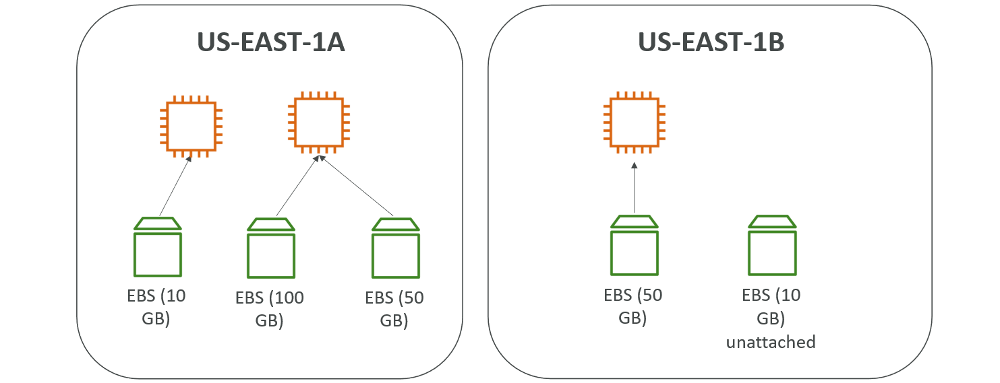
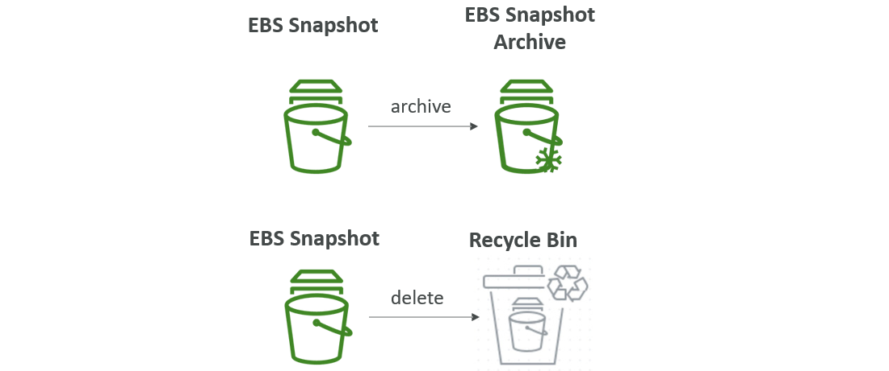
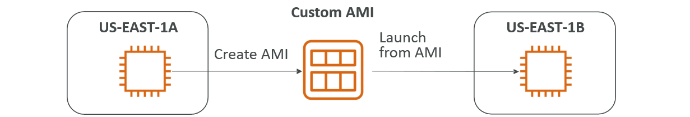
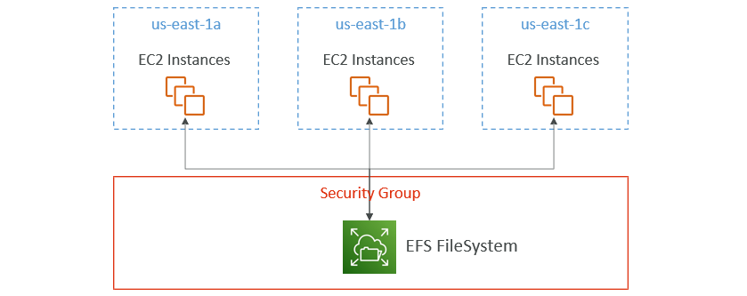

# AWS
* AWS (Amazon Web Services) is a Cloud Provider.
* They provide you with Servers and Services that you can use on demand and scale easily.
* **Use Cases:**
  * AWS enables you to build sophisticated, scalable Applications.
  * Applicable to a diverse set of Industries.
  * Use cases include
    * Enterprise IT, Backup & Storage, Big Data analytics
    * Website hosting, Mobile & Social Apps
    * Gaming

## AWS Global Infrastructure
* AWS Regions
* AWS Availability Zones
* AWS Data Centers
* AWS Edge Locations/Points of Presence

### AWS Regions
* AWS has Regions all around the world.
* Names can be us-east-1, eu-west-3…
* A Region is a cluster of Data Centers.
* Most AWS Services are region-scoped.

#### How to choose an AWS Region
* **Compliance with data governance and legal requirements:** data never leaves a Region without your explicit permission.
* **Proximity to customers:** reduced latency
* **Available Services within a Region:** new Services and new features aren’t available in every Region.
* **Pricing:** pricing varies Region to Region and is transparent in the service pricing page.

### AWS Availability Zones
* Each Region has many Availability Zones (usually 3, Min is 3, Max is 6). Example:
  * ap-southeast-2a
  * ap-southeast-2b
  * ap-southeast-2c
* Each Availability Zone (AZ) is one or more discrete data centers with redundant power, networking, and connectivity.
* They’re separate from each other, so that they’re isolated from disasters.
* They’re connected with high bandwidth, ultra-low latency networking.

## Tour of AWS Console
* **AWS has Global Services:**
  * Identity and Access Management (IAM)
  * Route 53 (DNS service)
  * CloudFront (Content Delivery Network)
  * WAF (Web Application Firewall)
* **Most AWS services are Region-scoped:**
  * Amazon EC2 (Infrastructure as a Service)
  * Elastic Beanstalk (Platform as a Service)
  * Lambda (Function as a Service)
  * Rekognition (Software as a Service)


# Identity and Access Management (IAM)
## IAM Users & Groups
* IAM is Global Service.
* Root account created by default, shouldn’t be used or shared.
* Users are People within your Organization, and can be Grouped.
* Groups only contain Users, not other Groups.
* Users don’t have to belong to a Group, and User can belong to Multiple Groups.

### Create IAM User
* Go to `IAM` and select `Users`.
* Click `Create user`.
  * Step 1 - `Specify user details`
    * Give `User name`
    * Select to `Provide user access to the AWS Management Console`
    * In User type, select `I want to create an IAM user`
    * Provide `Console password`
    * Choose & verify remaining data
  * Step 2 - `Set permissions`
    * Select `Permissions options` (In this case we are selecting `Add user to group`)
      * Click `Create group`
      * Give `User group name` and Add `Permissions policies`
      * Click `Create user group`.
    * Select `Group`
  * Step 3 - Review and create
    * Check Details and Click `Create user`
  * Step 4 - Retrieve password
    * Shows `Console sign-in details`
    * You can Save it using `Download .csv file` or `Email sign-in instructions`
  * Click `Return to users list`.

## Account Alias
* Account Alias is alias to Account ID. We can use Account Alias Name instead of Account ID.
* To set Account Alias:
  * Go to `IAM Dashboard`
  * In `AWS Account`, we can add `Account Alias`.
* This Account Alias Name is replaced with Account ID in `Sign-in URL for IAM users in this account`.

## IAM Permissions
* Users or Groups can be assigned JSON documents called Policies.
* These Policies define the Permissions of the Users.
* In AWS you apply the least privilege principle: don’t give more Permissions than a User needs.

### IAM Policies Structure


* Consists of
  * **Version:** Policy Language Version, always include “2012-10-17”
  * **Id:** An Identifier for the Policy (optional)
  * **Statement:** One or more individual Statements (required)
* Statements consists of
  * **Sid:** An identifier for the Statement (optional)
  * **Effect:** Whether the Statement allows or denies access (Allow, Deny)
  * **Principal:** Account/User/Role to which this Policy applied to
  * **Action:** List of Actions this Policy allows or denies
  * **Resource:** List of Resources to which the Actions applied to
  * **Condition:** Conditions for when this Policy is in effect (optional)

### About Policies
* We can `Attach/Dettach` Policies to `Users/Groups`.
  * Go to `Users/Groups`
  * In `Permissions`, we can Add/Remove `Permissions policies`.
* We can create Policies of your Own
  * Go to `Policies`
  * Click `Create policy`
    * Select `Service`, `Actions allowed` and `Resources`
    * Give `Policy name`
    * Click `Create policy`.
* In `Policies`, click on `Policy name`
  * It shows `Permissions defined in this policy`
  * Click on `JSON` to show that Policy JSON Format.

## IAM Password Policy
* Strong Passwords = higher security for your account.
* In AWS, you can setup a Password Policy:
  * Set a minimum password length
  * Require specific character types:
    * including uppercase letters
    * lowercase letters
    * numbers
    * non-alphanumeric characters
  * Allow all IAM Users to change their own Passwords
  * Require Users to change their Password after some time (password expiration)
  * Prevent Password re-use

### Create Password Policy
* In IAM, go to `Account settings` in Access management.
* In Password policy, click `Edit`.
* Select `Custom` to Apply customized password requirements.
* Select required Options and click `Save changes`.

## Multi Factor Authentication (MFA)
* Users have access to your Account and can possibly change Configurations or Delete Resources in your AWS Account.
* You protect your Root Accounts and IAM users using MFA.
* MFA = Password you know + Security Device you own.
* **Main benefit of MFA:** If a Password is stolen or hacked, the Account is not compromised.

### Add MFA to Root Account
* In AWS Console, click on Root Username and select `Security credentials`.
* In `Multi-factor authentication (MFA)`, select `Assign MFA device`.
  * Step 1 - `Select MFA device`
    * Give `Device name`
    * Select `Device options` (In this case we are using `Authenticator app`)
  * Step 2 - `Set up device`
    * Click `Show QR code` and Scan the QR Code with Authenticator App.
    * Add Authenticator App Codes in `Type two consecutive MFA codes below`
  * Click `Add MFA`.

## How Can Users Access AWS
* To Access AWS, we have three options:
  * **AWS Management Console:** Protected by Password + MFA
  * **AWS Command Line Interface (CLI):** Protected by Access Keys
  * **AWS Software Developer Kit (SDK):** For Code: Protected by Access Keys
* Access Keys are generated through the AWS Console.
  * Users manage their own Access Keys.
  * Access Keys are Secret, just like a Password. Don’t share them
    * Access Key ID ~= Username
    * Secret Access Key ~= Password

### AWS CLI
* A Tool that enables you to interact with AWS Services using commands in your Command-Line Shell.
* Direct access to the Public APIs of AWS Services.
* You can develop scripts to manage your Resources.
* Alternative to using AWS Management Console.

#### Install & Configure AWS CLI
* [Refer Here](https://docs.aws.amazon.com/cli/latest/userguide/getting-started-install.html) for Official Site.
* In that select your Operating System and follow the Steps.
* After installation check the version `aws --version`
* Create Access Keys and Configure AWS. Use command `aws configure`
  * Provide Access Key, Secret Access Key and Region.
* After successful Configuration, check the configuration using basic command `aws iam list-users --> List the IAM Users`.

#### Create Access Keys
* Go to `IAM Users` and click on User.
* In User `Security credentials`, navigate to `Access keys` and click `Create access key`.
  * Step 1 - `Access key best practices & alternatives`
    * In Use case, select `Command Line Interface (CLI)`
  * Step 2 - `Set description tag`
    * Provide `Description tag value`
    * Click `Create access key`.
  * Step 3 - `Retrieve access keys`
    * Save `Access key & Secret access key` by clicking `Download .csv file`

### AWS SDK (Software Development Kit)
* Language-specific APIs (set of libraries).
* Enables you to access and manage AWS Services Programmatically.
* Embedded within your Application.
* Supports
  * SDKs (JavaScript, Python, PHP, .NET, Ruby, Java, Go, Node.js, C++)
  * Mobile SDKs (Android, iOS, …)
  * IoT Device SDKs (Embedded C, Arduino, …)
* Example: AWS CLI is built on AWS SDK for Python.

## AWS CloudShell
* AWS CloudShell is available on top right side .
* AWS CloudShell is a Terminal in AWS Console comes with AWS CLI pre-installed.
* In AWS CloudShell
  * `Actions:` Used to Upload and Download files.
  * `Settings:` Used to change Display Preferences.

## IAM Roles for Services
* Some AWS service will need to perform actions on your behalf.
* To do so, we will assign Permissions to AWS services with IAM Roles.
* **Common Roles:**
  * EC2 Instance Roles
  * Lambda Function Roles
  * Roles for CloudFormation

### Create Role
* Go to IAM, in Access management select `Roles`.
* Click `Create role`.
  * Step 1 - Select trusted entity
    * Select `Trusted entity type` to `AWS service`
    * Select `Use case`
  * Step 2 - `Add permissions`
    * Provide `Permissions policies`
  * Step 3 - `Name, review, and create`
    * Give `Role name`
    * Check Details and click `Create role`.

## IAM Security Tools
* **IAM Credentials Report (Account-Level)**
  * A report that lists all your Account's Users and the status of their various Credentials.
  * For `Credentials Report:`
    * Go to IAM, In Access reports select `Credential report`
    * Click `Download credentials report`.
* **IAM Access Advisor (User-Level)**
  * Access advisor shows the Service permissions granted to a User and when those Services were last accessed.
  * You can use this information to revise your Policies.
  * For `Access Advisor Report:`
    * Go to IAM Users and select User.
    * Select `Last Accessed` and it shows the Report.

## IAM Guidelines & Best Practices
* Don’t use the root account except for AWS account setup.
* One Physical User = One AWS User.
* Assign Users to Groups and assign Permissions to Groups.
* Create a Strong Password Policy.
* Use and enforce the use of Multi Factor Authentication (MFA).
* Create and use Roles for giving Permissions to AWS Services.
* Use Access Keys for Programmatic Access (CLI / SDK).
* Audit Permissions of your Account using IAM Credentials Report & IAM Access Advisor.
* Never share IAM Users & Access Keys.

## IAM Section – Summary
* **Users:** Mapped to a Physical User, has a Password for AWS Console.
* **Groups:** Contains Users only.
* **Policies:** JSON document that outlines Permissions for Users or Groups.
* **Roles:** For EC2 Instances or AWS Services.
* **Security:** MFA + Password Policy.
* **AWS CLI:** Manage your AWS Services using the Command-Line.
* **AWS SDK:** Manage your AWS Services using a Programming Language.
* **Access Keys:** Access AWS using the CLI or SDK.
* **Audit:** IAM Credential Reports & IAM Access Advisor.

## AWS Budget Setup
* Click on Account Username and select `Billing and Cost Management`.
* IAM Users are by default they didn't have access to `Billing and Cost Management` even they have `Administrator Access`.
  * To Enable,
    * Go to IAM Root User Account and click Username, select `Account`.
    * In that navigate to `IAM user and role access to Billing information` and click `Edit`.
    * Select `Activate IAM Access` and click `Update`.
  * Now IAM Users can access `Billing and Cost Management` who have Administrator Access.

### Create Budget
* Go to Billing and Cost Management, select `Budgets` in Budgets and Planning.
* Click `Create budget`.
  * Select `Budget setup` - Use a template (simplified).
  * Select `Templates` based on requirement.
  * Give `Budget name` and provide `Email recipients`.
  * Click `Create budget`.


# Amazon EC2
* EC2 is one of the most popular of AWS offering.
* EC2 = Elastic Compute Cloud = Infrastructure as a Service.
* It mainly consists in the capability of
  * Renting Virtual Machines (EC2)
  * Storing Data on Virtual Drives (EBS)
  * Distributing load across Machines (ELB)
  * Scaling the Services using an Auto-Scaling Group (ASG)
* Knowing EC2 is fundamental to understand how the Cloud works.

## EC2 Sizing & Configuration Options
* Operating System (**OS**): Linux, Windows or MacOS
* How much Compute Power & Cores (**CPU**)
* How much Random-Access Memory (**RAM**)
* How much Storage Space:
  * Network-Attached (**EBS & EFS**)
  * Hardware (**EC2 Instance Store**)
* Network Card: Speed of the Card, Public IP Address
* Firewall Rules: **Security Group**
* Bootstrap Script (Configure at first Launch): **EC2 User Data**

## EC2 User Data
* It is possible to bootstrap our Instances using an EC2 User Data Script.
* Bootstrapping means Launching Commands when a Machine Starts.
* That Script is only run once at the Instance first Start.
* EC2 User Data is used to Automate boot Tasks such as:
  * Installing Updates
  * Installing Software
  * Downloading Common Files from the Internet
  * Anything you can think of
* The EC2 User Data Script runs with the Root User.

## Launch instance
* Go to EC2 and click `Launch instance`.
* Give `Name` in Name and tags.
* Select `AMI` in Application and OS Images (Amazon Machine Image).
* Select `Instance type`.
* Create or Add `Key pair (login)`
  * Click `Create new key pair`
  * Give `Key pair name` and click `Create key pair`.
* In `Network settings`, Create New Security Group or Select an Existing Security Group.
  * Select required Ports to allow Traffic.
* `Configure storage`, in that change Volume Size if required.
* In `Advanced details`, navigate to `User data` and provide required User Data.
  * User Data is knowthing but Commands
  * In User Data, we first provide `#!/bin/bash` and then give Commands.
  * Sample User Data:
    ```
    #!/bin/bash
    # install httpd on Amazon Linux
    yum update -y
    yum install -y httpd
    systemctl start httpd
    systemctl enable httpd
    echo "<h1>Hello World from $(hostname -f)</h1>" > /var/www/html/index.html
    ```
* Check `Summary`.
* Click `Launch instance`.

### Start/Stop/Terminate Instance
* Select Instance and click `Instance state`.
* Select required Action.

## Instance Types
* We can use different types of EC2 Instances that are optimised for different use cases.
* [Refer Here](https://aws.amazon.com/ec2/instance-types/) for Official docs.
* Instance Types are
  * General Purpose
  * Compute Optimized
  * Memory Optimized
  * Accelerated Computing
  * Storage Optimized
  * HPC Optimized
  * Instance Features
  * Measuring Instance Performance
* AWS has the naming convention: **m5.2xlarge**
  * `m:` Instance Class
  * `5:` Generation (AWS Improves then over Time)
  * `2xlarge:` Size within the Instance Class
#### General Purpose
* Great for a diversity of `Workloads` such as Web Servers or Code Repositories.
* Balance between:
  * Compute
  * Memory
  * Networking
* In the course, we will be using the t2.micro which is a General Purpose EC2 Instance.
#### Compute Optimized
* Great for compute-intensive tasks that require `high performance processors`:
  * Batch Processing Workloads
  * Media Transcoding
  * High Performance Web Servers
  * High Performance Computing (HPC)
  * Scientific Modeling & Machine Learning
  * Dedicated Gaming Servers
#### Memory Optimized
* Fast performance for workloads that process `large data sets in memory`
* Use cases:
  * High performance, relational/non-relational databases
  * Distributed web scale cache stores
  * In-memory databases optimized for BI (business intelligence)
  * Applications performing real-time processing of big unstructured data
#### Storage Optimized
* Great for `storage-intensive tasks` that require high, sequential read and write access to large data sets on local storage.
* Use cases:
  * High frequency online transaction processing (OLTP) systems
  * Relational & NoSQL databases
  * Cache for in-memory databases (for example, Redis)
  * Data warehousing applications
  * Distributed file systems

## Security Groups
* Security Groups are the fundamental of Network Security in AWS.
* They control how traffic is allowed into or out of our EC2 Instances.
  
* Security groups only contain rules.
* Security groups rules can reference by IP or by security group.
* Security groups are acting as a “firewall” on EC2 instances
* They regulate:
  * Access to Ports
  * Authorised IP ranges – IPv4 and IPv6
  * Control of inbound network (from other to the instance)
  * Control of outbound network (from the instance to other)
* Security Groups Diagram
  
* Referencing other Security Groups Diagram
  

### Security Groups Good to know
* Can be attached to multiple instances.
* Locked down to a region / VPC combination.
* Does live “outside” the EC2 – if traffic is blocked the EC2 instance won’t see it.
* It’s good to maintain one separate security group for SSH access.
* If your application is not accessible (time out), then it’s a security group issue.
* If your application gives a “connection refused“ error, then it’s an application error or it’s not launched.
* All inbound traffic is blocked by default.
* All outbound traffic is authorised by default.

### Classic Ports to know
* 22 = SSH (Secure Shell) - log into a Linux instance.
* 21 = FTP (File Transfer Protocol) – upload files into a file share.
* 22 = SFTP (Secure File Transfer Protocol) – upload files using SSH.
* 80 = HTTP – access unsecured websites.
* 443 = HTTPS – access secured websites.
* 3389 = RDP (Remote Desktop Protocol) – log into a Windows instance.

### Create Security Group
* Go to EC2, in Network & Security click `Security Groups`.
* Click `Create security group`.
  * Give `Security group name`, `Description` and select `VPC`.
  * Add `Inbound rules`
    * Click `Add rule`
    * Select `Type`, `Protocol`, `Port range` and `Source`
    * Provide `Tags`
  * Click `Create security group`.

### Update Inbound Rules to Security Group
* Go to Instances, select Instance.
  * Select `Security`, in `Security details` attached Security Groups are available in `Security groups`.
  * Click on required Security Group.
<center> (or) </center>

* Go to EC2, in Network & Security click `Security Groups`.
  * Select required Security Group.
* In `Inbound rules`, we can Add/Remove Inbound Rules.
  * Click `Edit inbound rules`
  * Click `Add rule`
  * Select `Type`, `Protocol`, `Port range` and `Source`
  * Click `Save rules`.

## SSH into EC2 Instance
* SSH is one of the most important function. It allows you to control a remote machine, all using the command line.
  ```
  ssh -i <.pem file along with path> <username>@<publicIP>
  ```

## EC2 Instance Connect
* Connect to your EC2 instance within your browser.
* No need to use your key file that was downloaded.
* The “magic” is that a temporary key is uploaded onto EC2 by AWS.
* Need to make sure the port 22 is still opened!
* Connect to Instance:
  * Select Instance and click `Connect`.
  * Choose `EC2 Instance Connect` and click `Connect`.
* Now SSH Connection is established to Instance.
* EC2 Instance Connect is a feature of AWS that provides a secure way to connect to your Linux Instances over Secure Shell.

## EC2 Instances Purchasing Options
* **On-Demand Instances:** short workload, predictable pricing, pay by second
* **Reserved:** (1 & 3 years)
  * **Reserved Instances:** long workloads
  * **Convertible Reserved Instances:** long workloads with flexible instances
* **Savings Plans:** commitment to an amount of usage, long workload (1 & 3 years)
* **Spot Instances:** short workloads, cheap, can lose instances (less reliable)
* **Dedicated Hosts:** book an entire physical server, control instance placement
* **Dedicated Instances:** no other customers will share your hardware
* **Capacity Reservations:** reserve capacity in a specific AZ for any duration

### EC2 On Demand
* Pay for what you use:
  * Linux or Windows - billing per second, after the first minute
  * All other operating systems - billing per hour 
* Has the highest cost but no upfront payment
* No long-term commitment
* Recommended for **short-term** and **un-interrupted workloads**, where you can't predict how the application will behave

### EC2 Reserved Instances
* **Up to 72% discount** compared to On-demand
* You reserve a specific instance attributes (**Instance Type, Region, Tenancy, OS**)
* **Reservation Period – 1 year** (+discount) or **3 years** (+++discount)
* **Payment Options** – **No Upfront** (+), **Partial Upfront** (++), **All Upfront** (+++)
* **Reserved Instance’s Scope** – **Regional** or **Zonal** (reserve capacity in an AZ)
* Recommended for steady-state usage applications (think database)
* You can buy and sell in the Reserved Instance Marketplace
* **Convertible Reserved Instance**
  * Can change the EC2 instance type, instance family, OS, scope and tenancy
  * Up to 66% discount

### EC2 Savings Plans
* Get a discount based on long-term usage (up to 72% - same as RIs)
* Commit to a certain type of usage ($10/hour for 1 or 3 years)
* Usage beyond EC2 Savings Plans is billed at the On-Demand price
* Locked to a specific instance family & AWS region (e.g., M5 in us-east-1)
* Flexible across:
  * Instance Size (e.g., m5.xlarge, m5.2xlarge)
  * OS (e.g., Linux, Windows)
  * Tenancy (Host, Dedicated, Default)

### EC2 Spot Instances
* Can get a **discount of up to 90%** compared to On-demand
* Instances that you can “lose” at any point of time if your max price is less than the current spot price
* The **MOST cost-efficient** instances in AWS
* **Useful for workloads that are resilient to failure**
  * Batch jobs
  * Data analysis
  * Image processing
  * Any **distributed** workloads
  * Workloads with a flexible start and end time
* **Not suitable for critical jobs or databases**

### EC2 Dedicated Hosts
* A physical server with EC2 instance capacity fully dedicated to your use
* Allows you address **compliance requirements** and **use your existing server- bound software licenses** (per-socket, per-core, pe—VM software licenses)
* Purchasing Options:
  * **On-demand** – pay per second for active Dedicated Host
  * **Reserved** - 1 or 3 years (No Upfront, Partial Upfront, All Upfront)
* The most expensive option
* Useful for software that have complicated licensing model (BYOL – Bring Your Own License)
* Or for companies that have strong regulatory or compliance needs

### EC2 Dedicated Instances
* Instances run on hardware that’s dedicated to you
* May share hardware with other instances in same account
* No control over instance placement (can move hardware after Stop / Start)

### EC2 Capacity Reservations
* Reserve **On-Demand** instances capacity in a specific AZ for any duration
* You always have access to EC2 capacity when you need it
* **No time commitment** (create/cancel anytime), **no billing discounts**
* Combine with Regional Reserved Instances and Savings Plans to benefit from billing discounts
* You’re charged at On-Demand rate whether you run instances or not
* Suitable for short-term, uninterrupted workloads that needs to be in a specific AZ

### Which purchasing option is right for me?
* **On demand:** coming and staying in resort whenever we like, we pay the full price
* **Reserved:** like planning ahead and if we plan to stay for a long time, we may get a good discount.
* **Savings Plans:** pay a certain amount per hour for certain period and stay in any room type (e.g., King, Suite, Sea View, …)
* **Spot instances:** the hotel allows people to bid for the empty rooms and the highest bidder keeps the rooms. You can get kicked out at any time
* **Dedicated Hosts:** We book an entire building of the resort
* **Capacity Reservations:** you book a room for a period with full price even you don’t stay in it

## EC2 Spot Instance Requests
* Can get a discount of up to 90% compared to On-demand
* Define **max spot price** and get the instance while **current spot price < max**
  * The hourly spot price varies based on offer and capacity
  * If the current spot price > your max price you can choose to stop or terminate your instance with a 2 minutes grace period.
* Other strategy: **Spot Block**
  * “block” spot instance during a specified time frame (1 to 6 hours) without interruptions
  * In rare situations, the instance may be reclaimed
* **Used for batch jobs, data analysis, or workloads that are resilient to failures**. 
* **Not great for critical jobs or databases**
* **EC2 Spot Instances Pricing:**
  
* **How to terminate Spot Instances:**
  

### Spot Fleets
* Spot Fleets = set of Spot Instances + (optional) On-Demand Instances
* The Spot Fleet will try to meet the target capacity with price constraints
  * Define possible launch pools: instance type (m5.large), OS, Availability Zone
  * Can have multiple launch pools, so that the fleet can choose
  * Spot Fleet stops launching instances when reaching capacity or max cost
* Strategies to allocate Spot Instances:
  * **lowestPrice:** from the pool with the lowest price (cost optimization, short workload)
  * **diversified:** distributed across all pools (great for availability, long workloads)
  * **capacityOptimized:** pool with the optimal capacity for the number of instances
  * **priceCapacityOptimized (recommended):** pools with highest capacity available, then select the pool with the lowest price (best choice for most workloads)
* Spot Fleets allow us to automatically request Spot Instances with the lowest price

## EC2 Instance Roles
* Always prefer IAM Roles for EC2 Instances when your Application need to access AWS Resources.
* EC2 Instance Roles are better because they are more secure, esier to manage and eliminate the need for hardcoded Credentials.
* We create Roles with required Policies and attach that Roles to Instance. This can be accessed without AWS Configuration.

### Attach Roles to Instance
* Go to EC2 Instance and select Instance.
* Click `Actions --> Security --> Modify IAM Role`.
  * Select `IAM role`.
  * Click `Update IAM role`.
* Now the Instance was access that particular Resource.

## Private vs Public IP (IPv4)
* Networking has two sorts of IPs. IPv4 and IPv6:
  * IPv4: `1.160.10.240`
  * IPv6: `3ffe:1900:4545:3:200:f8ff:fe21:67cf`
* In this course, we will only be using IPv4.
* IPv4 is still the most common format used online.
* IPv6 is newer and solves problems for the Internet of Things (IoT).
* IPv4 allows for 3.7 billion different addresses in the public space
* IPv4: `[0-255].[0-255].[0-255].[0-255]`
* Private vs Public IP (IPv4) Example:
  

### Private vs Public IP (IPv4) Fundamental Differences
* **Public IP:**
  * Public IP means the machine can be identified on the internet (WWW)
  * Must be unique across the whole web (not two machines can have the same public IP).
  * Can be geo-located easily
* **Private IP:**
  * Private IP means the machine can only be identified on a private network only
  * The IP must be unique across the private network
  * BUT two different private networks (two companies) can have the same IPs. 
  * Machines connect to WWW using a NAT + internet gateway (a proxy)
  * Only a specified range of IPs can be used as private IP
* **Private vs Public IP (IPv4) in AWS:**
  * By default, your EC2 machine comes with:
    * A private IP for the internal AWS Network
    * A public IP, for the WWW
  * When we are doing SSH into our EC2 machines:
    * We can’t use a private IP, because we are not in the same network 
    * We can only use the public IP. 
  * If your machine is stopped and then started, **the public IP can change**.

## Elastic IPs
* When you stop and then start an EC2 instance, it can change its public IP.
* If you need to have a fixed public IP for your instance, you need an Elastic IP
* An Elastic IP is a public IPv4 IP you own as long as you don’t delete it
* You can attach it to one instance at a time
* With an Elastic IP address, you can mask the failure of an instance or software by rapidly remapping the address to another instance in your account. 
* You can only have 5 Elastic IP in your account (you can ask AWS to increase that).
* Overall, try to avoid using Elastic IP:
  * They often reflect poor architectural decisions
  * Instead, use a random public IP and register a DNS name to it
  * Or, as we’ll see later, use a Load Balancer and don’t use a public IP

### Allocate Elastic IP address
* In EC2, select `Elastic IPs` in Network & Security.
* Click `Allocate Elastic IP address`.
  * Give `Tags`.
  * Click `Allocate`.
* **Attach Elastic IP to Instance:**
  * Select Elastic IP.
  * Click `Actions --> Associate Elastic IP address`.
    * Select `Resource type` (Instance)
    * Select `Instance` and `Private IP address`.
    * Click `Associate`.
* **Delete Elastic IP:**
  * First `Dissociate Elastic IP address`.
  * Then click `Actions --> Release Elastic IP addresses`.
  * Click `Release`.

## Placement Groups
* Sometimes you want control over the EC2 Instance placement strategy
* That strategy can be defined using placement groups
* When you create a placement group, you specify one of the following strategies for the group:
  * **Cluster:** clusters instances into a low-latency group in a single Availability Zone
  * **Spread:** spreads instances across underlying hardware (max 7 instances per group per AZ)
  * **Partition:** spreads instances across many different partitions (which rely on different sets of racks) within an AZ. Scales to 100s of EC2 instances per group (Hadoop, Cassandra, Kafka)

### Cluster - Placement Groups
* Pros: Great network (10 Gbps bandwidth between instances with Enhanced Networking enabled - recommended)
* Cons: If the AZ fails, all instances fails at the same time
* Use case: 
  * Big Data job that needs to complete fast
  * Application that needs extremely low latency and high network throughput
  

### Spread - Placement Groups
* Pros:
  * Can span across Availability Zones (AZ)
  * Reduced risk is simultaneous failure
  * EC2 Instances are on different physical hardware
* Cons: 
  * Limited to 7 instances per AZ per placement group
* Use case: 
  * Application that needs to maximize high availability
  * Critical Applications where each instance must be isolated from failure from each other
  

### Partition - Placements Groups
* Up to 7 partitions per AZ
* Can span across multiple AZs in the same region
* Up to 100s of EC2 instances
* The instances in a partition do not share racks with the instances in the other partitions
* A partition failure can affect many EC2 but won’t affect other partitions
* EC2 instances get access to the partition information as metadata
* Use cases: HDFS, HBase, Cassandra, Kafka
  

### Create Placement Group
* Go to EC2, click `Placement Groups` in Network & Security.
* Click `Create placement group`.
  * Give `Name`
  * Select `Placement strategy`
  * Click `Create group`.
* **Placement Groups are selected during Launch Instance:**
  * During Launch Instance, go to `Advanced details`
  * In that select `Placement group`.

## Elastic Network Interfaces (ENI)
* Logical component in a VPC that represents a **virtual network card**
* The ENI can have the following attributes:
  * Primary private IPv4, one or more secondary IPv4
  * One Elastic IP (IPv4) per private IPv4
  * One Public IPv4
  * One or more security groups
  * A MAC address 
* You can create ENI independently and attach them on the fly (move them) on EC2 instances for failover
* Bound to a specific availability zone (AZ)
* It helpful when we are using Instance Private IP. If that Instance fails, we create another Instance but that Instance have different Public IP
  * To overcome this, we create ENI and attach to Instance
  * If the Instance fails, we create another Instance and attach the same ENI to that Instance
  * In both times we can use ENI Private IP


### Create Network Interface (ENI)
* Go to EC2, select `Network Interfaces` in Network & Security.
* Click `Create network interface`.
  * Give `Description`
  * Select `Subnet` (Must match with Instance)
  * Add `Security groups`
  * Click `Create network interface`.
* **Attach ENI to Instance:**
  * Select ENI.
  * Click `Actions --> Attach`.
    * Select `VPC` and `Instance`
    * Click `Attach`.
* Select Instance, click `Networking`
  * In that shows attached `Network Interfaces`.

## EC2 Hibernate
* We know we can stop, terminate instances
  * **Stop:** the data on disk (EBS) is kept intact in the next start
  * **Terminate:** any EBS volumes (root) also set-up to be destroyed is lost
* On start, the following happens:
  * **First start:** the OS boots & the EC2 User Data script is run
  * **Following starts:** the OS boots up 
  * Then your application starts, caches get warmed up, and that can take time!
* Introducing EC2 Hibernate:
  * The in-memory (RAM) state is preserved
  * The instance boot is much faster! (the OS is not stopped / restarted)
  * Under the hood: the RAM state is written to a file in the root EBS volume
  * **The root EBS volume must be encrypted**
* Use cases:
  * Long-running processing
  * Saving the RAM state
  * Services that take time to initialize


### EC2 Hibernate – Good to know
* **Supported Instance Families:** C3, C4, C5, I3, M3, M4, R3, R4, T2, T3, …
* **Instance RAM Size:** must be less than 150 GB.
* **Instance Size:** not supported for bare metal instances.
* **AMI:** Amazon Linux 2, Linux AMI, Ubuntu, RHEL, CentOS & Windows… 
* **Root Volume:** must be EBS, encrypted, not instance store, and large
* Available for **On-Demand, Reserved** and **Spot Instances**
* An instance can **NOT be hibernated more than 60 days**

### EC2 Hibernate Creation
* We can select Hibernate during Launch Instance.
* During `Launch instance`, click `Advanced details`
  * Navigate to `Stop - Hibernate behavior` and `Enable` it.
  * Also need to Encrypt Volume
    * In `Configure storage`, click `Advanced`
    * Select the Volume
    * In Encrypted `-->` `Encrypted` it.
    * In KMS key, select default keys
  * Then provide all necessary information and click `Launch instance`.
* **To Hibernate Instance:**
  * Select Instance
  * Click `Instance state --> Hibernate instance`.
* We can identify using `uptime` command:
  * For Normal Instances, when we Stop and Start the Instance the uptime is starts from `0`.
  * But for Hibernate Instances the uptime continuous.


# EC2 Instance Storage
## EBS Volume
* **An EBS (Elastic Block Store) Volume is a network drive** you can attach to your instances while they run
* It allows your instances to persist data, even after their termination
* **They can only be mounted to one instance at a time** (at the CCP level)
* They are bound to **a specific Availability Zone**
* Analogy: Think of them as a “network USB stick” 
* Free tier: 30 GB of free EBS storage of type General Purpose (SSD) or Magnetic per month
* It’s a network drive (i.e. not a physical drive)
  * It uses the network to communicate the instance, which means there might be a bit of latency
  * It can be detached from an EC2 instance and attached to another one quickly
* It’s locked to an Availability Zone (AZ)
  * An EBS Volume in us-east-1a cannot be attached to us-east-1b
  * To move a volume across, you first need to snapshot it
* Have a provisioned capacity (size in GBs, and IOPS)
  * You get billed for all the provisioned capacity
  * You can increase the capacity of the drive over time
* EBS Volume Example:
  

### EBS – Delete on Termination attribute
* Controls the EBS behaviour when an EC2 instance terminates
  * By default, the root EBS volume is deleted (attribute enabled)
  * By default, any other attached EBS volume is not deleted (attribute disabled)
* This can be controlled by the AWS console / AWS CLI
* **Use case: preserve root volume when instance is terminated**
* We can change this `Termination Policy during Launch Instance`
  * In `Configure storage`, click `Advanced`
  * Select Volume, in `Delete on termination` change the behaviour if requirement.
  

### Create Volume
* Go to EC2, select `Volumes` in Elastic Block Store.
* Click `Create volume`.
  * Select `Volume type`
  * Give `Size (GiB)`
  * Select `Availability Zone` (Must match with Instance AZ)
  * Add `Tags`
  * Click `Create volume`.
* **Attach Volume to Instance:**
  * Select Volume.
  * Click `Actions --> Attach volume`
  * Select `Instance` and `Device name`
  * Click `Attach volume`.
* Select `Instance` and click `Storage`
  * In `Block devices`, shows attached Volumes.

## EBS Snapshots
* Make a backup (Snapshot) of your EBS volume at a point in time
* Not necessary to detach volume to do snapshot, but recommended
* Can copy snapshots across AZ or Region
  

### EBS Snapshots Features
* **EBS Snapshot Archive**
  * Move a Snapshot to an ”archive tier” that is 75% cheaper
  * Takes within 24 to 72 hours for restoring the archive
* **Recycle Bin for EBS Snapshots**
  * Setup rules to retain deleted snapshots so you can recover them after an accidental deletion
  * Specify retention (from 1 day to 1 year)
* **Fast Snapshot Restore (FSR)**
  * Force full initialization of snapshot to have no latency on the first use ($$$)
  

### Create Snapshot
* Go to EC2 Volumes and select Volume.
* Click `Actions --> Create snapshot`.
  * Give `Description` and `Tags`
  * Click `Create snapshot`.
* Go to EC2, select `Snapshots` in Elastic Block Store.
  * The Snapshots are available here.
#### Create Volume from Snapshot
* Go to Snapshots and select Snapshot.
* Click `Actions --> Create volume from snapshot`.
  * Select `Volume type`
  * Give `Size (GiB)`
  * Select `Availability Zone`
  * Add `Tags`
  * Click `Create volume`.
* **By using this process, we can move Volume from one AZ to another AZ.**
#### Copy Snapshot to Different Regions
* Go to Snapshots and select Snapshot.
* Click `Actions --> Copy snapshot`.
  * Select `Destination Region`
  * Give `Tags`
  * Select `Copy snapshot`.
* **By using this we can copy Volumes from one Region to another Region.**

### Protect Snapshots from Accidental Deletion
* To protect Snapshots from accidental deletion, we are using Recycle Bin.
* Recycle Bin Protect your Amazon EBS Snapshots and Amazon Machine Images (AMIs) from accidental deletion.
* **Create Recycle Bin:**
  * Go to Snapshots and click `Recycle Bin`.
  * Click `Create retention rule`.
    * Give `Retention rule name` and `Retention rule description`.
    * Select `Resource type` to EBS Snapshots.
      * Select Apply Match.
    * Give `Retention period`
    * Click `Create retention rule`.
* If we delete the Snapshot, it stores in `Recycle Bin --> Resources`.
  * We can Recover it to our Snapshots.
  * Go to `Recycle Bin --> Resources`, in that select deleted Snapshot and click `Recover`.
  * Click `Recover resources`.

### Archive Snapshot
* Select Snapshot.
* Click `Actions --> Archiving --> Archive snapshot`.
* Click `Archive snapshot`.
* We want to use Archive Snapshot, first Restore the Snapshot.
* Restoration takes 24 to 72 hours.
* For Archived Snapshots, the `Storage tier` is changed from `Standard` to `Archive`.
* **For Restoring the Snapshot:**
  * Select Snapshot
  * Click `Actions --> Archiving --> Restore snapshot from archive`
  * Select `Restore type`
  * Click `Restore snapshot`.

## AMI (Amazon Machine Image)
* AMI are a **customization** of an EC2 instance
  * You add your own software, configuration, operating system, monitoring…
  * Faster boot / configuration time because all your software is pre-packaged
* AMI are built for a **specific region** (and can be copied across regions)
* You can launch EC2 instances from:
  * **A Public AMI:** AWS provided
  * **Your own AMI:** you make and maintain them yourself
  * **An AWS Marketplace AMI:** an AMI someone else made (and potentially sells)
* **AMI Process (from an EC2 instance)**
  * Start an EC2 instance and customize it
  * Stop the instance (for data integrity)
  * Build an AMI – this will also create EBS snapshots
  * Launch instances from other AMIs
  

### Create AMI from Instance
* Go to EC2 Instances and select Instance.
* Click `Actions --> Image and templates --> Create image`.
  * Give `Image name` and `Image description`
  * Provide `Tags`
  * Click `Create image`.
* Click `AMIs` in Images, in that Created Images are available.
* Once the Image is available, you can Launch Instances from Images.

### Launch Instance from Created Image
* Click `AMIs` in Images and select required AMI.
  * Click `Launch instance from AMI`
  * Provide all required information and click `Launch instance`.
<center> (or) </center>

* Go to EC2 and click `Launch instance`.
* In `Application and OS Images (Amazon Machine Image)`, click `My AMIs`
  * Select `Amazon Machine Image (AMI)`
  * Provide remaining all required information and click `Launch instance`.

## EC2 Instance Store
* EBS volumes are **network drives** with good but “limited” performance
* **If you need a high-performance hardware disk, use EC2 Instance Store**
* Better I/O performance
* EC2 Instance Store lose their storage if they’re stopped (ephemeral)
* Good for buffer / cache / scratch data / temporary content 
* Risk of data loss if hardware fails
* Backups and Replication are your responsibility

## EBS Volume Types
* EBS Volumes come in 6 types
  * **gp2 / gp3 (SSD):** General purpose SSD volume that balances price and performance for a wide variety of workloads
  * **io1 / io2 Block Express (SSD):** Highest-performance SSD volume for mission-critical low-latency or high-throughput workloads
  * **st1 (HDD):** Low cost HDD volume designed for frequently accessed, throughput-intensive workloads
  * **sc1 (HDD):** Lowest cost HDD volume designed for less frequently accessed workloads
* EBS Volumes are characterized in Size | Throughput | IOPS (I/O Ops Per Sec)
* When in doubt always consult the AWS documentation – it’s good!
* **Only gp2/gp3 and io1/io2 Block Express can be used as boot volumes**

### EBS Volume Types Use cases
#### General Purpose SSD
* Cost effective storage, low-latency 
* System boot volumes, Virtual desktops, Development and test environments
* 1 GiB - 16 TiB
* gp3:
  * Baseline of 3,000 IOPS and throughput of 125 MiB/s
  * Can increase IOPS up to 16,000 and throughput up to 1000 MiB/s independently
* gp2:
  * Small gp2 volumes can burst IOPS to 3,000
  * Size of the volume and IOPS are linked, max IOPS is 16,000
  * 3 IOPS per GB, means at 5,334 GB we are at the max IOPS
#### Provisioned IOPS (PIOPS) SSD
* Critical business applications with sustained IOPS performance
* Or applications that need more than 16,000 IOPS
* Great for **databases workloads** (sensitive to storage perf and consistency)
* io1 (4 GiB - 16 TiB):
  * Max PIOPS: 64,000 for Nitro EC2 instances & 32,000 for other
  * Can increase PIOPS independently from storage size
* io2 Block Express (4 GiB – 64 TiB):
  * Sub-millisecond latency
  * Max PIOPS: 256,000 with an IOPS:GiB ratio of 1,000:1
* Supports EBS Multi-attach
#### Hard Disk Drives (HDD)
* Cannot be a boot volume
* 125 GiB to 16 TiB
* Throughput Optimized HDD (st1)
  * Big Data, Data Warehouses, Log Processing
  * Max throughput 500 MiB/s – max IOPS 500
* Cold HDD (sc1):
  * For data that is infrequently accessed
  * Scenarios where lowest cost is important
  * Max throughput 250 MiB/s – max IOPS 250

### EBS –Volume Types Summary


## EBS Multi-Attach – io1/io2 family
* Attach the same EBS volume to multiple EC2 instances in the same AZ
* Each instance has full read & write permissions to the high-performance volume
* Use case:
  * Achieve **higher application availability** in clustered Linux applications (ex: Teradata)
  * Applications must manage concurrent write operations
* **Up to 16 EC2 Instances at a time**
* Must use a file system that’s cluster-aware (not XFS, EXT4, etc…)


## EBS Encryption
* When you create an encrypted EBS volume, you get the following:
  * Data at rest is encrypted inside the volume
  * All the data in flight moving between the instance and the volume is encrypted
  * All snapshots are encrypted
  * All volumes created from the snapshot
* Encryption and decryption are handled transparently (you have nothing to do)
* Encryption has a minimal impact on latency
* EBS Encryption leverages keys from KMS (AES-256)
* Copying an unencrypted snapshot allows encryption
* Snapshots of encrypted volumes are encrypted

### Encryption: Encrypt an Unencrypted EBS Volume
* Create an EBS snapshot of the volume
* Encrypt the EBS snapshot ( using copy )
* Create new ebs volume from the snapshot ( the volume will also be encrypted ) 
* Now you can attach the encrypted volume to the original instance
#### Encrypt an unencrypted EBS volume
* Create a Snapshot for that UnEncrypted EBS Volume.
* Encrypt the Snapshot using Copy snapshot
  * Select Snapshot and click `Actions --> Copy snapshot`
  * In `Encryption`, tick `Encrypt this snapshot`
    * Select `KMS key`
  * Click `Copy snapshot`.
* Select Encrypted Snapshot and create Volume
  * Select Snapshot and click `Actions --> Create volume from snapshot`
  * In that we can see `Encryption` is enabled
  * Click `Create volume`.
<center> (or) </center>

* Create a Snapshot for that UnEncrypted EBS Volume.
* Create a Volume from that Snapshot.
  * Go to Snapshots, select Snapshot and click `Actions --> Create volume from snapshot`
  * In `Encryption`, tick `Encrypt this snapshot`
    * Select `KMS key`
  * Click `Create volume`.

## Amazon EFS – Elastic File System
* Managed NFS (network file system) that can be mounted on many EC2
* EFS works with EC2 instances in multi-AZ
* Highly available, scalable, expensive (3x gp2), pay per use


* Use cases: content management, web serving, data sharing, Wordpress
* Uses NFSv4.1 protocol
* Uses security group to control access to EFS
* **Compatible with Linux based AMI (not Windows)**
* Encryption at rest using KMS
* POSIX file system (~Linux) that has a standard file API
* File system scales automatically, pay-per-use, no capacity planning!

### EFS – Performance & Storage Classes
* **EFS Scale**
  * 1000s of concurrent NFS clients, 10 GB+ /s throughput
  * Grow to Petabyte-scale network file system, automatically
* **Performance Mode (set at EFS creation time)**
  * **General Purpose (default)** – latency-sensitive use cases (web server, CMS, etc…)
  * **Max I/O** – higher latency, throughput, highly parallel (big data, media processing)
* **Throughput Mode**
  * **Bursting** – 1 TB = 50MiB/s + burst of up to 100MiB/s
  * **Provisioned** – set your throughput regardless of storage size, ex: 1 GiB/s for 1 TB storage
  * **Elastic** – automatically scales throughput up or down based on your workloads
    * Up to 3GiB/s for reads and 1GiB/s for writes
    * Used for unpredictable workloads

### EFS – Storage Classes
* **Storage Tiers (lifecycle management feature – move file after N days)**
  * **Standard:** for frequently accessed files
  * **Infrequent access (EFS-IA):** cost to retrieve files, lower price to store. 
  * **Archive:** rarely accessed data (few times each year), 50% cheaper
  * Implement **lifecycle policies** to move files between storage tiers
* **Availability and durability**
  * Standard: Multi-AZ, great for prod
  * One Zone: One AZ, great for dev, backup enabled by default, compatible with IA (EFS One Zone-IA)
* Over 90% in cost savings


### Create Amazon Elastic File System (EFS)
* Go to `EFS`.
* Click `Create file system` and click `Customize`.
* Step 1 - `File system settings`
  * Give `Name`
  * Select `File system type`
    * `Regional:` Offers multiple AZ's within an AWS region. Chooses for Production.
    * `One Zone:` Offers single AZ. Chooses for Development.
  * In Automatic backups, `Enable automatic backups` its recommended.
  * Select `Lifecycle management`
    * Used to move data across different Storage tiers to save costs.
    * In Encryption, `Enable encryption of data at rest`
  * In Performance settings, select required `Throughput mode`
    * `Bursting:` Provides throughput that scales with the amount of storage for workloads with basic performance requirements.
    * `Elastic:` Use this mode for workloads with unpredictable I/O. With Elastic Throughput, performance automatically scales with your workload activity and you only pay for the throughput you use.
    * `Provisioned:` Use this mode if you can estimate your workload's throughput requirements. With Provisioned mode, you configure your file system's throughput and pay for throughput provisioned.
* Step 2 - `Network access`
  * Select `Virtual Private Cloud (VPC)`
  * In `Mount targets`, select `Security groups` for AZs
* Step 3 - `File system policy`
  * It's optional
* Step 4 - `Review and create`
  * Check details and click `Create`.
* After that, open created File System
  * `Metered size:` Its shows the Size we used. We can pay only for the Storage used.

### Mount EFS to Instance
* Go to EC2 Instances and click `Launch instances`.
* In `Network settings`, click `Edit`
  * Select `Subnet`
* In `Configure storage`, File systems click `Edit`
  * Select `EFS`
  * Select `Add shared file system`
    * Select `File system` and `Mount point` (/mnt/efs/fs1)
* Add all other required information and click `Launch instance`.
* **Work Scenario:**
  * Launch Two Instances with EFS (Same File System & Mount Point) and select different Subnets.
  * Now connect both Instances and check Mount Point is present or not `ls /mnt/efs/fs1`
  * From One Instance, create a Text file with some data in that Mount Point
  * Next, in other Instance check the Mount Point and that Created Text file is available.

## EBS vs EFS
### Elastic Block Storage
* EBS volumes…
  * one instance (except multi-attach io1/io2)
  * are locked at the Availability Zone (AZ) level
  * gp2: IO increases if the disk size increases
  * gp3 & io1: can increase IO independently
* To migrate an EBS volume across AZ
  * Take a snapshot 
  * Restore the snapshot to another AZ
  * EBS backups use IO and you shouldn’t run them while your application is handling a lot of traffic 
* Root EBS Volumes of instances get terminated by default if the EC2 instance gets terminated. (you can disable that)


### Elastic File System
* Mounting 100s of instances across AZ
* EFS share website files (WordPress)
* Only for Linux Instances (POSIX)
* EFS has a higher price point than EBS
* Can leverage Storage Tiers for cost savings
* Remember: EFS vs EBS vs Instance Store
